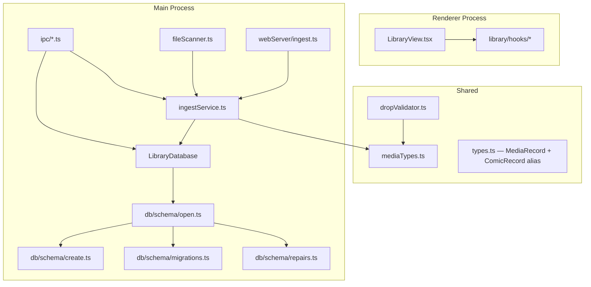

# Design Document: Codebase Refactor

## Overview

This design covers eight behavior-preserving refactoring efforts for the CB8 Electron comic/book reader. Every change is structural — no new user-facing features, no database schema changes, no IPC contract changes. The goal is to improve module boundaries, reduce duplication, clarify naming, and make the codebase easier to extend.

Each requirement is independently implementable. The order below is recommended but not mandatory.

## Architecture

The refactoring touches four layers of the application:



Key principle: every change must pass `pnpm run typecheck` and `pnpm test` with zero assertion modifications.

## Components and Interfaces

### 1. Schema Module Split (Requirement 1)

Current `src/main/db/schema.ts` (~250 lines) is split into four files under `src/main/db/schema/`:

| File | Exports | Contents |
|---|---|---|
| `schema/create.ts` | `SCHEMA: string` | All CREATE TABLE and CREATE INDEX DDL statements |
| `schema/migrations.ts` | `migrateSchema(db): void` | ALTER TABLE column additions, `migrateAuthSchema`, `ensurePostMigrationIndexes` |
| `schema/repairs.ts` | `runRepairs(db): void` | `repairExistingThumbnails`, `backfillCompletedOnFinalPage`, `backfillAccountFromPasswordHash` |
| `schema/open.ts` | `openOrRecreate(dbPath): Database` | Entry point that calls create → migrate → repair in order |

`schema/open.ts` also exports a barrel `index.ts` so that existing `import { openOrRecreate } from './db/schema'` continues to resolve.

The `openOrRecreate` function signature is unchanged:

```typescript
// schema/open.ts
import Database from 'better-sqlite3';
import * as fs from 'node:fs';
import { SCHEMA } from './create';
import { migrateSchema } from './migrations';
import { runRepairs } from './repairs';

export function openOrRecreate(dbPath: string): Database.Database {
  // Same try/catch logic as today, but calls migrateSchema + runRepairs
  // instead of a single monolithic migrateSchema
}
```

`schema/migrations.ts` moves `migrateSchema`, `migrateAuthSchema`, and `ensurePostMigrationIndexes` but no longer calls repair functions. The repair functions (`repairExistingThumbnails`, `backfillCompletedOnFinalPage`, `backfillAccountFromPasswordHash`) move to `schema/repairs.ts` and are called from `runRepairs`.

`libraryDatabase.ts` import changes from `'./db/schema'` to `'./db/schema/open'` (or uses the barrel).

### 2. Unified Ingest Service (Requirement 2)

New file: `src/main/ingestService.ts`

```typescript
export interface IngestResult {
  added: boolean;
  error?: string;
}

export interface IngestService {
  addFile(filePath: string): Promise<IngestResult>;
  scanDirectory(
    dirPath: string,
    mediaType: 'comic' | 'book' | 'all',
    onProgress: (progress: ScanProgress) => void,
  ): Promise<number>;
}

export function createIngestService(db: LibraryDatabase): IngestService;
```

The `addFile` method consolidates the three current implementations:
- `ipcHandlers.ts` `library:add-files` inline logic
- `webServer/ingest.ts` `addSingleFile`
- `fileScanner.ts` `processComicFile` / `processBookFile`

Logic flow for `addFile`:
1. Check `db.isDismissed(filePath)` → skip if true
2. Check `db.comicExistsByPath(filePath)` → skip if true
3. Call `detectMediaType(filePath)` from `mediaTypes.ts`
4. If comic: open archive → extract cover → generate thumbnail → `db.addComic`
5. If book: get page count (PDF only) → `db.addComic` → extract cover → update thumbnail
6. Parse series info via `parseSeriesFromFilename`

After this change:
- `ipcHandlers.ts` `library:add-files` calls `ingestService.addFile` in a loop
- `webServer/ingest.ts` `addSingleFile` delegates to `ingestService.addFile`
- `FileScannerImpl.processComicFile` / `processBookFile` delegate to `ingestService.addFile`

The `withTimeout` helper is shared (moved to a small utility or kept in ingestService).

### 3. IPC Handler Split (Requirement 3)

Current `src/main/ipcHandlers.ts` (~350 lines) is split into domain modules under `src/main/ipc/`:

| File | Channels |
|---|---|
| `ipc/archiveHandlers.ts` | `archive:open`, `archive:page`, `archive:close`, `book:read-file` |
| `ipc/libraryHandlers.ts` | `library:*`, `libraries:*`, `folders:*`, `dialog:*`, tag channels |
| `ipc/readingHandlers.ts` | `reading:*` |
| `ipc/webServerHandlers.ts` | `webserver:*`, web server auto-start logic |
| `ipc/appHandlers.ts` | `window:*`, `app-meta:*` |

Each module exports a registration function:

```typescript
// ipc/archiveHandlers.ts
export function registerArchiveHandlers(): void;

// ipc/libraryHandlers.ts
export function registerLibraryHandlers(
  db: LibraryDatabase | null,
  scanner: FileScanner | null,
  onRecentFilesChanged?: (filePath?: string) => void,
): void;
```

The coordinating entry point remains `registerIpcHandlers` in a new `src/main/ipc/index.ts`:

```typescript
export function registerIpcHandlers(
  db: LibraryDatabase | null,
  webServerRef?: { handle: WebServerHandle | null },
  onRecentFilesChanged?: (filePath?: string) => void,
): void {
  registerArchiveHandlers();
  registerLibraryHandlers(db, scanner, onRecentFilesChanged);
  registerReadingHandlers(db, onRecentFilesChanged);
  registerWebServerHandlers(db, webServerRef);
  registerAppHandlers(db);
}
```

The old `src/main/ipcHandlers.ts` becomes a re-export barrel:
```typescript
export { registerIpcHandlers } from './ipc/index';
```

This preserves the existing import in `src/main/index.ts`.

Shared state like `currentHandle` (the open archive) stays in `archiveHandlers.ts` as module-level state.

### 4. ComicRecord → MediaRecord Rename (Requirement 4)

In `src/shared/types.ts`:

```typescript
// Canonical type
export interface MediaRecord {
  id: number;
  filePath: string;
  title: string;
  pageCount: number;
  fileSize: number;
  coverThumbnail: Buffer | null;
  dateAdded: string;
  tags: string[];
  lastPage: number | null;
  lastLocation: string | null;
  lastRead: string | null;
  mediaType: 'comic' | 'book';
}

/** @deprecated Use MediaRecord instead */
export type ComicRecord = MediaRecord;
```

In `src/main/db/comics.ts`, add aliases:

```typescript
export const addItem = addComic;
export const getItem = getComic;
export const itemExistsByPath = comicExistsByPath;
export const getItemByPath = getComicByPath;
export const queryItems = queryComics;
```

In `src/main/libraryDatabase.ts`, add forwarding methods:

```typescript
addItem(...args) { return this.addComic(...args); }
getItem(id) { return this.getComic(id); }
queryItems(opts) { return this.queryComics(opts); }
itemExistsByPath(fp) { return this.comicExistsByPath(fp); }
getItemByPath(fp) { return this.getComicByPath(fp); }
```

IPC channel names (`library:query`, `reading:get-comic-by-path`, etc.) remain unchanged. The preload bridge whitelist is not modified.

### 5. Centralized Media Types Module (Requirement 5)

New file: `src/shared/mediaTypes.ts`

```typescript
export const COMIC_EXTENSIONS = new Set(['cbz', 'cbr']);
export const BOOK_EXTENSIONS = new Set(['pdf', 'epub', 'mobi']);
export const ALL_EXTENSIONS = new Set([...COMIC_EXTENSIONS, ...BOOK_EXTENSIONS]);

export type MediaCategory = 'comic' | 'book';

/** Extract the lowercase extension from a filename (without dot). */
function getExtension(filename: string): string {
  const dot = filename.lastIndexOf('.');
  return dot >= 0 ? filename.slice(dot + 1).toLowerCase() : '';
}

/** Detect media type from a filename or extension. Returns null if unsupported. */
export function detectMediaType(filename: string): MediaCategory | null {
  const ext = getExtension(filename);
  if (COMIC_EXTENSIONS.has(ext)) return 'comic';
  if (BOOK_EXTENSIONS.has(ext)) return 'book';
  return null;
}

/** Check if a filename is a supported media file. */
export function isSupportedFile(filename: string): boolean {
  return detectMediaType(filename) !== null;
}

/** Display labels for each supported extension. */
export const EXTENSION_LABELS: Record<string, string> = {
  cbz: 'Comic Archive (CBZ)',
  cbr: 'Comic Archive (CBR)',
  pdf: 'PDF Document',
  epub: 'EPUB Book',
  mobi: 'MOBI Book',
};

/** Check if a list of filenames contains at least one supported file. */
export function hasSupported(filenames: string[]): boolean {
  return filenames.some(isSupportedFile);
}

/** All supported extensions as an array (for dialog filters). */
export const ALL_EXTENSIONS_ARRAY: string[] = [...ALL_EXTENSIONS];
```

After this module exists, the following files are updated to import from it:

- `src/shared/dropValidator.ts` — delegates `isComicArchive`, `isBookFile`, `isSupportedFile` to `mediaTypes.ts`. The existing function signatures and exports are preserved as thin wrappers.
- `src/main/fileScanner.ts` — replaces local `COMIC_EXTENSIONS` / `BOOK_EXTENSIONS` with imports from `mediaTypes.ts` (adding dots: `new Set([...COMIC_EXTENSIONS].map(e => '.' + e))`).
- `src/main/webServer/ingest.ts` — replaces local `COMIC_EXTS` / `BOOK_EXTS` with imports.
- `src/main/ipcHandlers.ts` (or `ipc/libraryHandlers.ts`) — replaces hardcoded `['cbz', 'cbr', 'epub', 'pdf', 'mobi']` in the dialog filter with `ALL_EXTENSIONS_ARRAY`.

### 6. LibraryView Hook Extraction (Requirement 6)

Three new hooks in `src/renderer/components/library/hooks/`:

**`useLibraryQuery.ts`** — owns `comics`, `folders`, `totalCount`, `loadingMore`, pagination:

```typescript
export interface UseLibraryQueryReturn {
  comics: ComicEntry[];
  folders: FolderEntry[];
  totalCount: number;
  loadingMore: boolean;
  hasMore: boolean;
  loadInitial: (search?: string) => Promise<void>;
  loadMore: () => Promise<void>;
  setComics: React.Dispatch<React.SetStateAction<ComicEntry[]>>;
  setTotalCount: React.Dispatch<React.SetStateAction<number>>;
}

export function useLibraryQuery(opts: {
  activeFolder: { id: number; name: string } | null;
  activeLibraryId: number | null;
  activeView: 'all' | 'comics' | 'books';
  sortBy: QueryOptions['sortBy'];
  sortOrder: 'asc' | 'desc';
  readStatus?: QueryOptions['readStatus'];
  fileExt?: string;
  filterTag?: string;
}): UseLibraryQueryReturn;
```

**`useLibraryFilters.ts`** — owns `sortBy`, `sortOrder`, `readStatus`, `fileExt`, `filterTag`, `availableTags`, and persistence:

```typescript
export interface UseLibraryFiltersReturn {
  sortBy: QueryOptions['sortBy'];
  sortOrder: 'asc' | 'desc';
  readStatus: QueryOptions['readStatus'] | undefined;
  fileExt: string | undefined;
  filterTag: string | undefined;
  availableTags: string[];
  handleSortByChange: (field: QueryOptions['sortBy']) => void;
  handleSortOrderToggle: () => void;
  handleReadStatusChange: (status: QueryOptions['readStatus'] | undefined) => void;
  handleFileExtChange: (ext: string | undefined) => void;
  handleTagChange: (tag: string | undefined) => void;
  onFilterReset: () => void;
}

export function useLibraryFilters(): UseLibraryFiltersReturn;
```

**`useLibrarySelection.ts`** — owns `selectedIds`, shift/ctrl click logic, select-all:

```typescript
export interface UseLibrarySelectionReturn {
  handleComicClick: (e: React.MouseEvent, index: number) => void;
  handleCheckboxClick: (e: React.MouseEvent, comicId: number) => void;
  handleComicDragStart: (e: React.DragEvent, comicId: number) => void;
  clearSelection: () => void;
  selectAll: (comics: ComicEntry[]) => void;
  lastClickedIndex: React.MutableRefObject<number | null>;
}

export function useLibrarySelection(
  comics: ComicEntry[],
  selectedIds: Set<number>,
  onSelectionChange: (ids: Set<number>) => void,
): UseLibrarySelectionReturn;
```

The selection logic (shift-click range, ctrl-click toggle) is extracted as pure helper functions alongside the hook so they can be unit-tested independently:

```typescript
// Pure selection helpers (testable)
export function toggleSelection(current: Set<number>, id: number): Set<number>;
export function rangeSelection(
  current: Set<number>,
  items: { id: number }[],
  fromIndex: number,
  toIndex: number,
): Set<number>;
```

After extraction, `LibraryView.tsx` shrinks from ~1300 lines to ~600 lines, containing only rendering logic, drag-and-drop handlers, context menu orchestration, and the JSX tree.

### 7. DB Startup Diagnostics (Requirement 7)

New error type in `src/main/db/schema/open.ts`:

```typescript
export type DbStartupErrorCategory = 'corrupt' | 'migration' | 'repair';

export class DbStartupError extends Error {
  readonly category: DbStartupErrorCategory;
  readonly detail: string;

  constructor(category: DbStartupErrorCategory, detail: string, cause?: unknown) {
    const prefix = {
      corrupt: 'Database file unreadable or corrupt',
      migration: 'Schema migration failed',
      repair: 'Repair job failed',
    }[category];
    super(`${prefix}: ${detail}`);
    this.name = 'DbStartupError';
    this.category = category;
    this.detail = detail;
    if (cause instanceof Error) this.cause = cause;
  }
}
```

Updated `openOrRecreate` behavior:

1. **Corrupt file**: If `new Database(dbPath)` or `db.exec(SCHEMA)` throws, the existing wipe-and-recreate logic runs. If recreation also fails, throw `DbStartupError('corrupt', ...)`.
2. **Migration failure**: If `migrateSchema(db)` throws, throw `DbStartupError('migration', detail)` where `detail` identifies the failing migration step. The database file is NOT deleted.
3. **Repair failure**: If `runRepairs(db)` throws, log a warning and return the database in a usable state. The repair will be retried on next startup. Individual repair functions already have try/catch that logs and continues — this is preserved. Only if the entire `runRepairs` call throws unexpectedly does it become a `DbStartupError('repair', ...)`.

The phrase "database corrupted" is removed from the migration/repair error paths. Only the actual corrupt-file path uses "corrupt" terminology.

### 8. Behavior Preservation (Requirement 8)

This is a cross-cutting constraint, not a separate component. Each requirement above is designed to:
- Preserve all function signatures (or add aliases)
- Preserve all IPC channel names
- Preserve all database schema
- Preserve all web server API responses
- Keep `pnpm run typecheck` and `pnpm test` green after each step

## Data Models

No data model changes. The database schema is identical before and after all refactoring. The only type-level change is:

```typescript
// Before
export interface ComicRecord { ... }

// After
export interface MediaRecord { ... }
export type ComicRecord = MediaRecord;  // backward-compatible alias
```

All database column names, table names, and query logic remain unchanged.

## Correctness Properties

*A property is a characteristic or behavior that should hold true across all valid executions of a system — essentially, a formal statement about what the system should do. Properties serve as the bridge between human-readable specifications and machine-verifiable correctness guarantees.*

### Property 1: Media type detection correctness and consistency

*For any* filename string, `detectMediaType(filename)` SHALL return `'comic'` if the extension is in `COMIC_EXTENSIONS`, `'book'` if the extension is in `BOOK_EXTENSIONS`, and `null` otherwise. Furthermore, `isSupportedFile(filename)` SHALL equal `detectMediaType(filename) !== null`.

**Validates: Requirements 5.3, 5.4**

### Property 2: Drag-and-drop validation consistency

*For any* array of filename strings, `hasSupported(filenames)` SHALL return `true` if and only if at least one element satisfies `isSupportedFile(element) === true`.

**Validates: Requirements 5.6**

### Property 3: Selection toggle is self-inverse

*For any* selection set and any item id, calling `toggleSelection` twice with the same id SHALL return the original set. That is, `toggleSelection(toggleSelection(set, id), id)` equals `set`.

**Validates: Requirements 6.3**

### Property 4: Range selection covers exactly the specified range

*For any* list of items and any two indices `a` and `b` (where `0 ≤ a, b < items.length`), `rangeSelection(emptySet, items, a, b)` SHALL contain exactly the ids of items at indices `min(a,b)` through `max(a,b)` inclusive, and no others.

**Validates: Requirements 6.3**

## Error Handling

### DB Startup Errors (Requirement 7)

| Failure Mode | Category | Behavior |
|---|---|---|
| SQLite file unreadable / corrupt | `corrupt` | Wipe and recreate. If recreation fails, throw `DbStartupError('corrupt', ...)` |
| DDL exec fails on fresh file | `corrupt` | Same as above — treat as corrupt |
| ALTER TABLE migration fails | `migration` | Throw `DbStartupError('migration', ...)`. Do NOT delete the DB file |
| Repair job fails | `repair` | Log warning, continue with usable DB. Repair retries on next startup |

### Ingest Service Errors

- Unsupported file type → return `{ added: false, error: 'Unsupported file type' }`
- File already exists → return `{ added: false }` (no error)
- Dismissed path → return `{ added: false }` (no error)
- Cover extraction timeout → log warning, continue with null thumbnail
- Archive open failure → return `{ added: false, error: message }`

All error handling preserves existing behavior — no new error types are introduced for ingest.

## Testing Strategy

### Unit Tests

- `src/shared/mediaTypes.test.ts` — example-based tests for `detectMediaType`, `isSupportedFile`, `hasSupported`, `EXTENSION_LABELS` coverage
- `src/shared/dropValidator.test.ts` — existing tests continue to pass (dropValidator delegates to mediaTypes but preserves its API)
- Selection helpers (`toggleSelection`, `rangeSelection`) — example-based tests for specific click scenarios

### Property-Based Tests

Property-based testing applies to the pure functions introduced or extracted in this refactor. Use `fast-check` (already available via Vitest ecosystem) with minimum 100 iterations per property.

- **Property 1** (media type detection): Generate arbitrary strings, strings with known extensions, strings with mixed case. Verify `detectMediaType` and `isSupportedFile` consistency.
  - Tag: `Feature: codebase-refactor, Property 1: Media type detection correctness and consistency`
- **Property 2** (drag-and-drop validation): Generate arrays of arbitrary strings, some with supported extensions. Verify `hasSupported` matches `some(isSupportedFile)`.
  - Tag: `Feature: codebase-refactor, Property 2: Drag-and-drop validation consistency`
- **Property 3** (selection toggle): Generate random sets of numbers and a random id. Verify double-toggle is identity.
  - Tag: `Feature: codebase-refactor, Property 3: Selection toggle is self-inverse`
- **Property 4** (range selection): Generate random item lists and index pairs. Verify exact range coverage.
  - Tag: `Feature: codebase-refactor, Property 4: Range selection covers exactly the specified range`

### Integration / Smoke Tests

- `pnpm run typecheck` — verifies all import paths resolve, type aliases are compatible, and no regressions
- `pnpm test` — existing test suite passes without assertion changes
- Schema split: verify `openOrRecreate` produces a DB with the expected tables and columns (compare PRAGMA output)
- IPC split: verify all expected channel names are registered
- DB diagnostics: example tests for each error category (corrupt, migration, repair)
