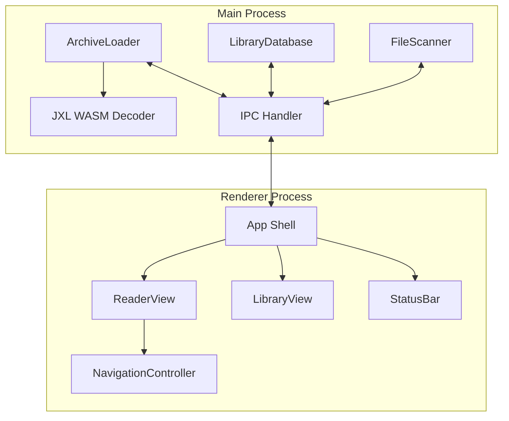

# Design Document: Comic Book Reader

## Overview

A desktop comic book reader built with Electron and TypeScript, replacing the existing Qt6/C++ prototype. The application provides two primary experiences: a comic viewer for reading CBZ/CBR archives with keyboard-driven navigation and fullscreen support, and a library manager backed by SQLite for organizing, searching, tagging, and browsing collections of 100K+ comics with virtualized scrolling.

The architecture follows Electron's process model: a main process handles file I/O, archive extraction, database operations, and native dialogs; a renderer process handles the UI including the image viewer, library grid, and keyboard input. Communication between processes uses Electron IPC with typed channels.

### Key Technical Decisions

| Decision | Choice | Rationale |
|---|---|---|
| Archive (ZIP) | `yauzl` | Async, streaming ZIP extraction. Well-maintained, no native deps. |
| Archive (RAR) | `node-unrar-js` | Emscripten-compiled unrar. Pure JS/WASM, no native binary needed. |
| JPEG XL decoding | `@aspect-build/jxl-dec` or `jxl.js` WASM decoder | Chromium dropped JXL support; WASM decoder converts JXL→PNG/raw pixels in main process before sending to renderer. |
| AVIF decoding | Native Chromium | Chromium supports AVIF natively. No extra work needed. |
| Database | `better-sqlite3` | Synchronous API is simpler for Electron main process. Fastest Node.js SQLite binding. Needs `electron-rebuild`. |
| Virtual scrolling | Custom implementation or `react-window` / `@tanstack/virtual` | Renders only visible grid cells + buffer row. Handles 100K+ items. |
| UI framework | React + TypeScript | Component-based UI, good ecosystem for virtual scrolling and state management. |
| Build tooling | Electron Forge or electron-builder | Standard Electron packaging and distribution. |
| Natural sort | Custom comparator | Simple numeric-aware string comparison, same logic as existing C++ code. |

### JPEG XL Handling Strategy

Since Chromium removed JPEG XL support, JXL images extracted from archives must be decoded before display:

1. Main process extracts raw bytes from archive
2. If the file extension is `.jxl`, the main process runs the WASM JXL decoder to produce raw RGBA pixel data
3. The pixel data is converted to a PNG buffer (using `sharp` or canvas encoding)
4. The PNG buffer is sent to the renderer as a data URL or transferred via `ArrayBuffer`

This keeps the renderer simple — it always receives browser-native image formats.

## Architecture



### Process Responsibilities

**Main Process:**
- Opens and extracts pages from CBZ (ZIP) and CBR (RAR) archives
- Decodes JXL images via WASM when encountered
- Manages the SQLite library database (CRUD, search, indexing)
- Runs async directory scans for comic discovery
- Handles native file dialogs and window management

**Renderer Process:**
- Displays comic pages scaled to viewport with aspect-ratio preservation
- Handles keyboard navigation (arrow keys, space, backspace, home, end)
- Manages fullscreen toggle (F11, Escape)
- Renders the library grid with virtual scrolling
- Provides search/filter UI and tag management
- Handles drag-and-drop file loading

### IPC Channel Design

All main↔renderer communication uses typed IPC channels:

| Channel | Direction | Purpose |
|---|---|---|
| `archive:open` | renderer→main | Open a CBZ/CBR file, returns page count and metadata |
| `archive:page` | renderer→main | Request page image data by index |
| `archive:close` | renderer→main | Close current archive |
| `dialog:open-file` | renderer→main | Show native open file dialog |
| `library:query` | renderer→main | Search/filter/sort comic records |
| `library:scan` | renderer→main | Start directory scan |
| `library:scan-progress` | main→renderer | Scan progress updates |
| `library:add-tag` | renderer→main | Assign tag to comic |
| `library:remove-tag` | renderer→main | Remove tag from comic |
| `library:remove-comics` | renderer→main | Delete comic records |
| `library:get-thumbnail` | renderer→main | Fetch cover thumbnail for a comic |

## Components and Interfaces

### ArchiveLoader (Main Process)

Responsible for opening CBZ/CBR archives, listing image entries in natural sort order, and extracting page data.

```typescript
interface ArchiveEntry {
  filename: string;
  index: number;
}

interface ArchiveHandle {
  filePath: string;
  format: 'cbz' | 'cbr';
  entries: ArchiveEntry[];
  pageCount: number;
}

interface ArchiveLoader {
  open(filePath: string): Promise<ArchiveHandle>;
  getPage(handle: ArchiveHandle, pageIndex: number): Promise<Buffer>;
  getCoverImage(handle: ArchiveHandle): Promise<Buffer>;
  close(handle: ArchiveHandle): Promise<void>;
}
```

**Natural Sort:** Filenames are sorted using a comparator that treats embedded numeric sequences as integers (e.g., `page2.jpg` before `page10.jpg`). Non-image files are filtered out based on extension matching: `jpg`, `jpeg`, `png`, `webp`, `gif`, `bmp`, `jxl`, `avif`.

**Cover Image Selection:** `getCoverImage` selects the cover thumbnail from an opened archive using the following priority:
1. If any image entry has a basename (without extension) that equals `"cover"` (case-insensitive match), that entry is used — e.g., `cover.jpg`, `Cover.PNG`, `COVER.jxl`.
2. Otherwise, the first image entry in the natural-sorted list (index 0) is used.

This allows archive creators to designate a specific cover image while providing a sensible default.

**CBZ extraction** uses `yauzl` for async streaming ZIP reads.
**CBR extraction** uses `node-unrar-js` which provides an Emscripten-compiled RAR extractor.

### ImageDecoder (Main Process)

Handles decoding of image formats not natively supported by Chromium.

```typescript
interface ImageDecoder {
  isJxl(buffer: Buffer): boolean;
  decodeJxl(buffer: Buffer): Promise<Buffer>; // Returns PNG buffer
  needsDecoding(extension: string): boolean;
  decode(buffer: Buffer, extension: string): Promise<Buffer>;
}
```

Only JXL requires special handling. AVIF, WebP, PNG, JPEG, GIF, and BMP are all natively supported by Chromium and passed through unchanged.

### NavigationController (Renderer Process)

Manages page state and keyboard input for the comic viewer.

```typescript
interface NavigationState {
  currentPage: number;
  totalPages: number;
  isFullscreen: boolean;
  archiveFilename: string | null;
}

interface NavigationController {
  goToPage(index: number): void;
  nextPage(): void;
  previousPage(): void;
  firstPage(): void;
  lastPage(): void;
  toggleFullscreen(): void;
  exitFullscreen(): void;
}
```

**Key bindings:**
- Right Arrow / Space → next page
- Left Arrow / Backspace → previous page
- Home → first page
- End → last page
- F11 → toggle fullscreen
- Escape → exit fullscreen

Boundary conditions: next page on last page and previous page on first page are no-ops.

### LibraryDatabase (Main Process)

Manages the SQLite database for comic metadata persistence.

```typescript
interface ComicRecord {
  id: number;
  filePath: string;
  title: string;
  pageCount: number;
  fileSize: number;
  coverThumbnail: Buffer;
  dateAdded: string; // ISO 8601
  tags: string[];
}

interface QueryOptions {
  search?: string;
  tag?: string;
  sortBy?: 'title' | 'dateAdded' | 'fileSize' | 'pageCount';
  sortOrder?: 'asc' | 'desc';
  offset?: number;
  limit?: number;
}

interface QueryResult {
  records: ComicRecord[];
  totalCount: number;
}

interface LibraryDatabase {
  initialize(): void;
  addComic(record: Omit<ComicRecord, 'id' | 'dateAdded'>): ComicRecord;
  removeComics(ids: number[]): void;
  getComic(id: number): ComicRecord | null;
  queryComics(options: QueryOptions): QueryResult;
  addTag(comicId: number, tag: string): void;
  removeTag(comicId: number, tag: string): void;
  getAllTags(): string[];
  comicExistsByPath(filePath: string): boolean;
}
```

### FileScanner (Main Process)

Recursively scans directories for comic archives asynchronously.

```typescript
interface ScanProgress {
  discovered: number;
  processed: number;
  currentFile: string;
}

interface FileScanner {
  scan(
    directoryPath: string,
    onProgress: (progress: ScanProgress) => void
  ): Promise<number>; // Returns count of new comics added
}
```

The scanner uses `fs.opendir` with recursive traversal, yielding control back to the event loop periodically to keep the main process responsive. Files already in the library (matched by path) are skipped. Failed archives are logged and skipped.

### LibraryView (Renderer Process)

Displays the comic grid with virtual scrolling.

```typescript
interface LibraryViewProps {
  onOpenComic: (comicId: number) => void;
  onSearch: (query: string) => void;
  onFilterByTag: (tag: string | null) => void;
  onSort: (sortBy: string, sortOrder: string) => void;
}
```

The grid uses virtual scrolling: only visible rows plus one buffer row above and below are rendered. Each cell shows a cover thumbnail and title. Thumbnails not yet loaded show a placeholder. Double-clicking a cell opens the comic in the reader view.

## Data Models

### SQLite Schema

```sql
CREATE TABLE comics (
  id INTEGER PRIMARY KEY AUTOINCREMENT,
  file_path TEXT NOT NULL UNIQUE,
  title TEXT NOT NULL,
  page_count INTEGER NOT NULL,
  file_size INTEGER NOT NULL,
  cover_thumbnail BLOB,
  date_added TEXT NOT NULL DEFAULT (datetime('now'))
);

CREATE TABLE tags (
  id INTEGER PRIMARY KEY AUTOINCREMENT,
  name TEXT NOT NULL UNIQUE
);

CREATE TABLE comic_tags (
  comic_id INTEGER NOT NULL REFERENCES comics(id) ON DELETE CASCADE,
  tag_id INTEGER NOT NULL REFERENCES tags(id) ON DELETE CASCADE,
  PRIMARY KEY (comic_id, tag_id)
);

-- Performance indexes for large collections (Requirement 14)
CREATE INDEX idx_comics_file_path ON comics(file_path);
CREATE INDEX idx_comics_title ON comics(title COLLATE NOCASE);
CREATE INDEX idx_comics_date_added ON comics(date_added);
CREATE INDEX idx_comics_file_size ON comics(file_size);
CREATE INDEX idx_comics_page_count ON comics(page_count);
CREATE INDEX idx_tags_name ON tags(name COLLATE NOCASE);
```

**Design notes:**
- `file_path` has a UNIQUE constraint to prevent duplicate imports (Requirement 11.3)
- Tags use a many-to-many junction table (`comic_tags`) so tags can be shared across comics (Requirement 15.4) and orphaned tags are retained (Requirement 15.5)
- `cover_thumbnail` is stored as a BLOB — thumbnails are small (resized to ~200px wide) so inline storage avoids filesystem scatter
- Indexes on all sortable/searchable columns ensure sub-200ms queries at 100K records (Requirements 13.2, 14.2, 14.5)
- Case-insensitive collation on `title` and `tags.name` supports case-insensitive search (Requirement 13.1)

### IPC Message Types

```typescript
// Archive messages
type ArchiveOpenRequest = { filePath: string };
type ArchiveOpenResponse = { pageCount: number; filename: string } | { error: string };
type ArchivePageRequest = { pageIndex: number };
type ArchivePageResponse = { imageData: ArrayBuffer; mimeType: string };

// Library messages
type LibraryQueryRequest = QueryOptions;
type LibraryQueryResponse = QueryResult;
type LibraryScanRequest = { directoryPath: string };
type LibraryScanProgress = ScanProgress;
type LibraryTagRequest = { comicId: number; tag: string };
type LibraryRemoveRequest = { comicIds: number[] };
```

## Correctness Properties

*A property is a characteristic or behavior that should hold true across all valid executions of a system — essentially, a formal statement about what the system should do. Properties serve as the bridge between human-readable specifications and machine-verifiable correctness guarantees.*

### Property 1: Natural sort ordering

*For any* list of filenames containing embedded numeric sequences, sorting with the natural sort comparator SHALL produce an ordering where purely numeric substrings are compared by numeric value (e.g., `page2` before `page10`), and non-numeric substrings are compared lexicographically.

**Validates: Requirements 1.2, 2.2**

### Property 2: Image extension filter correctness

*For any* filename string, the image filter function SHALL return `true` if and only if the file extension (case-insensitive) is one of: `jpg`, `jpeg`, `png`, `webp`, `gif`, `bmp`, `jxl`, `avif`.

**Validates: Requirements 1.5, 2.5**

### Property 3: Aspect-ratio scaling preserves ratio and fits viewport

*For any* image with dimensions (imgW, imgH) where both are positive, and any viewport with dimensions (vpW, vpH) where both are positive, the computed display dimensions (dispW, dispH) SHALL satisfy: `dispW / dispH ≈ imgW / imgH` (aspect ratio preserved), `dispW <= vpW`, and `dispH <= vpH` (fits within viewport).

**Validates: Requirements 3.1**

### Property 4: Navigation state machine correctness

*For any* valid navigation state with `currentPage` in `[0, totalPages-1]` where `totalPages >= 1`:
- `nextPage()` SHALL set currentPage to `min(currentPage + 1, totalPages - 1)`
- `previousPage()` SHALL set currentPage to `max(currentPage - 1, 0)`
- `firstPage()` SHALL set currentPage to `0`
- `lastPage()` SHALL set currentPage to `totalPages - 1`

The resulting page index SHALL always be in the range `[0, totalPages - 1]`.

**Validates: Requirements 4.1, 4.2, 4.3, 4.4, 4.5, 4.6**

### Property 5: Drop validator accepts only comic archives

*For any* filename string, the drop validator SHALL accept the file if and only if the file extension (case-insensitive) is `cbz` or `cbr`.

**Validates: Requirements 7.3**

### Property 6: Status bar format

*For any* `currentPage` in `[0, totalPages-1]` where `totalPages >= 1`, the status bar text SHALL equal `"${currentPage + 1} / ${totalPages}"`.

**Validates: Requirements 8.1**

### Property 7: Window title contains filename

*For any* file path string containing a filename component, the generated window title SHALL contain the filename (basename) extracted from that path.

**Validates: Requirements 9.1**

### Property 8: Comic record storage round-trip

*For any* valid comic record with file path, title, page count, file size, cover thumbnail, and tags, storing the record in the database and then retrieving it by ID SHALL return a record with all fields equal to the original values.

**Validates: Requirements 10.4**

### Property 9: Scan idempotence

*For any* set of comic file paths in a directory, scanning the directory twice SHALL result in the same number of Comic_Records as scanning it once — no duplicates are created.

**Validates: Requirements 11.3**

### Property 10: Virtual scroll renders correct item range

*For any* total item count, viewport height, item row height, columns per row, and scroll offset, the virtual scroll SHALL render only the items whose rows are visible in the viewport plus exactly one buffer row above and below.

**Validates: Requirements 12.2**

### Property 11: Search returns correct matches

*For any* set of Comic_Records and any search query string, the search results SHALL contain exactly the records where the title or file path contains the query string (case-insensitive comparison).

**Validates: Requirements 13.1**

### Property 12: Combined tag and search filter

*For any* set of Comic_Records, any tag filter, and any search query, the results SHALL contain exactly the records that match both the tag filter AND contain the search query in title or file path (case-insensitive).

**Validates: Requirements 13.4, 13.5**

### Property 13: Sort ordering correctness

*For any* set of Comic_Records and any sort field (title, dateAdded, fileSize, pageCount) with any sort direction (asc/desc), the returned records SHALL be in the correct order according to the specified field and direction.

**Validates: Requirements 14.4**

### Property 14: Tag assignment and retrieval

*For any* Comic_Record and any set of distinct tag strings, assigning all tags to the comic and then retrieving the comic's tags SHALL return a set containing all assigned tags. Additionally, *for any* tag assigned to multiple comics, each of those comics SHALL list that tag.

**Validates: Requirements 15.1, 15.3, 15.4**

### Property 15: Tag removal

*For any* Comic_Record with an assigned tag, removing that tag association and then retrieving the comic's tags SHALL return a set that does not contain the removed tag.

**Validates: Requirements 15.2**

### Property 16: Orphaned tag retention

*For any* tag that was assigned to a Comic_Record and then had all its associations removed, the tag SHALL still appear in the list of all tags.

**Validates: Requirements 15.5**

### Property 17: Batch deletion correctness

*For any* set of Comic_Records in the library and any subset selected for removal, after deletion the library SHALL contain exactly the records that were not in the selected subset.

**Validates: Requirements 14.3, 16.1**

### Property 18: Cover image selection priority

*For any* list of image entries in an archive, if an entry with the basename "cover" (case-insensitive, any recognized image extension) exists, `getCoverImage` SHALL return that entry. If no such entry exists, `getCoverImage` SHALL return the first entry in Natural_Sort_Order.

**Validates: Requirements 11.7**

## Error Handling

### Archive Loading Errors

| Error Condition | Handling | User Feedback |
|---|---|---|
| File not found | Return error result from `ArchiveLoader.open()` | Dialog: "File not found: {path}" |
| Corrupted ZIP/RAR | Catch extraction library errors, return descriptive message | Dialog: "Failed to open archive: {details}" |
| Unsupported archive format | Detect by extension before attempting open | Dialog: "Unsupported file format" |
| Page decode failure (corrupt image) | Return error for specific page, don't crash | Show error placeholder for that page, allow navigation to continue |
| JXL WASM decode failure | Catch WASM errors, return error for that page | Show error placeholder, log warning |

### Library Database Errors

| Error Condition | Handling | User Feedback |
|---|---|---|
| Database file missing at startup | Create new empty database, log warning | Silent — user sees empty library |
| Database file corrupted | Delete and recreate, log warning | Notification: "Library database was reset" |
| Insert failure (duplicate path) | Catch UNIQUE constraint violation, skip | Silent during scan; error during manual add |
| Scan: unreadable archive | Log error, skip file, continue scanning | Progress indicator shows skip count |
| Scan: permission denied on directory | Log error, skip directory, continue | Progress indicator notes skipped directories |

### UI Error States

- No archive loaded: black background, empty status bar, default title
- Archive load failure: error dialog, previous state preserved
- Thumbnail load failure: placeholder image persists
- Search with no results: empty grid with "No comics found" message

## Testing Strategy

### Property-Based Testing

Property-based testing is well-suited for this application. The core logic includes pure functions (natural sort, extension filtering, scaling computation, navigation state, formatting) and database operations with clear input/output contracts (search, filter, sort, CRUD round-trips).

**Library:** [fast-check](https://github.com/dubzzz/fast-check) — the standard PBT library for TypeScript/JavaScript.

**Configuration:**
- Minimum 100 iterations per property test
- Each test tagged with: `Feature: comic-book-reader, Property {N}: {title}`

**Property tests (18 properties):**
- Properties 1–7: Pure function tests (no I/O, fast execution)
- Property 18: Pure function test for cover image selection logic
- Properties 8–17: Database tests using an in-memory SQLite instance per test run

### Unit Tests (Example-Based)

Focus on specific scenarios and edge cases not covered by property tests:

- Fullscreen toggle state transitions (F11, Escape)
- File dialog filter configuration
- Drag-and-drop accept/reject behavior
- Empty archive loaded state (black background, empty status bar)
- Dialog cancellation preserves state
- Confirmation prompt before deletion
- Progress indicator during scan

### Integration Tests

- End-to-end archive loading with real CBZ/CBR fixture files
- JXL decoding pipeline (WASM decode → PNG conversion)
- IPC round-trip: renderer requests page → main extracts → renderer displays
- Directory scan with mixed file types
- Database persistence across simulated restarts
- Performance benchmarks: search/sort/insert at 100K records
