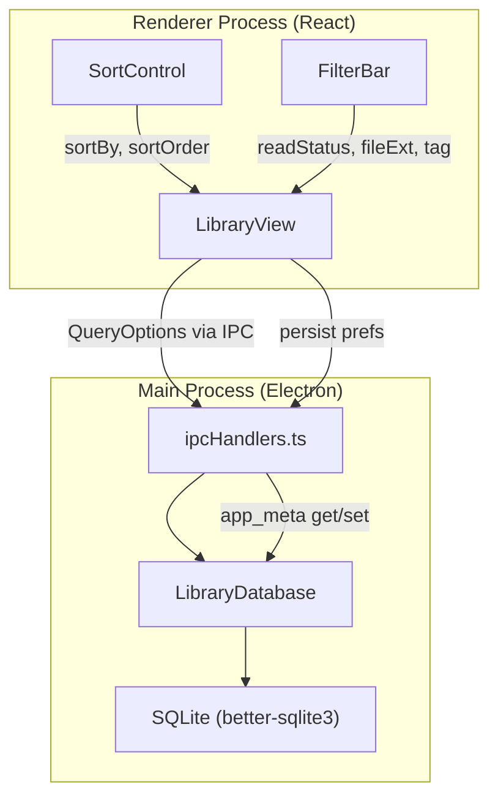

# Design Document: Library Filter & Sort

## Overview

This feature adds sort and filter controls to the Electron app's LibraryView, bringing it to parity with the web UI's sort capabilities and adding new filtering dimensions (read status, file type, tag). The implementation extends the existing `QueryOptions` interface, adds SQL condition-building for read status in the three desktop query methods (`queryComics`, `queryComicsByLibrary`, `getFolderComics`), introduces two new React components (`SortControl`, `FilterBar`), and persists user preferences via the existing `app_meta` key-value store.

All filtering is performed server-side (main process / SQLite) so that pagination, counts, and virtual scrolling remain correct. The renderer never filters in-memory.

## Architecture



The data flow is unidirectional:

1. User interacts with `SortControl` or `FilterBar`.
2. `LibraryView` merges the change into its local `QueryOptions` state.
3. `LibraryView` calls the appropriate IPC query (`library:query`, `libraries:query`, or `folders:query`).
4. The main process builds SQL with the new conditions and returns `QueryResult`.
5. `LibraryView` persists the updated filter preset to `app_meta` via existing IPC.

No new IPC channels are required. The existing `library:query`, `libraries:query`, and `folders:query` channels already accept `QueryOptions`, and `getAppMeta`/`setAppMeta` are already exposed internally. Two new IPC channels will be added for renderer access to app_meta: `app-meta:get` and `app-meta:set`.

## Components and Interfaces

### Extended QueryOptions

The shared `QueryOptions` interface gains one new field:

```typescript
// src/shared/types.ts
export interface QueryOptions {
  search?: string;
  tag?: string;
  sortBy?: 'title' | 'dateAdded' | 'fileSize' | 'pageCount' | 'lastRead';
  sortOrder?: 'asc' | 'desc';
  offset?: number;
  limit?: number;
  excludeFoldered?: boolean;
  mediaType?: 'comic' | 'book';
  fileExt?: string;
  readStatus?: 'unread' | 'in-progress' | 'completed'; // NEW
}
```

`fileExt` already exists in `QueryOptions` and is already handled by all three query methods. Only `readStatus` is new.

### Read Status SQL Conditions

The read status filter maps to SQL conditions on the `comics` table columns `last_page`, `last_read`, and `page_count`:

| readStatus     | SQL condition |
|----------------|---------------|
| `unread`       | `c.last_page IS NULL AND c.last_read IS NULL` |
| `in-progress`  | `(c.last_page IS NOT NULL OR c.last_read IS NOT NULL) AND (c.last_page IS NULL OR c.last_page < c.page_count - 1)` |
| `completed`    | `c.last_page = c.page_count - 1` |

These conditions will be added to the shared condition-building logic in `queryComics`, `queryComicsByLibrary`, and `getFolderComics`.

### FilterPreset Type

A new shared type for the persisted preference bundle:

```typescript
// src/shared/types.ts
export interface FilterPreset {
  sortBy: QueryOptions['sortBy'];
  sortOrder: QueryOptions['sortOrder'];
  readStatus?: QueryOptions['readStatus'];
  fileExt?: string;
  tag?: string;
}
```

This is serialized as JSON and stored under the `app_meta` key `"filterPreset"`.

### SortControl Component

A small toolbar component rendered inside `LibraryView`:

```typescript
// src/renderer/components/SortControl.tsx
interface SortControlProps {
  sortBy: QueryOptions['sortBy'];
  sortOrder: 'asc' | 'desc';
  onSortByChange: (field: QueryOptions['sortBy']) => void;
  onSortOrderToggle: () => void;
}
```

Renders a `<select>` for the sort field and a toggle button with an arrow icon for direction. When `sortBy` changes to `dateAdded` or `lastRead`, the component calls `onSortByChange` and the parent sets `sortOrder` to `'desc'` as the default. When `sortBy` changes to `title`, the parent defaults to `'asc'`.

### FilterBar Component

A horizontal strip rendered below the search bar:

```typescript
// src/renderer/components/FilterBar.tsx
interface FilterBarProps {
  readStatus: QueryOptions['readStatus'] | undefined;
  fileExt: string | undefined;
  tag: string | undefined;
  availableTags: string[];
  onReadStatusChange: (status: QueryOptions['readStatus'] | undefined) => void;
  onFileExtChange: (ext: string | undefined) => void;
  onTagChange: (tag: string | undefined) => void;
}
```

Contains three groups:
1. Read status pills: All | Unread | In Progress | Completed
2. File type pills: All | CBZ | CBR | PDF | EPUB
3. Tag selector: a `<select>` populated from `availableTags`, hidden when the array is empty

### LibraryView State Changes

`LibraryView` gains new state variables:

```typescript
const [sortBy, setSortBy] = useState<QueryOptions['sortBy']>('title');
const [sortOrder, setSortOrder] = useState<'asc' | 'desc'>('asc');
const [readStatus, setReadStatus] = useState<QueryOptions['readStatus'] | undefined>(undefined);
const [fileExt, setFileExt] = useState<string | undefined>(undefined);
const [filterTag, setFilterTag] = useState<string | undefined>(undefined);
const [availableTags, setAvailableTags] = useState<string[]>([]);
```

On mount, `LibraryView` loads the persisted `FilterPreset` from `app_meta` and applies it. The existing hardcoded `sortBy: 'title', sortOrder: 'asc'` in `fetchPage` is replaced with the state values.

When any filter/sort value changes, `LibraryView`:
1. Resets offset to 0 and re-fetches.
2. Persists the full `FilterPreset` to `app_meta`.

### IPC Additions

Two new channels for renderer access to `app_meta`:

```typescript
// In IpcInvokeMap
'app-meta:get': { args: [key: string]; result: string | null };
'app-meta:set': { args: [key: string, value: string]; result: void };
```

Corresponding helpers in `ipcClient.ts`:

```typescript
export async function getAppMeta(key: string): Promise<string | null> {
  return api.invoke('app-meta:get', key);
}
export async function setAppMeta(key: string, value: string): Promise<void> {
  await api.invoke('app-meta:set', key, value);
}
```

## Data Models

### Database Schema

No schema changes are needed. The `comics` table already has `last_page`, `last_read`, and `page_count` columns used for read status derivation. The `app_meta` table already exists for key-value persistence.

### app_meta Key

| Key | Value (JSON) | Example |
|-----|-------------|---------|
| `filterPreset` | `FilterPreset` | `{"sortBy":"dateAdded","sortOrder":"desc","readStatus":"unread"}` |

### Default FilterPreset

When no persisted preset exists:

```json
{
  "sortBy": "title",
  "sortOrder": "asc"
}
```

No `readStatus`, `fileExt`, or `tag` — meaning "show all".


## Correctness Properties

*A property is a characteristic or behavior that should hold true across all valid executions of a system — essentially, a formal statement about what the system should do. Properties serve as the bridge between human-readable specifications and machine-verifiable correctness guarantees.*

### Property 1: Read status classification is a total partition

*For any* comic record with `pageCount >= 1`, `classifyReadStatus(comic)` returns exactly one of `'unread'`, `'in-progress'`, or `'completed'`, and the classification is:
- `'unread'` iff `lastPage` is null and `lastRead` is null
- `'completed'` iff `lastPage === pageCount - 1`
- `'in-progress'` otherwise (i.e. some reading activity exists but the comic is not completed)

Every comic falls into exactly one category — the three sets are mutually exclusive and exhaustive.

**Validates: Requirements 3.4, 3.5, 3.6**

### Property 2: Read status filter returns exactly matching comics

*For any* array of comic records and *any* `readStatus` value (including `undefined`), filtering the array by read status returns exactly those comics whose `classifyReadStatus` result matches the filter value. When `readStatus` is `undefined`, all comics are returned.

**Validates: Requirements 3.2, 3.3, 9.2, 9.3, 9.4**

### Property 3: File extension filter returns exactly matching comics

*For any* array of comic records and *any* `fileExt` value (including `undefined`), filtering the array by file extension returns exactly those comics whose file path ends with `'.' + fileExt` (case-insensitive). When `fileExt` is `undefined`, all comics are returned.

**Validates: Requirements 4.2, 4.3**

### Property 4: Filters compose as logical AND

*For any* array of comic records and *any* combination of filter values (`readStatus`, `fileExt`, `tag`, `search`), the result of applying all filters simultaneously equals the intersection of applying each filter individually. That is, a comic appears in the combined result iff it passes every individual filter.

**Validates: Requirements 6.1, 9.5**

### Property 5: Default sort direction mapping

*For any* sort field, the default sort direction is:
- `'desc'` when the field is `'dateAdded'` or `'lastRead'`
- `'asc'` when the field is `'title'`, `'fileSize'`, or `'pageCount'`

**Validates: Requirements 2.4, 2.5**

### Property 6: Sort direction toggle is an involution

*For any* current sort order, toggling the sort direction produces the opposite order, and toggling twice returns to the original order.

**Validates: Requirements 2.2**

### Property 7: Single filter change preserves other filter values

*For any* `FilterPreset` and *any* single field update (e.g. changing `readStatus`), all other fields in the preset remain unchanged after the update.

**Validates: Requirements 6.2**

## Error Handling

### Invalid Persisted Preferences

If the JSON stored in `app_meta` under `"filterPreset"` fails to parse or contains invalid values (e.g. an unrecognized `sortBy` field), the application falls back to the default `FilterPreset` (`sortBy: 'title'`, `sortOrder: 'asc'`, no filters). A `console.warn` is emitted but no error is surfaced to the user.

### Empty Query Results

When the active filter combination yields zero results, the `LibraryView` displays the existing empty-state message. The `totalCount` in the toolbar shows `0`. No special error handling is needed.

### Tag Selector with No Tags

When `getAllTags()` returns an empty array, the `FilterBar` hides the tag selector entirely (Requirement 5.4). No error state is needed.

### Database Query Errors

Existing error handling in `ipcHandlers.ts` already catches and logs database errors. No additional error handling is introduced for the new `readStatus` condition — it uses the same parameterized query pattern as existing filters.

## Testing Strategy

### Property-Based Tests (Vitest + fast-check)

The project already uses Vitest. Property-based tests will use `fast-check` (to be added as a dev dependency) with a minimum of 100 iterations per property.

The following pure functions will be extracted to `src/shared/filterLogic.ts` to enable unit and property testing without database or React dependencies:

1. `classifyReadStatus(comic: { lastPage: number | null; lastRead: string | null; pageCount: number }): 'unread' | 'in-progress' | 'completed'`
2. `filterByReadStatus(comics: ComicRecord[], status: ReadStatus | undefined): ComicRecord[]`
3. `filterByFileExt(comics: ComicRecord[], ext: string | undefined): ComicRecord[]`
4. `applyFilters(comics: ComicRecord[], filters: FilterPreset & { search?: string }): ComicRecord[]`
5. `getDefaultSortOrder(sortBy: QueryOptions['sortBy']): 'asc' | 'desc'`
6. `toggleSortOrder(current: 'asc' | 'desc'): 'asc' | 'desc'`
7. `updateFilterPreset(preset: FilterPreset, field: keyof FilterPreset, value: unknown): FilterPreset`

Property tests go in `src/shared/filterLogic.test.ts`:

- **Feature: library-filter-sort, Property 1**: Read status classification partition — generate random comic records, verify classification is total and mutually exclusive.
- **Feature: library-filter-sort, Property 2**: Read status filter correctness — generate random comic arrays and random readStatus, verify filter output matches manual classification.
- **Feature: library-filter-sort, Property 3**: File extension filter correctness — generate random file paths and extensions, verify filter output.
- **Feature: library-filter-sort, Property 4**: Filter composition — generate random comics and random filter combinations, verify AND composition.
- **Feature: library-filter-sort, Property 5**: Default sort direction — for each sort field, verify the default direction.
- **Feature: library-filter-sort, Property 6**: Sort direction toggle involution — generate random starting order, verify toggle(toggle(x)) === x.
- **Feature: library-filter-sort, Property 7**: Filter preset update preserves other fields — generate random presets and single-field updates, verify other fields unchanged.

### Unit Tests (Example-Based)

Example-based tests in the same file for edge cases:

- `classifyReadStatus` with `pageCount = 1` and `lastPage = 0` → `'completed'`
- `classifyReadStatus` with `pageCount = 0` edge case handling
- `filterByFileExt` with mixed-case extensions (`.CBZ` vs `.cbz`)
- `parseFilterPreset` with malformed JSON → returns default
- `parseFilterPreset` with unknown `sortBy` value → returns default

### Integration Tests

- Verify that `queryComics` with `readStatus` parameter returns correct results against a test SQLite database.
- Verify that `queryComicsByLibrary` and `getFolderComics` also respect the `readStatus` parameter.
- Verify that `setAppMeta`/`getAppMeta` round-trip for `FilterPreset` JSON.

### What Is NOT Property-Tested

- UI rendering (pill highlighting, icon direction) — covered by example-based render tests
- IPC channel wiring — covered by `pnpm run typecheck`
- Persistence integration — covered by integration tests with real SQLite
