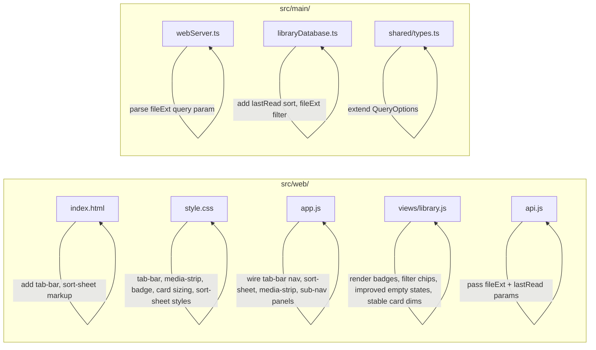

# Design Document: Web Library Mobile UX

## Overview

This design transforms the CB8 web library's mobile experience from a sidebar-driven navigation model to a modern tab-bar + filter-strip pattern, while enlarging cards, adding progress/format badges, and improving empty states. All changes are scoped to the existing vanilla JS/CSS/HTML stack in `src/web/` with minimal server-side additions. Desktop layout (> 640px) remains untouched.

### Key Design Decisions

1. **CSS-only visibility toggling** — The tab bar, media strip, and sort sheet are rendered in the DOM at all times but shown/hidden via the existing 640px media query. This avoids JS-based resize listeners and keeps the approach consistent with the current codebase.
2. **No new files** — All changes fit within the existing `index.html`, `style.css`, `app.js`, `views/library.js`, and `api.js`. No build step is introduced.
3. **Server-side `fileExt` filter and `lastRead` sort** — Two small additions to `QueryOptions`, `SORT_COLUMN_MAP`, and `parseQueryOptions` in `webServer.ts` / `libraryDatabase.ts` enable file-type filtering and recently-read sorting without new endpoints.
4. **Progressive enhancement** — Badges, filter chips, and the sort sheet degrade gracefully: if `fileExt` or `lastRead` data is missing, the UI simply omits the badge or sorts items to the end.

### Scope Boundary

- Only `src/web/*` (client) and `src/main/webServer.ts` + `src/main/libraryDatabase.ts` (server) are modified.
- The Electron renderer (`src/renderer/`) is not affected.
- No new npm dependencies are added.

## Architecture

The existing architecture is a vanilla-JS SPA with hash-based routing (`app.js`), a thin API client (`api.js`), two view modules (`views/library.js`, `views/reader.js`), and a single stylesheet (`style.css`). The server is a Node.js HTTP server (`webServer.ts`) backed by a SQLite database (`libraryDatabase.ts`).

### Current Mobile Flow

```
┌──────────────────────────┐
│  Navbar (search, sort,   │
│  media toggle, hamburger)│
├──────────────────────────┤
│  Sidebar (hidden, opens  │
│  as overlay via ☰)       │
├──────────────────────────┤
│  Card Grid (130px cards) │
│  scrolls vertically      │
└──────────────────────────┘
```

### Proposed Mobile Flow

```
┌──────────────────────────┐
│  Navbar (search + sort   │  ← sticky, compact
│  button only on mobile)  │
├──────────────────────────┤
│  Media Strip (All/Comics/│  ← new, inline pills
│  Books) + File-Type Chips│
├──────────────────────────┤
│  Card Grid (150px cards, │  ← larger, with badges
│  progress + format)      │
├──────────────────────────┤
│  Tab Bar (All, Recent,   │  ← new, fixed bottom
│  Collections, Folders,   │
│  Tags)                   │
└──────────────────────────┘
```

### Change Map



## Components and Interfaces

### 1. Tab Bar (`index.html` + `style.css` + `app.js`)

A `<nav id="tab-bar">` element appended as the last child of `#app`, containing five `<button>` elements. Each button stores a `data-tab` attribute (`all`, `recent`, `collections`, `folders`, `tags`).

**Behaviour (wired in `app.js`):**
- `all` → `window.location.hash = '#/'`
- `recent` → `window.location.hash = '#/recent'`
- `collections` / `folders` / `tags` → opens a sub-navigation panel (see §2)

**Visibility:**
- Shown only at ≤ 640px via CSS media query.
- Hidden when `#reader-overlay` is not `.hidden` (toggled by `app.js` during `navigate()`).

**Active state:**
- `app.js` `navigate()` calls a new `updateTabBarActive(route)` function that sets `.active` on the matching tab button.

### 2. Sub-Navigation Panels (`app.js`)

When the user taps Collections, Folders, or Tags in the tab bar, a panel slides up from the bottom (or replaces the main content area) showing a scrollable list of items. Each item is an `<a>` linking to the appropriate hash route.

**Implementation:**
- A single `<div id="tab-panel">` element in `index.html`, positioned above the tab bar, hidden by default.
- `app.js` populates it dynamically from the already-fetched sidebar data (libraries, folders, tags arrays cached from `populateSidebar()`).
- Tapping an item navigates to the route and closes the panel.
- If the list is empty, a short message is shown (e.g., "No collections").

### 3. Media Strip (`views/library.js` + `style.css`)

A `<div class="media-strip">` rendered by `renderLibrary()` between the library header and the grid. Contains three pill buttons: All, Comics, Books.

**Behaviour:**
- Tapping a pill updates `state.mediaType` and re-renders the library.
- The active pill gets the `.active` class (accent colour highlight).

**Visibility:**
- Rendered only at ≤ 640px. On desktop, the existing navbar media-toggle buttons remain.
- The navbar `.media-toggle` group is hidden at ≤ 640px via CSS.

### 4. File-Type Filter Chips (`views/library.js` + `style.css`)

A `<div class="filetype-strip">` rendered below the media strip, containing horizontally scrollable pill buttons: All, EPUB, PDF, CBZ, CBR, MOBI.

**Behaviour:**
- Tapping a chip sets a `fileExt` filter parameter and re-fetches the grid.
- Independent of the media-type filter — both can be active simultaneously.
- The active chip gets the `.active` class.

**API integration:**
- `api.js` passes `fileExt` as a query parameter to `/api/comics`.
- `webServer.ts` `parseQueryOptions()` reads `query.fileExt` and adds it to `QueryOptions`.
- `libraryDatabase.ts` `queryComics()` adds a `WHERE` clause: `LOWER(SUBSTR(c.file_path, -N)) = ?` matching the extension.

### 5. Sort Control (`app.js` + `style.css`)

**Mobile (≤ 640px):**
- A sort button (icon + current sort label) is rendered in the navbar or library header.
- Tapping it opens a `<div id="sort-sheet">` — a bottom-sheet overlay listing: Title, Date added, File size, Pages, Recently Read.
- Selecting an option updates `state.sortBy`, closes the sheet, and re-renders.

**Desktop (> 640px):**
- The existing `<select id="sort-select">` gains a new `<option value="lastRead">Recently Read</option>`.

**API integration:**
- `sortBy=lastRead` is passed to the server.
- `SORT_COLUMN_MAP` gains: `lastRead: 'c.last_read'`.
- `QueryOptions.sortBy` type is extended to include `'lastRead'`.
- Items with `NULL` `last_read` sort to the end (SQLite `NULLS LAST` or `COALESCE` trick).

### 6. Card Enhancements (`views/library.js` + `style.css`)

#### 6a. Larger Cards
- CSS variable `--card-w` changes from `130px` to `150px` at ≤ 640px.

#### 6b. Format Badge
- Replaces the current `card-badge` ("Comic" / "Book") with the uppercase `fileExt` value (e.g., "EPUB", "CBZ").
- Styling: book formats (epub, pdf, mobi) get a blue-tinted colour; comic formats (cbz, cbr) keep the default muted colour.

#### 6c. Progress Badge
- A new `<div class="progress-badge">` overlaid on the thumbnail.
- For comics/PDFs: shows `${Math.round(lastPage / pageCount * 100)}%` when `lastPage > 0 && pageCount > 0`.
- For EPUBs: shows "In progress" when `lastLocation` is non-null.
- Positioned bottom-left of the thumbnail, above the progress bar.

#### 6d. Stable Dimensions
- The existing `aspect-ratio: 2 / 3` on `.card-thumb-wrap` already reserves space. Verify it is set and the image fades in (the existing `.loading` class sets `opacity: 0`).
- Add a neutral background colour (`var(--surface)`) to `.card-thumb-wrap` as a placeholder.

#### 6e. Thumbnail Error Placeholder
- On `img.onerror`, instead of just reducing opacity, replace the `src` with an inline SVG data URI showing a book icon.

### 7. Improved Empty States (`views/library.js`)

Replace the single generic empty state with context-specific variants:

| Condition | Icon | Message |
|-----------|------|---------|
| Server unreachable | Cloud-off | "Cannot reach the server. Check your connection." |
| Search/filter no results | Search | "No items match your search or filters." |
| Recently Read empty | Clock | "Nothing read yet. Open a book or comic to get started." |
| Thumbnail load failure | Image-off | (placeholder graphic in card, not a full empty state) |

The `renderEmpty()` function in `library.js` accepts a `reason` parameter to select the appropriate variant.

### 8. Sticky Navbar (`style.css`)

At ≤ 640px:
- `#navbar` gets `position: fixed; top: 0; left: 0; right: 0; z-index: 100;`.
- `#main-content` gets `padding-top: var(--nav-h)` to prevent overlap with the first row of cards.
- Navbar height is kept compact (existing 52px is fine).

### 9. Search Accessibility

The search input already has `aria-label="Search library"` and `type="search"`. At ≤ 640px, the search input continues to be displayed in the navbar. The `nav-search-wrap` flex grows to fill available space after the brand and sort button.

## Data Models

### Extended `QueryOptions` (shared/types.ts)

```typescript
export interface QueryOptions {
  search?: string;
  tag?: string;
  sortBy?: 'title' | 'dateAdded' | 'fileSize' | 'pageCount' | 'lastRead';
  sortOrder?: 'asc' | 'desc';
  offset?: number;
  limit?: number;
  excludeFoldered?: boolean;
  mediaType?: 'comic' | 'book';
  fileExt?: string;  // new: filter by file extension (e.g., 'epub', 'cbz')
}
```

### Extended `SORT_COLUMN_MAP` (libraryDatabase.ts)

```typescript
const SORT_COLUMN_MAP: Record<string, string> = {
  title: 'c.title COLLATE NOCASE',
  dateAdded: 'c.date_added',
  fileSize: 'c.file_size',
  pageCount: 'c.page_count',
  lastRead: "COALESCE(c.last_read, '0')",  // NULLs sort to end in DESC
};
```

### Extended `parseQueryOptions` (webServer.ts)

```typescript
if (query.fileExt) options.fileExt = query.fileExt.toLowerCase();
```

### Extended `queryComics` WHERE clause (libraryDatabase.ts)

```typescript
if (options.fileExt) {
  const ext = '.' + options.fileExt;
  conditions.push("LOWER(SUBSTR(c.file_path, ?)) = ?");
  params.push(-ext.length, ext);
}
```

### `WebComicRecord` (webServer.ts) — unchanged

The existing `WebComicRecord` already exposes `fileExt`, `lastPage`, `pageCount`, `lastLocation`, and `lastRead`, which is everything the client needs for badges and sorting.

### Client-Side State (app.js)

```javascript
const state = {
  mediaType: '',       // '' | 'comic' | 'book'
  sortBy: 'title',
  search: '',
  fileExt: '',         // new: '' | 'epub' | 'pdf' | 'cbz' | 'cbr' | 'mobi'
  route: null,
  tabPanel: null,      // new: null | 'collections' | 'folders' | 'tags'
};
```


### 10. Headless Server Mode (`src/main/index.ts`)

CB8 gains a headless mode that runs the embedded HTTP web server without creating an Electron BrowserWindow, enabling deployment on servers, NAS devices, and headless machines.

#### Headless Detection

A new `isHeadless` constant is computed at the top of `src/main/index.ts`, before `app.on('ready', ...)`:

```typescript
const isHeadless =
  process.argv.includes('--headless') ||
  process.env.CB8_HEADLESS === '1';
```

Both `process.argv` and `process.env` are checked so the user can choose whichever is more convenient for their deployment (CLI flag for manual use, environment variable for systemd/Docker).

#### Startup Flow (headless path)

Inside the `app.on('ready', ...)` handler, the existing `createWindow()` call is wrapped in a conditional. When `isHeadless` is true, a new `startHeadless()` function runs instead:

```typescript
app.on('ready', () => {
  if (isHeadless) {
    startHeadless();
  } else {
    createWindow();
  }
});
```

`startHeadless()` performs the following steps in order:

1. **Hide dock icon on macOS**: `app.dock?.hide()` — prevents a bouncing icon in the macOS dock when there is no window.
2. **Initialize database**: Same `LibraryDatabase` constructor and `db.initialize()` call as `createWindow()`, using the standard `app.getPath('userData')` path.
3. **Register IPC handlers**: `registerIpcHandlers(db, webServerRef)` — the web server's API routes call into `LibraryDatabase` directly (not through IPC), but `registerIpcHandlers` also wires up the web server auto-start logic and settings persistence, so it is still called. The `onRecentFilesChanged` callback is omitted (no menu to refresh).
4. **Force-start the web server**: Regardless of the stored `web_server_enabled` setting, call `startWebServer(db, port)` directly. The port is read from the stored `web_server_port` app_meta key (falling back to 8008). This ensures the server always starts in headless mode.
5. **Console output**: The existing `startWebServer()` already logs `[CB8] Web UI: http://localhost:<port>` and `[CB8] LAN: http://<lan-ip>:<port>` via its `server.listen` callback. No additional logging is needed.

```typescript
function startHeadless(): void {
  if (process.platform === 'darwin') {
    app.dock?.hide();
  }

  try {
    const userDataPath = app.getPath('userData');
    const dbPath = path.join(userDataPath, 'library.db');
    db = new LibraryDatabase(dbPath);
    db.initialize();
    registerIpcHandlers(db, webServerRef);
  } catch (err) {
    console.error('[CB8] Failed to initialize database or IPC:', err);
    process.exit(1);
  }

  const rawPort = db!.getAppMeta('web_server_port');
  const port = rawPort ? parseInt(rawPort, 10) : 8008;
  const safePort = isNaN(port) ? 8008 : Math.max(1024, Math.min(65535, port));

  try {
    webServerRef.handle = startWebServer(db!, safePort);
  } catch (err) {
    console.error('[CB8] Failed to start web server in headless mode:', err);
    process.exit(1);
  }
}
```

#### `window-all-closed` Behaviour

The existing handler quits the app on non-macOS platforms when all windows close. In headless mode there are never any windows, so Electron fires this event immediately. The handler is updated to be a no-op in headless mode:

```typescript
app.on('window-all-closed', () => {
  if (isHeadless) return; // keep process alive — serving HTTP
  if (process.platform !== 'darwin') {
    app.quit();
  }
});
```

#### Graceful Shutdown

The existing `app.on('before-quit', ...)` handler already closes archive handles and the web server. For headless mode, SIGINT and SIGTERM are additionally handled to trigger `app.quit()`:

```typescript
if (isHeadless) {
  const shutdown = () => {
    console.log('[CB8] Shutting down headless server...');
    app.quit();
  };
  process.on('SIGINT', shutdown);
  process.on('SIGTERM', shutdown);
}
```

This ensures `before-quit` fires, which closes the HTTP server and archive handles.

#### Unchanged Modules

- **`webServer.ts`**: No changes. `startWebServer()` accepts a `LibraryDatabase` and port — it does not depend on `BrowserWindow`.
- **`libraryDatabase.ts`**: No changes. The database is a standalone SQLite wrapper with no Electron GUI dependencies.
- **`ipcHandlers.ts`**: No changes. IPC handlers that reference `BrowserWindow.fromWebContents()` will simply get `null` when there is no window, which is already handled (the web server uses direct `db` calls, not IPC).

#### Design Decisions

1. **`process.argv` over `app.commandLine`**: `process.argv` is simpler and works identically. `app.commandLine` is Chromium's switch parser and would require `--headless` to be passed as `--headless=true` or similar — less ergonomic.
2. **Force-start web server**: In headless mode the web server is the entire point, so the stored `web_server_enabled` preference is bypassed. The stored port is still respected.
3. **`process.exit(1)` on init failure**: In headless mode there is no GUI to show an error dialog, so a non-zero exit code is the appropriate signal to the process supervisor (systemd, Docker, etc.).
4. **No new files**: All changes fit within `src/main/index.ts`. The web server and database modules are reused as-is.

## Correctness Properties

*A property is a characteristic or behavior that should hold true across all valid executions of a system — essentially, a formal statement about what the system should do. Properties serve as the bridge between human-readable specifications and machine-verifiable correctness guarantees.*

The testable properties in this feature centre on the server-side query logic (filter composition, sort ordering) and the pure client-side badge computation functions. Most of the 14 requirements are CSS/layout or UI-interaction concerns that are best covered by example-based tests; the properties below capture the universal invariants.

### Property 1: Filter Composition — mediaType and fileExt

*For any* combination of `mediaType` (one of `''`, `'comic'`, `'book'`) and `fileExt` (one of `''`, `'epub'`, `'pdf'`, `'cbz'`, `'cbr'`, `'mobi'`), and *for any* set of comic records in the database, the records returned by `queryComics({ mediaType, fileExt })` SHALL satisfy both filters simultaneously: every returned record's `mediaType` matches the filter (when non-empty) AND every returned record's file path ends with `.{fileExt}` (when non-empty).

**Validates: Requirements 8.2, 8.3, 8.5**

### Property 2: Progress Badge Percentage Computation

*For any* `lastPage` in `[1, pageCount]` and *for any* `pageCount` in `[1, 100000]`, the progress badge text SHALL equal `Math.round(lastPage / pageCount * 100) + '%'`. When `lastPage` is `0` or `null`, or `pageCount` is `0` or `null`, no badge SHALL be produced.

**Validates: Requirements 9.1, 9.3**

### Property 3: Format Badge Text and Style Class

*For any* `fileExt` string from the set `{'epub', 'pdf', 'mobi', 'cbz', 'cbr'}`, the format badge text SHALL equal `fileExt.toUpperCase()`, AND the badge SHALL receive the `'book'` style class if `fileExt` is one of `{'epub', 'pdf', 'mobi'}` and the default (comic) style class if `fileExt` is one of `{'cbz', 'cbr'}`.

**Validates: Requirements 10.1, 10.3**

### Property 4: lastRead Sort Ordering

*For any* set of comic records with varying `lastRead` timestamps (including `null`), when sorted by `sortBy='lastRead'` with `sortOrder='desc'`, the returned records SHALL be ordered such that: (a) all records with a non-null `lastRead` appear before all records with a null `lastRead`, and (b) among records with non-null `lastRead`, they are ordered by `lastRead` descending (most recent first).

**Validates: Requirements 14.2, 14.3, 14.4**

## Error Handling

### Client-Side Errors

| Error | Handling |
|-------|----------|
| API fetch failure (network error, 5xx) | `renderLibrary()` catches the error and calls `renderEmpty('offline')`, showing the "Cannot reach the server" empty state. |
| API returns 0 results for search/filter | `renderEmpty('no-results')` is called with the search/filter context message. |
| Thumbnail image fails to load | `img.onerror` replaces `src` with an inline SVG data URI placeholder (book icon on dark background). Existing opacity reduction is replaced. |
| CDN script load failure (reader) | Existing handling in `reader.js` already shows an error message. No change needed. |
| Invalid hash route | Existing `parseRoute()` falls back to `{ type: 'all' }`. No change needed. |

### Server-Side Errors

| Error | Handling |
|-------|----------|
| Invalid `fileExt` query param | Treated as a normal filter — if no records match, an empty result set is returned. No error thrown. |
| Invalid `sortBy` value | Existing `SORT_COLUMN_MAP` fallback to `title` sort handles unknown values. The new `lastRead` key is added to the map. |
| `last_read` column is NULL | `COALESCE(c.last_read, '0')` ensures NULLs sort to the end when sorting descending. |

### Headless Mode Errors

| Error | Handling |
|-------|----------|
| Database initialization failure in headless mode | `startHeadless()` logs the error to stderr and calls `process.exit(1)` so the process supervisor can detect the failure. |
| Web server port already in use in headless mode | `startWebServer()` logs a warning (`EADDRINUSE`). `startHeadless()` catches the error and exits with code 1. |
| SIGINT / SIGTERM received | The `shutdown` handler calls `app.quit()`, which triggers `before-quit` to close the HTTP server and release archive handles before the process exits. |

### Edge Cases

- **fileExt filter with mediaType filter**: Both filters are AND-composed in the SQL WHERE clause. If a user selects mediaType=comic and fileExt=epub, zero results are returned (correct behaviour — EPUBs are books, not comics).
- **Progress badge for items at 0%**: `lastPage = 0` means "never opened" — no badge is shown. `lastPage = 1` on a 100-page item shows "1%".
- **Format badge for unknown extensions**: If `fileExt` is empty or unrecognised, the badge falls back to the existing "Comic"/"Book" label.
- **Headless mode with `--headless` and `CB8_HEADLESS=1` both set**: Both are checked with OR logic; setting both is harmless and equivalent to setting either one.
- **Headless mode on macOS**: `app.dock?.hide()` is called; the optional chaining handles the case where `dock` is undefined (non-macOS platforms).
- **`window-all-closed` in headless mode**: The handler returns early, preventing Electron from quitting the process. The process stays alive until SIGINT/SIGTERM.

## Testing Strategy

### Unit Tests (Example-Based)

Most requirements (1–7, 11–13) are CSS/layout and UI-interaction concerns. These are best tested with:

- **DOM snapshot tests**: Render components with JSDOM and assert element presence, class names, and attributes.
- **CSS rule verification**: Check computed styles at specific viewport widths (requires a browser-like environment or manual verification).
- **Event handler tests**: Simulate clicks on tab bar buttons, media strip pills, sort sheet options, and verify state changes and hash navigation.

Key example tests:
1. Tab bar renders 5 tabs with correct labels and data-tab attributes.
2. Tapping each tab navigates to the correct hash route.
3. Sub-navigation panel shows collections/folders/tags lists from API data.
4. Empty sub-navigation panel shows "No collections" / "No folders" / "No tags" message.
5. Media strip renders 3 pills; tapping one updates `state.mediaType`.
6. File-type chip strip renders 6 chips; tapping one updates `state.fileExt`.
7. Sort sheet lists 5 options including "Recently Read".
8. Empty state variants show correct icon and message for each reason.
9. Card thumbnail error handler replaces src with placeholder SVG.
10. Format badge shows "EPUB" not "Book" for an epub record.

### Property-Based Tests

Property-based testing applies to the four properties identified above. These test pure logic that varies meaningfully with input.

**Library**: [fast-check](https://github.com/dubzzz/fast-check) (already available in the Node.js/Vitest ecosystem used by this project).

**Configuration**: Minimum 100 iterations per property test.

**Tag format**: Each test is tagged with a comment referencing the design property:
```
// Feature: web-library-mobile-ux, Property {N}: {title}
```

**Property test plan:**

1. **Filter Composition** (Property 1): Generate random arrays of comic record objects with random `mediaType` and `filePath` (ending in random extensions). Apply `queryComics`-equivalent filter logic. Assert all returned records match both the `mediaType` and `fileExt` filters.

2. **Progress Badge Computation** (Property 2): Generate random `lastPage` ∈ [0, pageCount] and `pageCount` ∈ [1, 100000]. Call the badge computation function. Assert the output matches `Math.round(lastPage / pageCount * 100) + '%'` when lastPage > 0, and is null/undefined when lastPage is 0 or null.

3. **Format Badge Text and Style** (Property 3): Generate random `fileExt` from the valid set. Call the badge rendering logic. Assert text equals `fileExt.toUpperCase()` and class is `'book'` for epub/pdf/mobi, default otherwise.

4. **lastRead Sort Ordering** (Property 4): Generate random arrays of records with random `lastRead` timestamps (some null). Sort using the `COALESCE(last_read, '0')` logic. Assert non-null records come before null records, and non-null records are in descending timestamp order.

### Integration Tests

- Verify the full request cycle: client sends `?fileExt=epub&mediaType=book&sortBy=lastRead`, server returns correctly filtered and sorted results.
- Verify the `lastRead` sort option appears in the `<select>` on desktop and in the sort sheet on mobile.

### Headless Mode Tests (Example-Based)

Headless mode is best tested with example-based integration tests rather than property-based tests, since the behaviour is deterministic (flag on/off) and tests Electron lifecycle wiring rather than input-varying logic.

Key example tests:
1. When `process.argv` includes `--headless`, `isHeadless` is `true`.
2. When `process.env.CB8_HEADLESS` is `'1'`, `isHeadless` is `true`.
3. When neither flag nor env var is set, `isHeadless` is `false`.
4. In headless mode, `createWindow()` is not called (no `BrowserWindow` created).
5. In headless mode, the web server starts regardless of the stored `web_server_enabled` setting.
6. In headless mode, `window-all-closed` does not quit the app.
7. In headless mode on macOS, `app.dock.hide()` is called.

### Manual / Visual Testing

- Verify CSS breakpoint behaviour at 640px boundary (tab bar appears/disappears, sidebar toggles).
- Verify card grid visual stability during thumbnail loading (no CLS).
- Verify badge positioning does not obscure card title.
- Verify sticky navbar does not overlap first card row.
- Verify desktop layout is unchanged (no regression).
