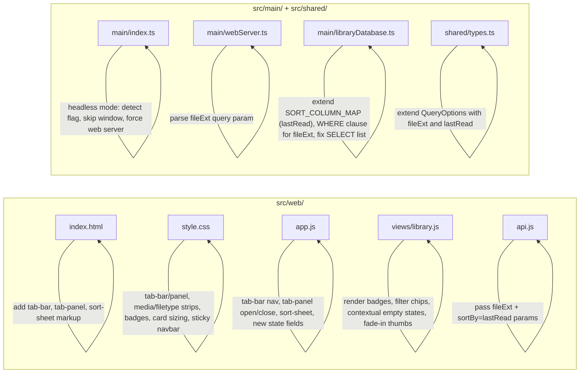

# Design Document: Web Library Mobile UX

## Overview

This design transforms the CB8 web library's mobile experience from a sidebar-driven model to a bottom tab-bar + filter-strip pattern, while enlarging cards, adding progress/format badges, improving empty states, adding a "Recently Read" sort, and introducing a headless server mode so CB8 can run on a NAS or server without the Electron GUI. All client changes fit within the existing vanilla JS/HTML/CSS stack in `src/web/`; server-side changes are localized to three files. Desktop layout (> 640px) is unchanged except for a single new sort option.

### Key Design Decisions

1. **CSS-only visibility toggling.** The Tab_Bar, Tab_Panel host, Media_Strip, File_Type_Strip, Sort_Sheet, and their desktop counterparts are all rendered into the DOM once; the 640px media query in `style.css` toggles which are displayed. No JS resize listeners.
2. **No new client files.** All client changes fit within `src/web/index.html`, `src/web/style.css`, `src/web/app.js`, `src/web/views/library.js`, and `src/web/api.js`.
3. **Minimal server changes.** `fileExt` filtering and `lastRead` sorting are added by editing `src/shared/types.ts` (extend `QueryOptions`), `src/main/webServer.ts` (parse new query param), and `src/main/libraryDatabase.ts` (extend `SORT_COLUMN_MAP` and `queryComics`/`queryComicsByLibrary`/`getFolderComics` WHERE clauses). No new files, no new dependencies.
4. **Headless mode** lives in `src/main/index.ts` as a pre-ready check; it reuses `startWebServer` and `LibraryDatabase` unchanged.
5. **Progressive enhancement.** Badges and filter chips degrade gracefully: if `fileExt`, `lastPage`, or `lastLocation` is missing, the badge is simply not rendered.

### Scope Boundary

- **Modified files:** `src/web/index.html`, `src/web/style.css`, `src/web/app.js`, `src/web/views/library.js`, `src/web/api.js`, `src/main/index.ts`, `src/main/webServer.ts`, `src/main/libraryDatabase.ts`, `src/shared/types.ts`.
- **Unchanged:** `src/renderer/` (Electron renderer), `src/main/ipcHandlers.ts`, all other server modules.
- **No new npm dependencies, no new build step, no new runtime files.**

### Incidental Fix

`queryComicsByLibrary` in `libraryDatabase.ts` omits `c.last_location` from its SELECT list (present in `queryComics` and `getFolderComics`), causing `lastLocation` to always appear as `null` for records fetched under `#/library/:id`. Since Requirement 9.2 depends on `lastLocation` for EPUB progress badges, add `c.last_location` to that SELECT list as part of this work.

## Architecture

The current architecture is a vanilla-JS SPA with hash-based routing (`app.js`), a thin API client (`api.js`), two view modules (`views/library.js`, `views/reader.js`), and a single stylesheet (`style.css`). The server is a Node.js HTTP server (`webServer.ts`) backed by SQLite via `libraryDatabase.ts`. Headless mode adds no new architectural layer; it simply skips window creation.

### Current Mobile Flow

```
┌──────────────────────────┐
│  Navbar (search, sort,   │
│  media toggle, hamburger)│
├──────────────────────────┤
│  Sidebar (hidden, opens  │
│  as overlay via ☰)       │
├──────────────────────────┤
│  Card Grid (130px cards) │
│  scrolls vertically      │
└──────────────────────────┘
```

### Proposed Mobile Flow

```
┌──────────────────────────┐
│  Navbar (search + sort   │  ← fixed top, compact
│  button only)            │
├──────────────────────────┤
│  Media Strip (All/Comics/│  ← inline pills
│  Books)                  │
│  File-Type Strip (chips) │  ← inline pills
├──────────────────────────┤
│  Card Grid (150px cards, │  ← larger, with badges
│  progress + format)      │
├──────────────────────────┤
│  Tab Bar (All, Recent,   │  ← fixed bottom
│  Collections, Folders,   │
│  Tags)                   │
└──────────────────────────┘
```

### Change Map



## Components and Interfaces

### 1. Tab Bar (`index.html` + `style.css` + `app.js`)

A `<nav id="tab-bar">` element appended as the last child of `#app`, containing five `<button>` elements with `data-tab` values: `all`, `recent`, `collections`, `folders`, `tags`.

**Markup sketch:**
```html
<nav id="tab-bar" aria-label="Primary">
  <button data-tab="all"         aria-label="All">…</button>
  <button data-tab="recent"      aria-label="Recent">…</button>
  <button data-tab="collections" aria-label="Collections">…</button>
  <button data-tab="folders"     aria-label="Folders">…</button>
  <button data-tab="tags"        aria-label="Tags">…</button>
</nav>
```

Each button contains an inline SVG icon and a small text label below it.

**Behaviour (wired in `app.js`):**
- `all` → `window.location.hash = '#/'`
- `recent` → `window.location.hash = '#/recent'`
- `collections` / `folders` / `tags` → call `openTabPanel('collections' | 'folders' | 'tags')` (see §2) without changing the hash. Tapping the same tab again while its panel is open calls `closeTabPanel()`.

**Visibility:**
- Hidden by default; shown at `@media (max-width: 640px)`.
- Additionally hidden when the reader overlay is open: `#reader-overlay:not(.hidden) ~ #tab-bar { display: none; }` — or toggled via a class on `<body>` set inside `navigate()`.

**Active state:**
- `updateTabBarActive(route, tabPanel)` is called from `navigate()` and whenever the Tab_Panel opens or closes. It clears `.active` on all tab buttons and sets it on the one matching the current route (All/Recent) or the open panel (Collections/Folders/Tags).

**CSS sizing:**
- New CSS var `--tab-bar-h: 56px`.
- `#main-content` receives `padding-bottom: var(--tab-bar-h)` on mobile so the last row of cards is not hidden behind the Tab_Bar.

### 2. Tab Panel (`index.html` + `style.css` + `app.js`)

A single `<div id="tab-panel" hidden>` element in `index.html`, positioned as a fixed overlay between `#main-content` (bottom-padded by `--tab-bar-h`) and the Tab_Bar. Only one Tab_Panel content set is visible at a time; `openTabPanel(kind)` repopulates the same container.

**Structure:**
```html
<div id="tab-panel" hidden role="dialog" aria-modal="false">
  <header class="tab-panel-header">
    <h2></h2>
    <button class="tab-panel-close" aria-label="Close">✕</button>
  </header>
  <ul class="tab-panel-list"></ul>
</div>
```

**Implementation:**
- `app.js` caches `libraries`, `folders`, and `tags` arrays in module scope when `populateSidebar()` fetches them.
- `openTabPanel('collections' | 'folders' | 'tags')` sets the header title ("Collections" / "Folders" / "Tags"), repopulates `.tab-panel-list` from the cached array, unsets the `hidden` attribute, and updates the Tab_Bar's active state.
- Each `<li>` contains an `<a>` whose click handler calls `closeTabPanel()` and lets the hash-change fire naturally (browser default).
- `closeTabPanel()` sets the `hidden` attribute again and updates the Tab_Bar.
- If the cached array is empty, render a single `<li class="tab-panel-empty">` with "No collections" / "No folders" / "No tags".
- Tapping the currently-active Collections/Folders/Tags tab button while its panel is open calls `closeTabPanel()`.

**Visibility:**
- Mobile-only (hidden via media query on desktop). On desktop the sidebar handles this navigation.
- `z-index` above `#main-content` but below the Tab_Bar (so the Tab_Bar stays tappable).

### 3. Media Strip (`views/library.js` + `style.css`)

A `<div class="media-strip" role="group" aria-label="Media type">` rendered by `renderLibrary()` between the `.library-header` and the `.comics-grid`, containing three pill `<button>`s: All, Comics, Books.

**Behaviour:**
- Tapping a pill updates `state.mediaType` and calls `navigate()` to re-query.
- The active pill gets `.active`.
- State is shared with the desktop `.media-toggle` buttons — `state.mediaType` is the single source of truth, and both UIs reflect it.

**Visibility:**
- Rendered into the DOM whenever the library view renders.
- Shown only at `max-width: 640px` via CSS (`display: none` above the breakpoint).
- At the same breakpoint, `.nav-actions > .media-toggle { display: none; }` hides the desktop toggle.

### 4. File-Type Filter Strip (`views/library.js` + `style.css`)

A `<div class="filetype-strip" role="group" aria-label="File type">` rendered below the Media_Strip, containing six horizontally scrollable pill `<button>`s with `data-ext` values `''`, `epub`, `pdf`, `cbz`, `cbr`, `mobi`.

**Behaviour:**
- Tapping a chip sets `state.fileExt` and calls `navigate()` to re-query.
- The active chip gets `.active`.
- Composes with `state.mediaType` — both filters are AND-ed server-side.

**API integration:**
- `api.js` passes `fileExt` in the query string when non-empty.
- `webServer.ts` `parseQueryOptions()` reads `query.fileExt` and lowercases it into `QueryOptions.fileExt`.
- `libraryDatabase.ts` `queryComics`, `queryComicsByLibrary`, and `getFolderComics` append the WHERE clause:
  ```
  LOWER(c.file_path) LIKE ?    -- param: '%.epub'
  ```

**Visibility:**
- Shown only at `max-width: 640px` via CSS.

### 5. Sort Control (`index.html` + `style.css` + `app.js`)

**Desktop (> 640px):**
- The existing `<select id="sort-select">` gains a new `<option value="lastRead">Recently Read</option>`. No layout changes.

**Mobile (≤ 640px):**
- The `<select id="sort-select">` is hidden via CSS.
- A new `<button id="sort-button">` is rendered adjacent to it in the Navbar with a sort-icon SVG and a `<span class="sort-button-label">` showing the label of the currently active option.
- Tapping `#sort-button` unsets the `hidden` attribute on `<div id="sort-sheet">`, a bottom-sheet overlay listing the five options as tappable rows.
- Selecting an option updates `state.sortBy`, updates `#sort-select.value` (so desktop/mobile stay in sync), updates `.sort-button-label`, closes the sheet, and calls `navigate()`.
- Tapping the sheet's backdrop or its close button calls `closeSortSheet()` without changing the sort.

**Sort_Sheet markup:**
```html
<div id="sort-sheet" hidden role="dialog" aria-modal="true" aria-label="Sort by">
  <div class="sort-sheet-backdrop"></div>
  <div class="sort-sheet-panel">
    <button data-sort="title">Title</button>
    <button data-sort="dateAdded">Date added</button>
    <button data-sort="fileSize">File size</button>
    <button data-sort="pageCount">Pages</button>
    <button data-sort="lastRead">Recently Read</button>
  </div>
</div>
```

**API integration:**
- `sortBy=lastRead` is sent to the server.
- `SORT_COLUMN_MAP` gains `lastRead: "COALESCE(c.last_read, '')"`. The empty-string fallback ensures NULL `last_read` rows sort before any real datetime string when ascending (and after, when descending) — satisfying Requirement 13.3 and 13.4.
- `QueryOptions.sortBy` type is extended to include `'lastRead'`.

### 6. Card Enhancements (`views/library.js` + `style.css`)

#### 6a. Larger Cards

- Root `--card-w` stays at `160px`; the mobile media-query override changes from `130px` to `150px`.
- Mobile `.comics-grid` gap bumps from `10px` to `12px`, horizontal padding from `12px` to `10px` (per Requirement 4.4 minimum).

#### 6b. Format Badge (replaces current `.card-badge`)

- In `createCard(record)`, compute:
  ```js
  const ext = (record.fileExt || '').toLowerCase();
  const isBook = ext === 'epub' || ext === 'pdf' || ext === 'mobi';
  const label = ext ? ext.toUpperCase()
                    : (record.mediaType === 'book' ? 'Book' : 'Comic');
  ```
- Render a single `<div class="card-badge ${isBook || record.mediaType === 'book' ? 'book' : ''}">` with `textContent = label`. No additional badge.
- Keep the existing top-right absolute positioning.

#### 6c. Progress Badge (new element)

- Render iff the record has reading progress:
  ```js
  let progressLabel = null;
  if (record.pageCount > 0 && record.lastPage != null && record.lastPage > 0) {
    const pct = Math.max(1, Math.min(100, Math.round(record.lastPage / record.pageCount * 100)));
    progressLabel = pct + '%';
  } else if (record.lastLocation) {
    progressLabel = 'In progress';
  }
  ```
- When `progressLabel` is non-null, append `<div class="progress-badge">${progressLabel}</div>` to `.card-thumb-wrap`.
- CSS positions the badge at `position: absolute; bottom: 6px; left: 6px;` (above the 3px `.progress-bar`) so it does not overlap the Format_Badge (top-right) or the card title (below the thumb wrap).

#### 6d. Stable Dimensions

- The existing `.card-thumb-wrap { aspect-ratio: 2 / 3; background: var(--surface); overflow: hidden; }` already reserves space and provides a placeholder — keep it in place.
- The existing `.card-thumb.loading { opacity: 0; }` with `transition: opacity 0.2s;` and the `load` event handler that removes `.loading` provide the fade-in — keep it in place. No extra code required for Requirement 12.3.

#### 6e. Thumbnail Error Placeholder

- Replace the current `img.addEventListener('error', …)` (which sets `opacity: 0.15`) with:
  ```js
  img.addEventListener('error', () => {
    img.classList.remove('loading');
    img.src = PLACEHOLDER_BOOK_SVG_DATA_URI;
  });
  ```
- `PLACEHOLDER_BOOK_SVG_DATA_URI` is a module-level constant in `views/library.js`: `'data:image/svg+xml;utf8,...'` containing a simple book icon on a muted background.

### 7. Improved Empty States (`views/library.js`)

Replace the single generic `renderEmpty()` with `renderEmpty(reason)`:

| `reason`       | Icon (inline SVG) | Message                                                    | Trigger                                                                                   |
|----------------|-------------------|------------------------------------------------------------|-------------------------------------------------------------------------------------------|
| `'offline'`    | Cloud-off         | "Cannot reach the server. Check your connection."          | API rejection or non-2xx during initial page load of the current view.                    |
| `'no-results'` | Search            | "No items match your search or filters."                   | Zero records AND any of `state.search`, `state.mediaType`, `state.fileExt`, or tag route. |
| `'no-recent'`  | Clock             | "Nothing read yet. Open a book or comic to get started."   | Recent view (`route.type === 'recent'`) returns zero records AND no filter active.        |
| `'empty'`      | Book              | "No items found."                                          | Any other view returns zero records AND no filter active.                                 |

The trigger classification happens in `loadNextPage()`'s error and empty-result branches. On error, `renderEmpty('offline')`; on empty result with filters active, `renderEmpty('no-results')`; else the route-dependent fallback.

Each empty state is rendered inside the `.comics-grid` container (grid cleared first) so it sits where the cards would go and does not shift layout.

### 8. Sticky Navbar (`style.css`)

Add at `@media (max-width: 640px)`:

```css
#navbar  { position: fixed; top: 0; left: 0; right: 0; z-index: 100; }
#layout  { padding-top: var(--nav-h); }
#main-content { padding-bottom: calc(var(--tab-bar-h) + env(safe-area-inset-bottom, 0px)); }
```

- `--nav-h` is the existing 52px.
- `--tab-bar-h` is the new 56px token.
- The `env(safe-area-inset-bottom)` allowance keeps the last row reachable on iOS Safari.
- `#layout` already has `display: flex; flex: 1; min-height: 0; overflow: hidden;` — the `padding-top` shifts its flex children below the fixed Navbar. On mobile, sidebar is hidden, so `#main-content` takes the full width.

### 9. Search Accessibility

The existing `.nav-search-wrap` has `flex: 1; min-width: 0; max-width: 400px;`. On mobile we remove the `max-width` to let search fill all available horizontal space after the brand and sort button:

```css
@media (max-width: 640px) {
  .nav-search-wrap { max-width: none; }
}
```

No JS change.

### 10. Headless Server Mode (`src/main/index.ts`)

Headless mode runs CB8's embedded HTTP web server without creating an Electron `BrowserWindow`.

#### Detection

A module-level constant computed before `app.on('ready', …)`:

```ts
const isHeadless =
  process.argv.includes('--headless') ||
  process.env.CB8_HEADLESS === '1';
```

Both sources are checked so the user can choose whichever fits their deployment (CLI flag for manual use, env var for systemd/Docker).

#### Startup Flow

```ts
app.on('ready', () => {
  if (isHeadless) {
    startHeadless();
  } else {
    createWindow();
  }
});

function startHeadless(): void {
  if (process.platform === 'darwin') {
    app.dock?.hide();
  }

  try {
    const userDataPath = app.getPath('userData');
    const dbPath = path.join(userDataPath, 'library.db');
    db = new LibraryDatabase(dbPath);
    db.initialize();
    // No onRecentFilesChanged callback — there is no menu in headless mode.
    registerIpcHandlers(db, webServerRef);
  } catch (err) {
    console.error('[CB8] Failed to initialize database or IPC:', err);
    process.exit(1);
  }

  const rawPort = db!.getAppMeta('web_server_port');
  const parsed = rawPort ? parseInt(rawPort, 10) : NaN;
  const port = Number.isFinite(parsed)
    ? Math.max(1024, Math.min(65535, parsed))
    : 8008;

  try {
    webServerRef.handle = startWebServer(db!, port);
  } catch (err) {
    console.error('[CB8] Failed to start web server in headless mode:', err);
    process.exit(1);
  }
}
```

Notes:
- `registerIpcHandlers` is still called because its auto-start branch is guarded by the stored `web_server_enabled` setting; calling it is harmless in headless mode and keeps the IPC surface available for any future web-settings writes. The subsequent direct `startWebServer` call force-starts the server regardless of the stored preference (Requirement 14.4).
- If `ipcHandlers.ts`'s auto-start branch happens to also start the server, the subsequent direct `startWebServer` call will attempt to bind the same port and `EADDRINUSE` will be logged. To avoid this, check `webServerRef.handle` before calling `startWebServer`:
  ```ts
  if (!webServerRef.handle) webServerRef.handle = startWebServer(db!, port);
  ```
- Console output is already handled by `startWebServer`'s `listen` callback — no extra logging needed.

#### `window-all-closed` Behaviour

```ts
app.on('window-all-closed', () => {
  if (isHeadless) return;                  // keep serving HTTP
  if (process.platform !== 'darwin') app.quit();
});
```

#### Graceful Shutdown

The existing `app.on('before-quit', …)` already closes archive handles and the web server. For headless mode, SIGINT/SIGTERM trigger `app.quit()`:

```ts
if (isHeadless) {
  const shutdown = () => {
    console.log('[CB8] Shutting down headless server…');
    app.quit();
  };
  process.on('SIGINT', shutdown);
  process.on('SIGTERM', shutdown);
}
```

#### Unchanged Modules

- `webServer.ts`: unchanged for headless. Already binds to `0.0.0.0` so LAN access works.
- `libraryDatabase.ts`: unchanged for headless.
- `ipcHandlers.ts`: unchanged. Any IPC handlers that look up `BrowserWindow.fromWebContents(...)` simply never fire in headless mode (no renderer).

#### Design Decisions

1. **`process.argv` over `app.commandLine`** — `process.argv` is simpler and works identically. `app.commandLine` is Chromium's switch parser and would require awkward `--headless=true` syntax.
2. **Force-start the web server** — in headless mode the web server is the entire point of the process, so the stored `web_server_enabled` preference is bypassed. The stored `web_server_port` is still respected (with the same 1024–65535 clamp used elsewhere).
3. **`process.exit(1)` on init failure** — there is no GUI to show an error dialog, so a non-zero exit code signals the process supervisor (systemd, Docker, etc.).
4. **No new files** — all changes fit within `src/main/index.ts`.

## Data Models

### Extended `QueryOptions` (`src/shared/types.ts`)

```ts
export interface QueryOptions {
  search?: string;
  tag?: string;
  sortBy?: 'title' | 'dateAdded' | 'fileSize' | 'pageCount' | 'lastRead';
  sortOrder?: 'asc' | 'desc';
  offset?: number;
  limit?: number;
  excludeFoldered?: boolean;
  mediaType?: 'comic' | 'book';
  fileExt?: string;   // lowercase extension without the dot, e.g. 'epub' | 'pdf' | 'cbz' | 'cbr' | 'mobi'
}
```

### Extended `SORT_COLUMN_MAP` (`libraryDatabase.ts`)

```ts
const SORT_COLUMN_MAP: Record<string, string> = {
  title:     'c.title COLLATE NOCASE',
  dateAdded: 'c.date_added',
  fileSize:  'c.file_size',
  pageCount: 'c.page_count',
  lastRead:  "COALESCE(c.last_read, '')",
};
```

The empty-string default for NULL `last_read` rows makes them sort before any real datetime string (which starts with a digit) when ascending, and after when descending — satisfying Requirement 13.3 and 13.4.

### Extended `parseQueryOptions` (`webServer.ts`)

```ts
if (query.fileExt) {
  options.fileExt = String(query.fileExt).toLowerCase().replace(/^\./, '');
}
```

### Extended WHERE clauses (`libraryDatabase.ts`)

Add to `queryComics`, `queryComicsByLibrary`, and `getFolderComics`:

```ts
if (options.fileExt) {
  conditions.push('LOWER(c.file_path) LIKE ?');
  params.push('%.' + options.fileExt);
}
```

Also fix `queryComicsByLibrary`: add `c.last_location` to its SELECT list (currently omitted — see §Incidental Fix).

### `WebComicRecord` (`webServer.ts`) — unchanged

The existing `WebComicRecord` already exposes `fileExt`, `lastPage`, `pageCount`, `lastLocation`, and `lastRead`, which is everything the client needs.

### Client-Side State (`app.js`)

```js
const state = {
  mediaType: '',       // '' | 'comic' | 'book'
  sortBy:    'title',  // 'title' | 'dateAdded' | 'fileSize' | 'pageCount' | 'lastRead'
  search:    '',
  fileExt:   '',       // '' | 'epub' | 'pdf' | 'cbz' | 'cbr' | 'mobi'
  route:     null,
  tabPanel:  null,     // null | 'collections' | 'folders' | 'tags'
};
```

`state.tabPanel` is the only field that is not persisted to the URL — it is purely a UI state for which mobile sub-nav sheet (if any) is open.

## Correctness Properties

*A property is a characteristic or behavior that should hold true across all valid executions of a system.*

The testable properties centre on the server-side query logic (filter composition, sort ordering) and the pure client-side badge computation functions. Most of the 14 requirements are CSS/layout or UI-interaction concerns best covered by example-based tests; the properties below capture the universal invariants.

### Property 1: Filter Composition — `mediaType` and `fileExt`

*For any* combination of `mediaType` (one of `''`, `'comic'`, `'book'`) and `fileExt` (one of `''`, `'epub'`, `'pdf'`, `'cbz'`, `'cbr'`, `'mobi'`), and *for any* set of comic records in the database, the records returned by `queryComics({ mediaType, fileExt })` SHALL satisfy both filters simultaneously: every returned record's `mediaType` matches the filter (when non-empty) AND every returned record's `file_path` ends with `.{fileExt}` (case-insensitive) when `fileExt` is non-empty.

**Validates: Requirements 8.2, 8.3, 8.4**

### Property 2: Progress Badge Percentage Computation

*For any* `lastPage` in `[1, pageCount]` and *for any* `pageCount` in `[1, 100000]`, the progress badge text SHALL equal `Math.max(1, Math.min(100, Math.round(lastPage / pageCount * 100))) + '%'`. When `lastPage` is `0` or `null`, AND `lastLocation` is `null`, no badge SHALL be produced. When `lastPage` is `0` or `null` AND `lastLocation` is a non-empty string, the badge SHALL be the literal text "In progress".

**Validates: Requirements 9.1, 9.2, 9.3**

### Property 3: Format Badge Text and Style Class

*For any* `fileExt` string from the set `{'epub', 'pdf', 'mobi', 'cbz', 'cbr'}`, the Format_Badge text SHALL equal `fileExt.toUpperCase()`, AND the badge SHALL receive the `book` style class iff `fileExt ∈ {'epub', 'pdf', 'mobi'}`. When `fileExt` is empty, the badge text SHALL be `'Book'` or `'Comic'` depending on `record.mediaType`.

**Validates: Requirements 10.1, 10.2, 10.4**

### Property 4: `lastRead` Sort Ordering

*For any* set of comic records with varying `lastRead` timestamps (including `null`), when sorted by `sortBy='lastRead'` with `sortOrder='desc'`, the returned records SHALL be ordered such that (a) all records with a non-null `lastRead` appear before all records with `lastRead === null`, and (b) among records with non-null `lastRead`, they are ordered by `lastRead` descending (most recent first). When `sortOrder='asc'`, records with `lastRead === null` SHALL appear first, and non-null records SHALL be in ascending timestamp order.

**Validates: Requirements 13.2, 13.3, 13.4**

## Error Handling

### Client-Side Errors

| Error                                       | Handling                                                                                                            |
|---------------------------------------------|---------------------------------------------------------------------------------------------------------------------|
| API fetch failure (network error, 5xx) during initial page load | `loadNextPage()` catches the error and calls `renderEmpty('offline')`.                         |
| API returns 0 results when any filter is active | `renderEmpty('no-results')`.                                                                                    |
| API returns 0 results on `#/recent` with no filter active | `renderEmpty('no-recent')`.                                                                            |
| API returns 0 results on any other route with no filter active | `renderEmpty('empty')`.                                                                         |
| Thumbnail image fails to load               | `img.onerror` replaces `src` with the inline SVG data URI placeholder. Dimensions are preserved by the wrapper's `aspect-ratio`. |
| Invalid hash route                          | Existing `parseRoute()` falls back to `{ type: 'all' }`. No change needed.                                          |
| Tab_Panel opened with empty list            | Single `<li class="tab-panel-empty">` with "No collections" / "No folders" / "No tags".                             |

### Server-Side Errors

| Error                                 | Handling                                                                                                |
|---------------------------------------|---------------------------------------------------------------------------------------------------------|
| Invalid `fileExt` query param         | Treated as a normal filter — the WHERE clause matches no rows and an empty page is returned. No error.  |
| Invalid `sortBy` value                | Existing `SORT_COLUMN_MAP[...] ?? SORT_COLUMN_MAP.title` fallback handles unknown values.               |
| `last_read` column is NULL            | `COALESCE(c.last_read, '')` places NULLs at the string-sort boundary (before any real datetime).        |

### Headless Mode Errors

| Error                                                 | Handling                                                                                                  |
|-------------------------------------------------------|-----------------------------------------------------------------------------------------------------------|
| Database initialization failure in headless mode      | `startHeadless()` logs the error to stderr and calls `process.exit(1)`.                                   |
| Web server port already in use in headless mode       | `startWebServer()` logs a warning (`EADDRINUSE`). `startHeadless()` catches the exception and exits with 1. |
| SIGINT / SIGTERM received                             | `shutdown` handler calls `app.quit()`, which triggers the existing `before-quit` cleanup.                 |
| `registerIpcHandlers` auto-start already started the server | Guarded by `if (!webServerRef.handle)` before calling `startWebServer` directly (see §10 Notes).    |

### Edge Cases

- **`fileExt` with `mediaType` that cannot match** (e.g., `mediaType='comic' & fileExt='epub'`): both filters are AND-composed in SQL, so an empty result set is returned — correct behaviour.
- **Progress badge when `lastPage === 0`** (= "never opened"): no badge is shown. When `lastPage >= 1`, the percentage is clamped to the 1–100 range so a 1/100-page read shows "1%" not "0%".
- **Format badge for unknown extensions**: if `fileExt` is empty or missing, falls back to the mediaType-based label ("Book" or "Comic").
- **Headless mode with both `--headless` and `CB8_HEADLESS=1`**: harmless — either one activates headless mode; setting both is equivalent to setting one.
- **Headless mode on macOS**: `app.dock?.hide()` uses optional chaining to handle non-macOS callers (where `dock` is `undefined`).
- **`window-all-closed` in headless mode**: the handler returns early, preventing Electron from quitting.
- **Tab_Panel open + user taps a card link in a route that is already active**: the hash-change fires anyway (browser default) and `closeTabPanel()` still runs, so the panel closes and the grid refreshes.

## Testing Strategy

### Unit Tests (Example-Based)

Most requirements (1–7, 9–12) are CSS/layout and UI-interaction concerns. These are tested with:

- **DOM tests** using JSDOM via Vitest: render the SPA shell, assert element presence, class names, `data-` attributes, and hash-change side effects.
- **CSS rule verification**: assert computed styles at specific viewport widths via `matchMedia` mocking or manual verification.
- **Event-handler tests**: simulate clicks/taps on Tab_Bar buttons, Media_Strip pills, File_Type_Strip chips, and Sort_Sheet options, and verify `state` mutations and `window.location.hash` changes.

Key example tests:

1. Tab_Bar renders 5 `<button data-tab="…">` elements with correct labels.
2. Tapping All / Recent tabs sets `window.location.hash` correctly.
3. Tapping Collections / Folders / Tags opens the Tab_Panel with the correct list and title, without changing the hash.
4. Empty Tab_Panel shows "No collections" / "No folders" / "No tags".
5. Tapping the active Collections tab a second time closes the Tab_Panel.
6. Media_Strip renders 3 pills; tapping one updates `state.mediaType` and re-queries.
7. File_Type_Strip renders 6 chips; tapping one updates `state.fileExt` and re-queries.
8. Sort_Sheet renders 5 options including "Recently Read"; selecting one updates `state.sortBy`, updates the mobile sort-button label and the desktop sort-select value, and closes the sheet.
9. Empty state variants render the correct icon and message for each `reason` value.
10. Card thumbnail `error` event replaces `src` with the placeholder SVG and keeps the wrapper dimensions.
11. Format_Badge renders "EPUB" (not "Book") for an epub record, and "Book" for a record with empty `fileExt` and `mediaType='book'`.
12. Progress_Badge renders "42%" for `lastPage=42, pageCount=100` and "In progress" for an EPUB with `lastLocation='epubcfi(/…)'` and `lastPage=null`.
13. On mobile media query, Sidebar and hamburger are hidden; Tab_Bar is displayed.
14. On desktop media query, Tab_Bar, Tab_Panel, Media_Strip, File_Type_Strip, and Sort_Sheet are all hidden.

### Property-Based Tests

Property-based testing applies to the four properties identified above, using [fast-check](https://github.com/dubzzz/fast-check) (already available in this project's Vitest setup).

**Configuration**: minimum 100 iterations per property test.

**Tag format** (one comment per test):
```
// Feature: web-library-mobile-ux, Property {N}: {title}
```

**Property test plan:**

1. **Filter Composition** (Property 1): generate random arrays of comic records with random `mediaType` and `filePath` ending in random extensions. Run the `queryComics`-equivalent filter logic in pure JS, then assert all returned records match both the `mediaType` and `fileExt` filters.
2. **Progress Badge Computation** (Property 2): generate random `(lastPage, lastLocation, pageCount)` tuples. Call the badge computation function. Assert the output matches the spec from the property.
3. **Format Badge Text and Style** (Property 3): generate random `fileExt` from the valid set plus empty. Call the badge rendering logic. Assert text equals `fileExt.toUpperCase()` and class is `book` for epub/pdf/mobi, default otherwise; empty `fileExt` falls back to mediaType label.
4. **`lastRead` Sort Ordering** (Property 4): generate random arrays of records with random `lastRead` timestamps (some null). Sort using the `COALESCE(last_read, '')` logic. Assert the ordering invariants for both `asc` and `desc`.

### Integration Tests

- Issue `GET /api/comics?fileExt=epub&mediaType=book&sortBy=lastRead&sortOrder=desc` against a seeded SQLite database and assert the returned records satisfy all three constraints.
- Verify the `lastRead` option appears in the desktop `<select>` and in the mobile Sort_Sheet.
- Verify `queryComicsByLibrary` now returns records with non-null `lastLocation` for EPUBs that have been read (regression fix).

### Headless Mode Tests (Example-Based)

Headless mode is deterministic (flag on/off) and tests Electron lifecycle wiring rather than input-varying logic — example-based tests are sufficient.

Key example tests (may require mocking the `electron` module):

1. `process.argv.includes('--headless')` → `isHeadless === true`.
2. `process.env.CB8_HEADLESS === '1'` → `isHeadless === true`.
3. Neither set → `isHeadless === false`.
4. In headless mode, `createWindow` is not called (no `BrowserWindow` instance).
5. In headless mode, `startWebServer` is called even when `web_server_enabled === 'false'` in app_meta.
6. In headless mode, `window-all-closed` does NOT call `app.quit()`.
7. In headless mode on macOS, `app.dock.hide()` is called.
8. In headless mode, a SIGINT event triggers `app.quit()`.

### Manual / Visual Testing

- Verify the 640px breakpoint boundary: Tab_Bar/Tab_Panel/Media_Strip/File_Type_Strip appear at 640px and hide at 641px; Sidebar inverts.
- Verify the Card_Grid has no CLS while thumbnails load (Lighthouse or DevTools Performance panel).
- Verify Progress_Badge positioning: does not overlap title or Format_Badge; is visible above the progress bar.
- Verify sticky Navbar does not overlap the first row of cards and remains tappable while scrolling.
- Verify the Tab_Bar is not obscured on iOS Safari (safe-area inset respected).
- Verify desktop (> 640px) layout is visually identical to main except for the new "Recently Read" sort option.
- Verify headless mode end-to-end: run `CB8_HEADLESS=1 npm start` (or `./out/CB8 --headless`), open the printed URL from a second device on the LAN, browse the library, send SIGINT, confirm clean shutdown.
