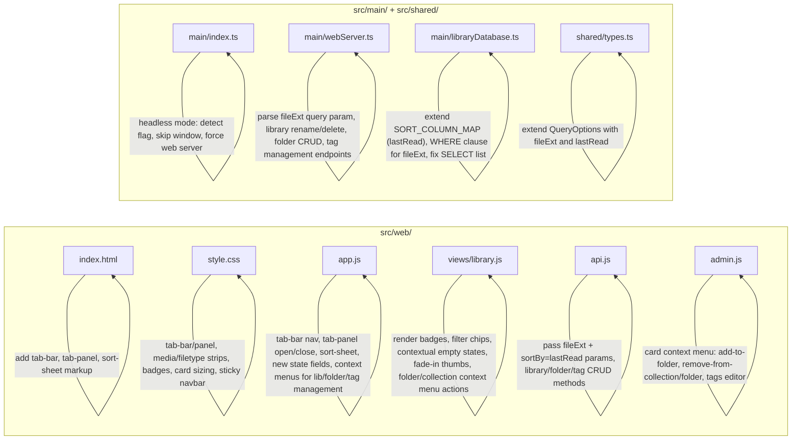

# Design Document: Web Library Mobile UX

## Overview

This design transforms the CB8 web library's mobile experience from a sidebar-driven model to a bottom tab-bar + filter-strip pattern, while enlarging cards, adding progress/format badges, improving empty states, adding a "Recently Read" sort, introducing a headless server mode so CB8 can run on a NAS or server without the Electron GUI, and enabling drag-and-drop file upload for admin users. All client changes fit within the existing vanilla JS/HTML/CSS stack in `src/web/`; server-side changes are localized to three files. Desktop layout (> 640px) is unchanged except for a single new sort option.

### Key Design Decisions

1. **CSS-only visibility toggling.** The Tab_Bar, Tab_Panel host, Media_Strip, File_Type_Strip, Sort_Sheet, and their desktop counterparts are all rendered into the DOM once; the 640px media query in `style.css` toggles which are displayed. No JS resize listeners.
2. **No new client files.** All client changes fit within `src/web/index.html`, `src/web/style.css`, `src/web/app.js`, `src/web/views/library.js`, and `src/web/api.js`.
3. **Minimal server changes.** `fileExt` filtering and `lastRead` sorting are added by editing `src/shared/types.ts` (extend `QueryOptions`), `src/main/webServer.ts` (parse new query param), and `src/main/libraryDatabase.ts` (extend `SORT_COLUMN_MAP` and `queryComics`/`queryComicsByLibrary`/`getFolderComics` WHERE clauses). No new files, no new dependencies.
4. **Headless mode** lives in `src/main/index.ts` as a pre-ready check; it reuses `startWebServer` and `LibraryDatabase` unchanged.
5. **Progressive enhancement.** Badges and filter chips degrade gracefully: if `fileExt`, `lastPage`, or `lastLocation` is missing, the badge is simply not rendered.

### Scope Boundary

- **Modified files:** `src/web/index.html`, `src/web/style.css`, `src/web/app.js`, `src/web/views/library.js`, `src/web/api.js`, `src/web/admin.js`, `src/main/index.ts`, `src/main/webServer.ts`, `src/main/libraryDatabase.ts`, `src/shared/types.ts`.
- **Unchanged:** `src/renderer/` (Electron renderer), `src/main/ipcHandlers.ts`, all other server modules.
- **No new npm dependencies, no new build step, no new runtime files.**

### Management Feature Parity Note

Requirements 17–21 bring library, folder, and tag management to the web UI. The desktop Electron GUI already has full CRUD for these entities via IPC (`libraries:create`, `libraries:rename`, `libraries:delete`, `folders:create`, etc.) backed by `LibraryDatabase` methods (`createLibrary`, `renameLibrary`, `deleteLibrary`, `createFolder`, `renameFolder`, `deleteFolder`, `addTag`, `removeTag`, `renameTag`, `deleteTag`). The web server already exposes `POST /api/libraries` and `POST /api/libraries/:id/comics`. The new work adds the missing REST endpoints (`PUT`/`DELETE` for libraries, full CRUD for folders, tag management) and the corresponding web UI affordances (context menus, inline rename, confirmation dialogs).

### Incidental Fix

`queryComicsByLibrary` in `libraryDatabase.ts` omits `c.last_location` from its SELECT list (present in `queryComics` and `getFolderComics`), causing `lastLocation` to always appear as `null` for records fetched under `#/library/:id`. Since Requirement 9.2 depends on `lastLocation` for EPUB progress badges, add `c.last_location` to that SELECT list as part of this work.

## Architecture

The current architecture is a vanilla-JS SPA with hash-based routing (`app.js`), a thin API client (`api.js`), two view modules (`views/library.js`, `views/reader.js`), and a single stylesheet (`style.css`). The server is a Node.js HTTP server (`webServer.ts`) backed by SQLite via `libraryDatabase.ts`. Headless mode adds no new architectural layer; it simply skips window creation.

### Current Mobile Flow

```
┌──────────────────────────┐
│  Navbar (search, sort,   │
│  media toggle, hamburger)│
├──────────────────────────┤
│  Sidebar (hidden, opens  │
│  as overlay via ☰)       │
├──────────────────────────┤
│  Card Grid (130px cards) │
│  scrolls vertically      │
└──────────────────────────┘
```

### Proposed Mobile Flow

```
┌──────────────────────────┐
│  Navbar (search + sort   │  ← fixed top, compact
│  button only)            │
├──────────────────────────┤
│  Media Strip (All/Comics/│  ← inline pills
│  Books)                  │
│  File-Type Strip (chips) │  ← inline pills
├──────────────────────────┤
│  Card Grid (150px cards, │  ← larger, with badges
│  progress + format)      │
├──────────────────────────┤
│  Tab Bar (All, Recent,   │  ← fixed bottom
│  Collections, Folders,   │
│  Tags)                   │
└──────────────────────────┘
```

### Change Map



## Components and Interfaces

### 1. Tab Bar (`index.html` + `style.css` + `app.js`)

A `<nav id="tab-bar">` element appended as the last child of `#app`, containing five `<button>` elements with `data-tab` values: `all`, `recent`, `collections`, `folders`, `tags`.

**Markup sketch:**
```html
<nav id="tab-bar" aria-label="Primary">
  <button data-tab="all"         aria-label="All">…</button>
  <button data-tab="recent"      aria-label="Recent">…</button>
  <button data-tab="collections" aria-label="Collections">…</button>
  <button data-tab="folders"     aria-label="Folders">…</button>
  <button data-tab="tags"        aria-label="Tags">…</button>
</nav>
```

Each button contains an inline SVG icon and a small text label below it.

**Behaviour (wired in `app.js`):**
- `all` → `window.location.hash = '#/'`
- `recent` → `window.location.hash = '#/recent'`
- `collections` / `folders` / `tags` → call `openTabPanel('collections' | 'folders' | 'tags')` (see §2) without changing the hash. Tapping the same tab again while its panel is open calls `closeTabPanel()`.

**Visibility:**
- Hidden by default; shown at `@media (max-width: 640px)`.
- Additionally hidden when the reader overlay is open: `#reader-overlay:not(.hidden) ~ #tab-bar { display: none; }` — or toggled via a class on `<body>` set inside `navigate()`.

**Active state:**
- `updateTabBarActive(route, tabPanel)` is called from `navigate()` and whenever the Tab_Panel opens or closes. It clears `.active` on all tab buttons and sets it on the one matching the current route (All/Recent) or the open panel (Collections/Folders/Tags).

**CSS sizing:**
- New CSS var `--tab-bar-h: 56px`.
- `#main-content` receives `padding-bottom: var(--tab-bar-h)` on mobile so the last row of cards is not hidden behind the Tab_Bar.

### 2. Tab Panel (`index.html` + `style.css` + `app.js`)

A single `<div id="tab-panel" hidden>` element in `index.html`, positioned as a fixed overlay between `#main-content` (bottom-padded by `--tab-bar-h`) and the Tab_Bar. Only one Tab_Panel content set is visible at a time; `openTabPanel(kind)` repopulates the same container.

**Structure:**
```html
<div id="tab-panel" hidden role="dialog" aria-modal="false">
  <header class="tab-panel-header">
    <h2></h2>
    <button class="tab-panel-close" aria-label="Close">✕</button>
  </header>
  <ul class="tab-panel-list"></ul>
</div>
```

**Implementation:**
- `app.js` caches `libraries`, `folders`, and `tags` arrays in module scope when `populateSidebar()` fetches them.
- `openTabPanel('collections' | 'folders' | 'tags')` sets the header title ("Collections" / "Folders" / "Tags"), repopulates `.tab-panel-list` from the cached array, unsets the `hidden` attribute, and updates the Tab_Bar's active state.
- Each `<li>` contains an `<a>` whose click handler calls `closeTabPanel()` and lets the hash-change fire naturally (browser default).
- `closeTabPanel()` sets the `hidden` attribute again and updates the Tab_Bar.
- If the cached array is empty, render a single `<li class="tab-panel-empty">` with "No collections" / "No folders" / "No tags".
- Tapping the currently-active Collections/Folders/Tags tab button while its panel is open calls `closeTabPanel()`.

**Visibility:**
- Mobile-only (hidden via media query on desktop). On desktop the sidebar handles this navigation.
- `z-index` above `#main-content` but below the Tab_Bar (so the Tab_Bar stays tappable).

### 3. Media Strip (`views/library.js` + `style.css`)

A `<div class="media-strip" role="group" aria-label="Media type">` rendered by `renderLibrary()` between the `.library-header` and the `.comics-grid`, containing three pill `<button>`s: All, Comics, Books.

**Behaviour:**
- Tapping a pill updates `state.mediaType` and calls `navigate()` to re-query.
- The active pill gets `.active`.
- State is shared with the desktop `.media-toggle` buttons — `state.mediaType` is the single source of truth, and both UIs reflect it.

**Visibility:**
- Rendered into the DOM whenever the library view renders.
- Shown only at `max-width: 640px` via CSS (`display: none` above the breakpoint).
- At the same breakpoint, `.nav-actions > .media-toggle { display: none; }` hides the desktop toggle.

### 4. File-Type Filter Strip (`views/library.js` + `style.css`)

A `<div class="filetype-strip" role="group" aria-label="File type">` rendered below the Media_Strip, containing six horizontally scrollable pill `<button>`s with `data-ext` values `''`, `epub`, `pdf`, `cbz`, `cbr`, `mobi`.

**Behaviour:**
- Tapping a chip sets `state.fileExt` and calls `navigate()` to re-query.
- The active chip gets `.active`.
- Composes with `state.mediaType` — both filters are AND-ed server-side.

**API integration:**
- `api.js` passes `fileExt` in the query string when non-empty.
- `webServer.ts` `parseQueryOptions()` reads `query.fileExt` and lowercases it into `QueryOptions.fileExt`.
- `libraryDatabase.ts` `queryComics`, `queryComicsByLibrary`, and `getFolderComics` append the WHERE clause:
  ```
  LOWER(c.file_path) LIKE ?    -- param: '%.epub'
  ```

**Visibility:**
- Shown only at `max-width: 640px` via CSS.

### 5. Sort Control (`index.html` + `style.css` + `app.js`)

**Desktop (> 640px):**
- The existing `<select id="sort-select">` gains a new `<option value="lastRead">Recently Read</option>`. No layout changes.

**Mobile (≤ 640px):**
- The `<select id="sort-select">` is hidden via CSS.
- A new `<button id="sort-button">` is rendered adjacent to it in the Navbar with a sort-icon SVG and a `<span class="sort-button-label">` showing the label of the currently active option.
- Tapping `#sort-button` unsets the `hidden` attribute on `<div id="sort-sheet">`, a bottom-sheet overlay listing the five options as tappable rows.
- Selecting an option updates `state.sortBy`, updates `#sort-select.value` (so desktop/mobile stay in sync), updates `.sort-button-label`, closes the sheet, and calls `navigate()`.
- Tapping the sheet's backdrop or its close button calls `closeSortSheet()` without changing the sort.

**Sort_Sheet markup:**
```html
<div id="sort-sheet" hidden role="dialog" aria-modal="true" aria-label="Sort by">
  <div class="sort-sheet-backdrop"></div>
  <div class="sort-sheet-panel">
    <button data-sort="title">Title</button>
    <button data-sort="dateAdded">Date added</button>
    <button data-sort="fileSize">File size</button>
    <button data-sort="pageCount">Pages</button>
    <button data-sort="lastRead">Recently Read</button>
  </div>
</div>
```

**API integration:**
- `sortBy=lastRead` is sent to the server.
- `SORT_COLUMN_MAP` gains `lastRead: "COALESCE(c.last_read, '')"`. The empty-string fallback ensures NULL `last_read` rows sort before any real datetime string when ascending (and after, when descending) — satisfying Requirement 13.3 and 13.4.
- `QueryOptions.sortBy` type is extended to include `'lastRead'`.

### 6. Card Enhancements (`views/library.js` + `style.css`)

#### 6a. Larger Cards

- Root `--card-w` stays at `160px`; the mobile media-query override changes from `130px` to `150px`.
- Mobile `.comics-grid` gap bumps from `10px` to `12px`, horizontal padding from `12px` to `10px` (per Requirement 4.4 minimum).

#### 6b. Format Badge (replaces current `.card-badge`)

- In `createCard(record)`, compute:
  ```js
  const ext = (record.fileExt || '').toLowerCase();
  const isBook = ext === 'epub' || ext === 'pdf' || ext === 'mobi';
  const label = ext ? ext.toUpperCase()
                    : (record.mediaType === 'book' ? 'Book' : 'Comic');
  ```
- Render a single `<div class="card-badge ${isBook || record.mediaType === 'book' ? 'book' : ''}">` with `textContent = label`. No additional badge.
- Keep the existing top-right absolute positioning.

#### 6c. Progress Badge (new element)

- Render iff the record has reading progress:
  ```js
  let progressLabel = null;
  if (record.pageCount > 0 && record.lastPage != null && record.lastPage > 0) {
    const pct = Math.max(1, Math.min(100, Math.round(record.lastPage / record.pageCount * 100)));
    progressLabel = pct + '%';
  } else if (record.lastLocation) {
    progressLabel = 'In progress';
  }
  ```
- When `progressLabel` is non-null, append `<div class="progress-badge">${progressLabel}</div>` to `.card-thumb-wrap`.
- CSS positions the badge at `position: absolute; bottom: 6px; left: 6px;` (above the 3px `.progress-bar`) so it does not overlap the Format_Badge (top-right) or the card title (below the thumb wrap).

#### 6d. Stable Dimensions

- The existing `.card-thumb-wrap { aspect-ratio: 2 / 3; background: var(--surface); overflow: hidden; }` already reserves space and provides a placeholder — keep it in place.
- The existing `.card-thumb.loading { opacity: 0; }` with `transition: opacity 0.2s;` and the `load` event handler that removes `.loading` provide the fade-in — keep it in place. No extra code required for Requirement 12.3.

#### 6e. Thumbnail Error Placeholder

- Replace the current `img.addEventListener('error', …)` (which sets `opacity: 0.15`) with:
  ```js
  img.addEventListener('error', () => {
    img.classList.remove('loading');
    img.src = PLACEHOLDER_BOOK_SVG_DATA_URI;
  });
  ```
- `PLACEHOLDER_BOOK_SVG_DATA_URI` is a module-level constant in `views/library.js`: `'data:image/svg+xml;utf8,...'` containing a simple book icon on a muted background.

### 7. Improved Empty States (`views/library.js`)

Replace the single generic `renderEmpty()` with `renderEmpty(reason)`:

| `reason`       | Icon (inline SVG) | Message                                                    | Trigger                                                                                   |
|----------------|-------------------|------------------------------------------------------------|-------------------------------------------------------------------------------------------|
| `'offline'`    | Cloud-off         | "Cannot reach the server. Check your connection."          | API rejection or non-2xx during initial page load of the current view.                    |
| `'no-results'` | Search            | "No items match your search or filters."                   | Zero records AND any of `state.search`, `state.mediaType`, `state.fileExt`, or tag route. |
| `'no-recent'`  | Clock             | "Nothing read yet. Open a book or comic to get started."   | Recent view (`route.type === 'recent'`) returns zero records AND no filter active.        |
| `'empty'`      | Book              | "No items found."                                          | Any other view returns zero records AND no filter active.                                 |

The trigger classification happens in `loadNextPage()`'s error and empty-result branches. On error, `renderEmpty('offline')`; on empty result with filters active, `renderEmpty('no-results')`; else the route-dependent fallback.

Each empty state is rendered inside the `.comics-grid` container (grid cleared first) so it sits where the cards would go and does not shift layout.

### 8. Sticky Navbar (`style.css`)

Add at `@media (max-width: 640px)`:

```css
#navbar  { position: fixed; top: 0; left: 0; right: 0; z-index: 100; }
#layout  { padding-top: var(--nav-h); }
#main-content { padding-bottom: calc(var(--tab-bar-h) + env(safe-area-inset-bottom, 0px)); }
```

- `--nav-h` is the existing 52px.
- `--tab-bar-h` is the new 56px token.
- The `env(safe-area-inset-bottom)` allowance keeps the last row reachable on iOS Safari.
- `#layout` already has `display: flex; flex: 1; min-height: 0; overflow: hidden;` — the `padding-top` shifts its flex children below the fixed Navbar. On mobile, sidebar is hidden, so `#main-content` takes the full width.

### 9. Search Accessibility

The existing `.nav-search-wrap` has `flex: 1; min-width: 0; max-width: 400px;`. On mobile we remove the `max-width` to let search fill all available horizontal space after the brand and sort button:

```css
@media (max-width: 640px) {
  .nav-search-wrap { max-width: none; }
}
```

No JS change.

### 10. Headless Server Mode (`src/main/index.ts`)

Headless mode runs CB8's embedded HTTP web server without creating an Electron `BrowserWindow`.

#### Detection

A module-level constant computed before `app.on('ready', …)`:

```ts
const isHeadless =
  process.argv.includes('--headless') ||
  process.env.CB8_HEADLESS === '1';
```

Both sources are checked so the user can choose whichever fits their deployment (CLI flag for manual use, env var for systemd/Docker).

#### Startup Flow

```ts
app.on('ready', () => {
  if (isHeadless) {
    startHeadless();
  } else {
    createWindow();
  }
});

function startHeadless(): void {
  if (process.platform === 'darwin') {
    app.dock?.hide();
  }

  try {
    const userDataPath = app.getPath('userData');
    const dbPath = path.join(userDataPath, 'library.db');
    db = new LibraryDatabase(dbPath);
    db.initialize();
    // No onRecentFilesChanged callback — there is no menu in headless mode.
    registerIpcHandlers(db, webServerRef);
  } catch (err) {
    console.error('[CB8] Failed to initialize database or IPC:', err);
    process.exit(1);
  }

  const rawPort = db!.getAppMeta('web_server_port');
  const parsed = rawPort ? parseInt(rawPort, 10) : NaN;
  const port = Number.isFinite(parsed)
    ? Math.max(1024, Math.min(65535, parsed))
    : 8008;

  try {
    webServerRef.handle = startWebServer(db!, port);
  } catch (err) {
    console.error('[CB8] Failed to start web server in headless mode:', err);
    process.exit(1);
  }
}
```

Notes:
- `registerIpcHandlers` is still called because its auto-start branch is guarded by the stored `web_server_enabled` setting; calling it is harmless in headless mode and keeps the IPC surface available for any future web-settings writes. The subsequent direct `startWebServer` call force-starts the server regardless of the stored preference (Requirement 14.4).
- If `ipcHandlers.ts`'s auto-start branch happens to also start the server, the subsequent direct `startWebServer` call will attempt to bind the same port and `EADDRINUSE` will be logged. To avoid this, check `webServerRef.handle` before calling `startWebServer`:
  ```ts
  if (!webServerRef.handle) webServerRef.handle = startWebServer(db!, port);
  ```
- Console output is already handled by `startWebServer`'s `listen` callback — no extra logging needed.

#### `window-all-closed` Behaviour

```ts
app.on('window-all-closed', () => {
  if (isHeadless) return;                  // keep serving HTTP
  if (process.platform !== 'darwin') app.quit();
});
```

#### Graceful Shutdown

The existing `app.on('before-quit', …)` already closes archive handles and the web server. For headless mode, SIGINT/SIGTERM trigger `app.quit()`:

```ts
if (isHeadless) {
  const shutdown = () => {
    console.log('[CB8] Shutting down headless server…');
    app.quit();
  };
  process.on('SIGINT', shutdown);
  process.on('SIGTERM', shutdown);
}
```

#### Unchanged Modules

- `webServer.ts`: unchanged for headless. Already binds to `0.0.0.0` so LAN access works.
- `libraryDatabase.ts`: unchanged for headless.
- `ipcHandlers.ts`: unchanged. Any IPC handlers that look up `BrowserWindow.fromWebContents(...)` simply never fire in headless mode (no renderer).

#### Design Decisions

1. **`process.argv` over `app.commandLine`** — `process.argv` is simpler and works identically. `app.commandLine` is Chromium's switch parser and would require awkward `--headless=true` syntax.
2. **Force-start the web server** — in headless mode the web server is the entire point of the process, so the stored `web_server_enabled` preference is bypassed. The stored `web_server_port` is still respected (with the same 1024–65535 clamp used elsewhere).
3. **`process.exit(1)` on init failure** — there is no GUI to show an error dialog, so a non-zero exit code signals the process supervisor (systemd, Docker, etc.).
4. **No new files** — all changes fit within `src/main/index.ts`.

### 11. Drag-and-Drop File Upload (`app.js` + `admin.js` + `api.js` + `webServer.ts`)

This component enables authenticated admin users to drag files (or folders containing files) onto the web UI to upload them to the server and add them to the library. It also covers the admin upload modal for non-drag-and-drop file selection.

#### 11a. Client-Side: Drop Zone Overlay (`app.js`)

A `<div id="drop-overlay">` element is lazily created and appended to `document.body`. It covers the full viewport with a translucent backdrop and the label "Drop to add to library".

**Behaviour (wired in `app.js` `wireDrop()`):**

- `document.addEventListener('dragenter', …)` — increments a `dragCounter` and shows the overlay. Only activates when `isAuthenticated()` returns `true`.
- `document.addEventListener('dragleave', …)` — decrements `dragCounter`; hides the overlay when it reaches zero.
- `document.addEventListener('dragover', …)` — calls `e.preventDefault()` and sets `e.dataTransfer.dropEffect = 'copy'`. This is critical: without `preventDefault()` on `dragover`, the browser's default behaviour (navigate to the file or show a save dialog) takes over.
- `document.addEventListener('drop', …)` — calls `e.preventDefault()`, resets `dragCounter`, hides the overlay, then delegates to `gatherFromDrop(e.dataTransfer)` from `admin.js`.

**Non-authenticated users:** When `isAuthenticated()` returns `false`, all four event handlers return early without calling `preventDefault()`, so the browser's default drag-and-drop behaviour is preserved.

**File gathering (`admin.js` `gatherFromDrop()`):**

Uses the `DataTransferItem.webkitGetAsEntry()` API (supported in all modern browsers) to recursively traverse dropped folders. Falls back to `DataTransfer.files` when the entry API is unavailable. Filters files by extension using the `ACCEPTED_EXTS` set (`['cbz', 'cbr', 'epub', 'pdf', 'mobi']`). Returns an array of `{ file: File, relPath: string }` objects where `relPath` preserves the folder structure for nested drops.

**Upload flow:**

After gathering, `wireDrop()` shows a toast ("Uploading N files…"), then uploads each file sequentially via `api.adminUploadFile(file, relPath)`. On completion, shows a summary toast ("Added N files" or "Added N, failed M") and dispatches `cb8:library-changed` to refresh the sidebar and grid.

#### 11b. Client-Side: Admin Upload Modal (`admin.js`)

The admin menu includes an "Upload comics" option that opens a modal with:

- A drop zone (`<div class="upload-dropzone">`) that accepts drag-and-drop within the modal.
- "Choose files…" and "Choose folder…" buttons backed by hidden `<input type="file">` elements (the folder input uses the `webkitdirectory` attribute).
- A queue list showing each file's name, size, and upload status (pending → uploading with percentage → done/skipped/error).
- An overall progress bar and phase label.
- Per-file progress tracking via `XMLHttpRequest.upload.onprogress` (used instead of `fetch` because `fetch` does not expose upload progress events in browsers).

**Upload API (`api.js` `adminUploadFile()`):**

```js
export function adminUploadFile(file, relPath, onProgress) {
  return new Promise((resolve, reject) => {
    const xhr = new XMLHttpRequest();
    xhr.open('POST', '/api/admin/upload');
    xhr.responseType = 'json';
    xhr.setRequestHeader('Content-Type', 'application/octet-stream');
    xhr.setRequestHeader('X-CB8-Filename', encodeURIComponent(file.name));
    xhr.setRequestHeader('X-CB8-Relpath', encodeURIComponent(relPath || file.name));
    xhr.upload.onprogress = (e) => {
      if (e.lengthComputable) onProgress?.(e.loaded, e.total);
    };
    xhr.onload = () => { /* resolve or reject based on status */ };
    xhr.send(file);
  });
}
```

The raw body approach (sending the `File` object directly as the request body) avoids the overhead of `multipart/form-data` encoding for large files. The filename and relative path are transmitted via custom headers (`X-CB8-Filename`, `X-CB8-Relpath`), both percent-encoded to safely carry non-ASCII characters.

#### 11c. Server-Side: Upload Endpoint (`webServer.ts`)

**Route:** `POST /api/admin/upload`

**Authentication:** Requires a valid admin session cookie (`isAuthenticated(req)`). Returns 401 if not authenticated.

**Request format:**
- Body: raw file bytes (streamed via `req.pipe(writeStream)`)
- Headers:
  - `X-CB8-Filename` (required): percent-encoded original filename
  - `X-CB8-Relpath` (optional): percent-encoded relative path (for folder drops, e.g., `subfolder/book.epub`)

**Validation:**
1. `X-CB8-Filename` must be present and non-empty.
2. Both headers must be valid percent-encoded UTF-8.
3. Filename must not contain null bytes, must not be an absolute path, and `path.basename(filename)` must equal `filename` (no directory components).
4. Relative path parts must not contain `..` or `.` components (path traversal prevention).
5. File extension must be in the supported set (`.epub`, `.pdf`, `.cbz`, `.cbr`, `.mobi`). Returns HTTP 415 for unsupported types.
6. The resolved destination path must start with the base upload directory (defense-in-depth against traversal).

**Storage:**
- Base directory: `path.join(app.getPath('userData'), 'web-uploads')`
- Destination: `path.resolve(baseDir, ...relParts)` where `relParts` are the sanitized components of the relative path.
- Parent directories are created recursively via `fsp.mkdir(path.dirname(destPath), { recursive: true })`.

**Duplicate detection:**
- Before writing, checks `db.comicExistsByPath(destPath)`. If the file is already in the library, drains the request body and returns `{ added: false, skipped: true, reason: 'Already in library' }`.

**Ingestion:**
- After writing the file to disk, calls `addSingleFile(db, destPath)` — the same function used by the `ingestPathStreaming` flow. This handles:
  - Comic archives (`.cbz`, `.cbr`): opens the archive, extracts cover image, generates thumbnail, adds to database with `mediaType: 'comic'`.
  - Book files (`.epub`, `.pdf`, `.mobi`): extracts cover (EPUB/PDF), counts pages (PDF), adds to database with `mediaType: 'book'`.
- If `addSingleFile` fails, the uploaded file is deleted from disk and an HTTP 500 error is returned.

**Response:** `{ added: boolean, filePath: string }` on success, or `{ added: false, skipped: true, reason: string }` for duplicates.

#### 11d. Design Decisions

1. **Raw body over multipart/form-data** — Streaming the file as the raw request body is simpler, avoids multipart boundary parsing on the server (no new dependencies like `busboy` or `multer`), and allows direct `req.pipe(writeStream)` for memory-efficient handling of large files.
2. **XHR over fetch for uploads** — The `fetch` API does not expose upload progress events in browsers. `XMLHttpRequest.upload.onprogress` provides real-time progress tracking needed for the per-file progress bars.
3. **`web-uploads/` inside userData** — Uploaded files are stored alongside the database in the user data directory. This keeps all CB8 data in one place and avoids requiring the user to configure an upload directory. The subdirectory name `web-uploads` is distinct from any existing CB8 data.
4. **Sequential uploads** — Files are uploaded one at a time rather than in parallel. This simplifies progress tracking, avoids overwhelming the server with concurrent writes, and makes error handling straightforward.
5. **Admin-only gating** — Both the drop overlay and the upload endpoint require authentication. Non-admin users see no upload affordance and the browser's default drag-and-drop behaviour is preserved for them.
6. **Reuse of `addSingleFile`** — The upload endpoint reuses the same ingestion function as the server-path scan flow, ensuring consistent cover extraction, metadata population, and database insertion logic.

## Data Models

### Extended `QueryOptions` (`src/shared/types.ts`)

```ts
export interface QueryOptions {
  search?: string;
  tag?: string;
  sortBy?: 'title' | 'dateAdded' | 'fileSize' | 'pageCount' | 'lastRead';
  sortOrder?: 'asc' | 'desc';
  offset?: number;
  limit?: number;
  excludeFoldered?: boolean;
  mediaType?: 'comic' | 'book';
  fileExt?: string;   // lowercase extension without the dot, e.g. 'epub' | 'pdf' | 'cbz' | 'cbr' | 'mobi'
}
```

### Extended `SORT_COLUMN_MAP` (`libraryDatabase.ts`)

```ts
const SORT_COLUMN_MAP: Record<string, string> = {
  title:     'c.title COLLATE NOCASE',
  dateAdded: 'c.date_added',
  fileSize:  'c.file_size',
  pageCount: 'c.page_count',
  lastRead:  "COALESCE(c.last_read, '')",
};
```

The empty-string default for NULL `last_read` rows makes them sort before any real datetime string (which starts with a digit) when ascending, and after when descending — satisfying Requirement 13.3 and 13.4.

### Extended `parseQueryOptions` (`webServer.ts`)

```ts
if (query.fileExt) {
  options.fileExt = String(query.fileExt).toLowerCase().replace(/^\./, '');
}
```

### Extended WHERE clauses (`libraryDatabase.ts`)

Add to `queryComics`, `queryComicsByLibrary`, and `getFolderComics`:

```ts
if (options.fileExt) {
  conditions.push('LOWER(c.file_path) LIKE ?');
  params.push('%.' + options.fileExt);
}
```

Also fix `queryComicsByLibrary`: add `c.last_location` to its SELECT list (currently omitted — see §Incidental Fix).

### `WebComicRecord` (`webServer.ts`) — unchanged

The existing `WebComicRecord` already exposes `fileExt`, `lastPage`, `pageCount`, `lastLocation`, and `lastRead`, which is everything the client needs.

### Client-Side State (`app.js`)

```js
const state = {
  mediaType: '',       // '' | 'comic' | 'book'
  sortBy:    'title',  // 'title' | 'dateAdded' | 'fileSize' | 'pageCount' | 'lastRead'
  search:    '',
  fileExt:   '',       // '' | 'epub' | 'pdf' | 'cbz' | 'cbr' | 'mobi'
  route:     null,
  tabPanel:  null,     // null | 'collections' | 'folders' | 'tags'
};
```

`state.tabPanel` is the only field that is not persisted to the URL — it is purely a UI state for which mobile sub-nav sheet (if any) is open.

### 12. Library Management API Endpoints (`webServer.ts`)

These endpoints expose the existing `LibraryDatabase` CRUD methods to the web UI, matching the functionality already available in the desktop Electron GUI via IPC.

#### `PUT /api/libraries/:id` — Rename Library

```
PUT /api/libraries/:id
Content-Type: application/json
Body: { "name": "New Name" }
Response: { "ok": true }
```

**Authentication:** Required (admin session cookie). Returns 401 if not authenticated.

**Validation:**
1. `name` must be a non-empty string after trimming.
2. Returns HTTP 400 if `name` is missing or empty.
3. Returns HTTP 409 if a library with the same name already exists (SQLite UNIQUE constraint).

**Implementation:**
```ts
const libRenameMatch = pathname.match(/^\/api\/libraries\/(\d+)$/);
if (method === 'PUT' && libRenameMatch) {
  if (!isAuthenticated(req)) return sendError(res, 401, 'Unauthorized');
  const id = parseInt(libRenameMatch[1], 10);
  const body = await readBody(req);
  let parsed: { name?: string };
  try { parsed = JSON.parse(body); } catch { return sendError(res, 400, 'Invalid JSON'); }
  if (typeof parsed.name !== 'string' || !parsed.name.trim()) {
    return sendError(res, 400, 'Provide "name" (non-empty string)');
  }
  try {
    db.renameLibrary(id, parsed.name.trim());
    return sendJson(res, 200, { ok: true });
  } catch {
    return sendError(res, 409, 'A collection with that name already exists');
  }
}
```

#### `DELETE /api/libraries/:id` — Delete Library

```
DELETE /api/libraries/:id
Response: { "ok": true }
```

**Authentication:** Required. Returns 401 if not authenticated.

**Implementation:**
```ts
const libDeleteMatch = pathname.match(/^\/api\/libraries\/(\d+)$/);
if (method === 'DELETE' && libDeleteMatch) {
  if (!isAuthenticated(req)) return sendError(res, 401, 'Unauthorized');
  const id = parseInt(libDeleteMatch[1], 10);
  db.deleteLibrary(id);
  return sendJson(res, 200, { ok: true });
}
```

**Safety:** `deleteLibrary` only removes the library row and its `library_comics` associations. No comic records or files on disk are affected.

#### `DELETE /api/libraries/:id/comics` — Remove Comics from Library

```
DELETE /api/libraries/:id/comics
Content-Type: application/json
Body: { "comicIds": [1, 2, 3] }
Response: { "ok": true }
```

**Authentication:** Required. Returns 401 if not authenticated.

**Implementation:**
```ts
if (method === 'DELETE' && libAddComicsMatch) {
  if (!isAuthenticated(req)) return sendError(res, 401, 'Unauthorized');
  const libId = parseInt(libAddComicsMatch[1], 10);
  const body = await readBody(req);
  let parsed: { comicIds?: number[] };
  try { parsed = JSON.parse(body); } catch { return sendError(res, 400, 'Invalid JSON'); }
  if (!Array.isArray(parsed.comicIds) || parsed.comicIds.length === 0) {
    return sendError(res, 400, 'Provide "comicIds" (non-empty array)');
  }
  db.removeComicsFromLibrary(libId, parsed.comicIds.map(Number));
  return sendJson(res, 200, { ok: true });
}
```

### 13. Folder Management API Endpoints (`webServer.ts`)

#### `POST /api/folders` — Create Folder

```
POST /api/folders
Content-Type: application/json
Body: { "name": "My Folder", "comicIds": [] }
Response: { "id": 5, "name": "My Folder" }
```

**Authentication:** Required. Returns 401 if not authenticated.

**Implementation:**
```ts
if (method === 'POST' && pathname === '/api/folders') {
  if (!isAuthenticated(req)) return sendError(res, 401, 'Unauthorized');
  const body = await readBody(req);
  let parsed: { name?: string; comicIds?: number[] };
  try { parsed = JSON.parse(body); } catch { return sendError(res, 400, 'Invalid JSON'); }
  if (typeof parsed.name !== 'string' || !parsed.name.trim()) {
    return sendError(res, 400, 'Provide "name" (non-empty string)');
  }
  const comicIds = Array.isArray(parsed.comicIds) ? parsed.comicIds.map(Number) : [];
  const folder = db.createFolder(parsed.name.trim(), comicIds);
  return sendJson(res, 201, folder);
}
```

#### `PUT /api/folders/:id` — Rename Folder

```
PUT /api/folders/:id
Content-Type: application/json
Body: { "name": "New Name" }
Response: { "ok": true }
```

**Authentication:** Required. Returns 401 if not authenticated.

**Implementation:**
```ts
const folderRenameMatch = pathname.match(/^\/api\/folders\/(\d+)$/);
if (method === 'PUT' && folderRenameMatch) {
  if (!isAuthenticated(req)) return sendError(res, 401, 'Unauthorized');
  const id = parseInt(folderRenameMatch[1], 10);
  const body = await readBody(req);
  let parsed: { name?: string };
  try { parsed = JSON.parse(body); } catch { return sendError(res, 400, 'Invalid JSON'); }
  if (typeof parsed.name !== 'string' || !parsed.name.trim()) {
    return sendError(res, 400, 'Provide "name" (non-empty string)');
  }
  db.renameFolder(id, parsed.name.trim());
  return sendJson(res, 200, { ok: true });
}
```

#### `DELETE /api/folders/:id` — Delete Folder

```
DELETE /api/folders/:id
Response: { "ok": true }
```

**Authentication:** Required. Returns 401 if not authenticated.

**Implementation:**
```ts
const folderDeleteMatch = pathname.match(/^\/api\/folders\/(\d+)$/);
if (method === 'DELETE' && folderDeleteMatch) {
  if (!isAuthenticated(req)) return sendError(res, 401, 'Unauthorized');
  const id = parseInt(folderDeleteMatch[1], 10);
  db.deleteFolder(id);
  return sendJson(res, 200, { ok: true });
}
```

**Safety:** `deleteFolder` only removes the folder row and its `folder_comics` associations. No comic records or files on disk are affected.

#### `POST /api/folders/:id/comics` — Add Comics to Folder

```
POST /api/folders/:id/comics
Content-Type: application/json
Body: { "comicIds": [1, 2, 3] }
Response: { "ok": true }
```

**Authentication:** Required. Returns 401 if not authenticated.

**Implementation:**
```ts
const folderAddComicsMatch = pathname.match(/^\/api\/folders\/(\d+)\/comics$/);
if (method === 'POST' && folderAddComicsMatch) {
  if (!isAuthenticated(req)) return sendError(res, 401, 'Unauthorized');
  const folderId = parseInt(folderAddComicsMatch[1], 10);
  const body = await readBody(req);
  let parsed: { comicIds?: number[] };
  try { parsed = JSON.parse(body); } catch { return sendError(res, 400, 'Invalid JSON'); }
  if (!Array.isArray(parsed.comicIds) || parsed.comicIds.length === 0) {
    return sendError(res, 400, 'Provide "comicIds" (non-empty array)');
  }
  db.addComicsToFolder(folderId, parsed.comicIds.map(Number));
  return sendJson(res, 200, { ok: true });
}
```

#### `DELETE /api/folders/:id/comics` — Remove Comics from Folder

```
DELETE /api/folders/:id/comics
Content-Type: application/json
Body: { "comicIds": [1, 2, 3] }
Response: { "ok": true }
```

**Authentication:** Required. Returns 401 if not authenticated.

**Implementation:**
```ts
if (method === 'DELETE' && folderAddComicsMatch) {
  if (!isAuthenticated(req)) return sendError(res, 401, 'Unauthorized');
  const folderId = parseInt(folderAddComicsMatch[1], 10);
  const body = await readBody(req);
  let parsed: { comicIds?: number[] };
  try { parsed = JSON.parse(body); } catch { return sendError(res, 400, 'Invalid JSON'); }
  if (!Array.isArray(parsed.comicIds) || parsed.comicIds.length === 0) {
    return sendError(res, 400, 'Provide "comicIds" (non-empty array)');
  }
  db.removeComicsFromFolder(folderId, parsed.comicIds.map(Number));
  return sendJson(res, 200, { ok: true });
}
```

### 14. Tag Management API Endpoints (`webServer.ts`)

#### `PUT /api/comics/:id/tags` — Set Tags on a Comic

```
PUT /api/comics/:id/tags
Content-Type: application/json
Body: { "tags": ["action", "sci-fi"] }
Response: { "ok": true }
```

**Authentication:** Required. Returns 401 if not authenticated.

**Implementation:**
Computes the diff between the comic's current tags and the provided tags, then calls `addTag` for new tags and `removeTag` for removed tags.

```ts
const comicTagsMatch = pathname.match(/^\/api\/comics\/(\d+)\/tags$/);
if (method === 'PUT' && comicTagsMatch) {
  if (!isAuthenticated(req)) return sendError(res, 401, 'Unauthorized');
  const comicId = parseInt(comicTagsMatch[1], 10);
  const record = db.getComic(comicId);
  if (!record) return sendError(res, 404, 'Comic not found');
  const body = await readBody(req);
  let parsed: { tags?: string[] };
  try { parsed = JSON.parse(body); } catch { return sendError(res, 400, 'Invalid JSON'); }
  if (!Array.isArray(parsed.tags)) {
    return sendError(res, 400, 'Provide "tags" (array of strings)');
  }
  const newTags = new Set(parsed.tags.map((t) => String(t).trim()).filter(Boolean));
  const oldTags = new Set(record.tags);
  for (const tag of newTags) {
    if (!oldTags.has(tag)) db.addTag(comicId, tag);
  }
  for (const tag of oldTags) {
    if (!newTags.has(tag)) db.removeTag(comicId, tag);
  }
  return sendJson(res, 200, { ok: true });
}
```

#### `PUT /api/tags/:name` — Rename Tag Globally

```
PUT /api/tags/:name
Content-Type: application/json
Body: { "newName": "science-fiction" }
Response: { "ok": true }
```

**Authentication:** Required. Returns 401 if not authenticated.

**Implementation:**
```ts
const tagRenameMatch = pathname.match(/^\/api\/tags\/(.+)$/);
if (method === 'PUT' && tagRenameMatch) {
  if (!isAuthenticated(req)) return sendError(res, 401, 'Unauthorized');
  const oldName = decodeURIComponent(tagRenameMatch[1]);
  const body = await readBody(req);
  let parsed: { newName?: string };
  try { parsed = JSON.parse(body); } catch { return sendError(res, 400, 'Invalid JSON'); }
  if (typeof parsed.newName !== 'string' || !parsed.newName.trim()) {
    return sendError(res, 400, 'Provide "newName" (non-empty string)');
  }
  db.renameTag(oldName, parsed.newName.trim());
  return sendJson(res, 200, { ok: true });
}
```

#### `DELETE /api/tags/:name` — Delete Tag Globally

```
DELETE /api/tags/:name
Response: { "ok": true }
```

**Authentication:** Required. Returns 401 if not authenticated.

**Implementation:**
```ts
const tagDeleteMatch = pathname.match(/^\/api\/tags\/(.+)$/);
if (method === 'DELETE' && tagDeleteMatch) {
  if (!isAuthenticated(req)) return sendError(res, 401, 'Unauthorized');
  const tagName = decodeURIComponent(tagDeleteMatch[1]);
  db.deleteTag(tagName);
  return sendJson(res, 200, { ok: true });
}
```

### 15. Library/Folder Context Menu in Tab_Panel (`app.js` + `style.css`)

The Tab_Panel list items (§2) gain context-menu support for admin users. On desktop, right-clicking a library or folder item opens a Context_Menu. On mobile, a long-press (via `touchstart`/`touchend` timer, ~500ms) triggers the same menu.

**Context_Menu structure:**
```html
<div class="context-menu" role="menu">
  <button role="menuitem" data-action="rename">Rename</button>
  <button role="menuitem" class="danger" data-action="delete">Delete</button>
</div>
```

**Rename flow:**
1. Clicking "Rename" replaces the Context_Menu with an inline `<input>` pre-filled with the current name.
2. Pressing Enter or blurring the input sends the `PUT` request.
3. On success, the Tab_Panel list is refreshed and `cb8:library-changed` is dispatched.

**Delete flow:**
1. Clicking "Delete" calls `window.confirm('Delete {type} "{name}"? This will not delete any files.')`.
2. On confirmation, sends the `DELETE` request.
3. On success, the Tab_Panel list is refreshed, `cb8:library-changed` is dispatched, and if the user was viewing the deleted item, navigates to `#/`.

**"New collection" / "New folder" button:**
A `+` button is rendered at the bottom of the Collections and Folders Tab_Panel lists (visible only to authenticated admins). Tapping it opens a `window.prompt()` for the name. For collections, a second prompt or toggle selects the media type (comic/book), defaulting to comic.

### 16. Card Context Menu Enhancements (`admin.js` + `views/library.js`)

The existing `openCardContextMenu` in `admin.js` already has an "Add to collection ▸" submenu. Requirements 19–21 extend it with:

#### "Add to folder ▸" submenu

Identical pattern to the existing "Add to collection ▸" submenu:
- Lazy-loads the folder list via `api.fetchFolders()` on hover/click.
- Each folder is a tappable option that calls `api.addComicsToFolder(folderId, targets)`.
- A "+ New folder…" option at the bottom prompts for a name, creates the folder via `api.createFolder(name)`, then adds the comics.

#### "Remove from collection" option (conditional)

Rendered only when `currentRoute.type === 'library'`:
- Calls `api.removeComicsFromLibrary(currentRoute.id, targets)`.
- Removes the cards from the grid and dispatches `cb8:library-changed`.

#### "Remove from folder" option (conditional)

Rendered only when `currentRoute.type === 'folder'`:
- Calls `api.removeComicsFromFolder(currentRoute.id, targets)`.
- Removes the cards from the grid and dispatches `cb8:library-changed`.

#### "Tags…" option

Opens a Tag_Editor inline within the Context_Menu or as a small popover:
- Fetches the comic's current tags via `api.fetchComic(targetId)`.
- Displays tags as removable chips.
- Provides a text input to add new tags (autocomplete from `api.fetchTags()`).
- On each add/remove, sends `api.setComicTags(comicId, updatedTags)`.
- For multi-select (multiple `targets`), shows only tags common to all selected comics, with an indicator for partially-applied tags.

### 17. Web API Client Extensions (`api.js`)

New functions added to `api.js`:

```js
export async function renameLibrary(id, name) {
  const res = await fetch(`${API}/api/libraries/${id}`, {
    method: 'PUT',
    headers: { 'Content-Type': 'application/json' },
    body: JSON.stringify({ name }),
  });
  if (!res.ok) throw new Error((await res.json().catch(() => ({}))).error || `API error ${res.status}`);
  return res.json();
}

export async function deleteLibrary(id) {
  const res = await fetch(`${API}/api/libraries/${id}`, { method: 'DELETE' });
  if (!res.ok) throw new Error((await res.json().catch(() => ({}))).error || `API error ${res.status}`);
  return res.json();
}

export async function removeComicsFromLibrary(libraryId, comicIds) {
  const res = await fetch(`${API}/api/libraries/${libraryId}/comics`, {
    method: 'DELETE',
    headers: { 'Content-Type': 'application/json' },
    body: JSON.stringify({ comicIds }),
  });
  if (!res.ok) throw new Error((await res.json().catch(() => ({}))).error || `API error ${res.status}`);
  return res.json();
}

export async function createFolder(name, comicIds = []) {
  const res = await fetch(`${API}/api/folders`, {
    method: 'POST',
    headers: { 'Content-Type': 'application/json' },
    body: JSON.stringify({ name, comicIds }),
  });
  if (!res.ok) throw new Error((await res.json().catch(() => ({}))).error || `API error ${res.status}`);
  return res.json();
}

export async function renameFolder(id, name) {
  const res = await fetch(`${API}/api/folders/${id}`, {
    method: 'PUT',
    headers: { 'Content-Type': 'application/json' },
    body: JSON.stringify({ name }),
  });
  if (!res.ok) throw new Error((await res.json().catch(() => ({}))).error || `API error ${res.status}`);
  return res.json();
}

export async function deleteFolder(id) {
  const res = await fetch(`${API}/api/folders/${id}`, { method: 'DELETE' });
  if (!res.ok) throw new Error((await res.json().catch(() => ({}))).error || `API error ${res.status}`);
  return res.json();
}

export async function addComicsToFolder(folderId, comicIds) {
  const res = await fetch(`${API}/api/folders/${folderId}/comics`, {
    method: 'POST',
    headers: { 'Content-Type': 'application/json' },
    body: JSON.stringify({ comicIds }),
  });
  if (!res.ok) throw new Error((await res.json().catch(() => ({}))).error || `API error ${res.status}`);
  return res.json();
}

export async function removeComicsFromFolder(folderId, comicIds) {
  const res = await fetch(`${API}/api/folders/${folderId}/comics`, {
    method: 'DELETE',
    headers: { 'Content-Type': 'application/json' },
    body: JSON.stringify({ comicIds }),
  });
  if (!res.ok) throw new Error((await res.json().catch(() => ({}))).error || `API error ${res.status}`);
  return res.json();
}

export async function setComicTags(comicId, tags) {
  const res = await fetch(`${API}/api/comics/${comicId}/tags`, {
    method: 'PUT',
    headers: { 'Content-Type': 'application/json' },
    body: JSON.stringify({ tags }),
  });
  if (!res.ok) throw new Error((await res.json().catch(() => ({}))).error || `API error ${res.status}`);
  return res.json();
}

export async function renameTag(oldName, newName) {
  const res = await fetch(`${API}/api/tags/${encodeURIComponent(oldName)}`, {
    method: 'PUT',
    headers: { 'Content-Type': 'application/json' },
    body: JSON.stringify({ newName }),
  });
  if (!res.ok) throw new Error((await res.json().catch(() => ({}))).error || `API error ${res.status}`);
  return res.json();
}

export async function deleteTag(name) {
  const res = await fetch(`${API}/api/tags/${encodeURIComponent(name)}`, { method: 'DELETE' });
  if (!res.ok) throw new Error((await res.json().catch(() => ({}))).error || `API error ${res.status}`);
  return res.json();
}
```

### 18. Tag Context Menu in Tags Tab_Panel (`app.js`)

The Tags Tab_Panel list items gain context-menu support for admin users, following the same pattern as §15 (Library/Folder Context Menu).

**Context_Menu options:**
- "Rename tag" — opens an inline text input, sends `PUT /api/tags/:name`.
- "Delete tag" — shows `window.confirm('Delete tag "{name}"? This will remove the tag from all comics.')`, sends `DELETE /api/tags/:name`.

On success, the Tab_Panel list is refreshed and `cb8:library-changed` is dispatched.

## Correctness Properties

*A property is a characteristic or behavior that should hold true across all valid executions of a system.*

The testable properties centre on the server-side query logic (filter composition, sort ordering) and the pure client-side badge computation functions. Most of the 14 requirements are CSS/layout or UI-interaction concerns best covered by example-based tests; the properties below capture the universal invariants.

### Property 1: Filter Composition — `mediaType` and `fileExt`

*For any* combination of `mediaType` (one of `''`, `'comic'`, `'book'`) and `fileExt` (one of `''`, `'epub'`, `'pdf'`, `'cbz'`, `'cbr'`, `'mobi'`), and *for any* set of comic records in the database, the records returned by `queryComics({ mediaType, fileExt })` SHALL satisfy both filters simultaneously: every returned record's `mediaType` matches the filter (when non-empty) AND every returned record's `file_path` ends with `.{fileExt}` (case-insensitive) when `fileExt` is non-empty.

**Validates: Requirements 8.2, 8.3, 8.4**

### Property 2: Progress Badge Percentage Computation

*For any* `lastPage` in `[1, pageCount]` and *for any* `pageCount` in `[1, 100000]`, the progress badge text SHALL equal `Math.max(1, Math.min(100, Math.round(lastPage / pageCount * 100))) + '%'`. When `lastPage` is `0` or `null`, AND `lastLocation` is `null`, no badge SHALL be produced. When `lastPage` is `0` or `null` AND `lastLocation` is a non-empty string, the badge SHALL be the literal text "In progress".

**Validates: Requirements 9.1, 9.2, 9.3**

### Property 3: Format Badge Text and Style Class

*For any* `fileExt` string from the set `{'epub', 'pdf', 'mobi', 'cbz', 'cbr'}`, the Format_Badge text SHALL equal `fileExt.toUpperCase()`, AND the badge SHALL receive the `book` style class iff `fileExt ∈ {'epub', 'pdf', 'mobi'}`. When `fileExt` is empty, the badge text SHALL be `'Book'` or `'Comic'` depending on `record.mediaType`.

**Validates: Requirements 10.1, 10.2, 10.4**

### Property 4: `lastRead` Sort Ordering

*For any* set of comic records with varying `lastRead` timestamps (including `null`), when sorted by `sortBy='lastRead'` with `sortOrder='desc'`, the returned records SHALL be ordered such that (a) all records with a non-null `lastRead` appear before all records with `lastRead === null`, and (b) among records with non-null `lastRead`, they are ordered by `lastRead` descending (most recent first). When `sortOrder='asc'`, records with `lastRead === null` SHALL appear first, and non-null records SHALL be in ascending timestamp order.

**Validates: Requirements 13.2, 13.3, 13.4**

### Property 5: Upload File Extension Validation

*For any* filename string, the upload endpoint SHALL accept the file if and only if its extension (case-insensitive) is one of `.epub`, `.pdf`, `.cbz`, `.cbr`, or `.mobi`. Files with any other extension SHALL be rejected with HTTP 415. Files with no extension SHALL be rejected.

**Validates: Requirements 16.7, 16.11**

### Property 6: Upload Path Traversal Prevention

*For any* relative path string containing `..` or `.` components, or starting with `/` or `\`, or containing null bytes, the upload endpoint SHALL reject the request with HTTP 400. *For any* relative path whose resolved destination escapes the `web-uploads/` base directory, the upload endpoint SHALL reject the request with HTTP 400.

**Validates: Requirements 16.8, 16.12**

### Property 7: Library CRUD Auth Gating

*For any* HTTP request to `PUT /api/libraries/:id`, `DELETE /api/libraries/:id`, or `DELETE /api/libraries/:id/comics` that does not include a valid admin session cookie, the server SHALL return HTTP 401. *For any* authenticated request with a valid session cookie, the server SHALL process the request and return a 2xx response (assuming valid input).

**Validates: Requirements 17.8, 19.7**

### Property 8: Folder CRUD Auth Gating

*For any* HTTP request to `POST /api/folders`, `PUT /api/folders/:id`, `DELETE /api/folders/:id`, `POST /api/folders/:id/comics`, or `DELETE /api/folders/:id/comics` that does not include a valid admin session cookie, the server SHALL return HTTP 401. *For any* authenticated request with a valid session cookie, the server SHALL process the request and return a 2xx response (assuming valid input).

**Validates: Requirements 18.9, 20.8**

### Property 9: Tag Set Diff Correctness

*For any* comic with an existing tag set `oldTags` and *for any* new tag set `newTags`, the `PUT /api/comics/:id/tags` endpoint SHALL add exactly the tags in `newTags \ oldTags` and remove exactly the tags in `oldTags \ newTags`. After the operation, the comic's tags SHALL equal `newTags`.

**Validates: Requirements 21.2, 21.3, 21.4**

### Property 10: Delete Library/Folder Preserves Comic Records

*For any* library or folder deletion, the comic records referenced by the deleted library or folder SHALL remain in the database with all their fields unchanged. Only the association rows (in `library_comics` or `folder_comics`) SHALL be removed.

**Validates: Requirements 17.6, 18.7**

## Error Handling

### Client-Side Errors

| Error                                       | Handling                                                                                                            |
|---------------------------------------------|---------------------------------------------------------------------------------------------------------------------|
| API fetch failure (network error, 5xx) during initial page load | `loadNextPage()` catches the error and calls `renderEmpty('offline')`.                         |
| API returns 0 results when any filter is active | `renderEmpty('no-results')`.                                                                                    |
| API returns 0 results on `#/recent` with no filter active | `renderEmpty('no-recent')`.                                                                            |
| API returns 0 results on any other route with no filter active | `renderEmpty('empty')`.                                                                         |
| Thumbnail image fails to load               | `img.onerror` replaces `src` with the inline SVG data URI placeholder. Dimensions are preserved by the wrapper's `aspect-ratio`. |
| Invalid hash route                          | Existing `parseRoute()` falls back to `{ type: 'all' }`. No change needed.                                          |
| Tab_Panel opened with empty list            | Single `<li class="tab-panel-empty">` with "No collections" / "No folders" / "No tags".                             |
| Drop contains no supported files            | Toast notification: "No supported files in drop (.cbz .cbr .epub .pdf .mobi)".                                      |
| Drop gather fails (entry API error)         | Toast notification: "Drop failed: {error.message}".                                                                  |
| File upload fails (network or server error) | Per-file error status in the upload modal; summary toast with failure count for drag-and-drop uploads.               |

### Server-Side Errors

| Error                                 | Handling                                                                                                |
|---------------------------------------|---------------------------------------------------------------------------------------------------------|
| Invalid `fileExt` query param         | Treated as a normal filter — the WHERE clause matches no rows and an empty page is returned. No error.  |
| Invalid `sortBy` value                | Existing `SORT_COLUMN_MAP[...] ?? SORT_COLUMN_MAP.title` fallback handles unknown values.               |
| `last_read` column is NULL            | `COALESCE(c.last_read, '')` places NULLs at the string-sort boundary (before any real datetime).        |

### Upload Endpoint Errors

| Error                                          | Handling                                                                                                |
|------------------------------------------------|---------------------------------------------------------------------------------------------------------|
| Missing `X-CB8-Filename` header                | Returns HTTP 400 with "Missing X-CB8-Filename header".                                                  |
| Invalid percent-encoding in headers            | Returns HTTP 400 with "Headers are not valid percent-encoded UTF-8".                                    |
| Path traversal attempt (`..` components)       | Returns HTTP 400 with "Invalid relative path".                                                          |
| Resolved path escapes upload directory         | Returns HTTP 400 with "Resolved path escapes upload directory".                                         |
| Unsupported file extension                     | Returns HTTP 415 with "Unsupported file type".                                                          |
| File already in library (duplicate path)       | Returns HTTP 200 with `{ added: false, skipped: true, reason: 'Already in library' }`. Not an error.   |
| Disk write failure                             | Returns HTTP 500 with the error message. Partially written file is deleted.                             |
| Ingestion failure (cover extraction, etc.)     | Returns HTTP 500 with the error message. Uploaded file is deleted from disk.                            |
| Unauthenticated request                        | Returns HTTP 401 with "Unauthorized".                                                                   |

### Library/Folder/Tag Management Endpoint Errors

| Error                                                    | Handling                                                                                                |
|----------------------------------------------------------|---------------------------------------------------------------------------------------------------------|
| Unauthenticated request to any management endpoint       | Returns HTTP 401 with "Unauthorized".                                                                   |
| `PUT /api/libraries/:id` with empty or missing `name`   | Returns HTTP 400 with "Provide \"name\" (non-empty string)".                                            |
| `PUT /api/libraries/:id` with duplicate name             | Returns HTTP 409 with "A collection with that name already exists".                                     |
| `DELETE /api/libraries/:id` for non-existent library     | `deleteLibrary` is a no-op (DELETE WHERE id = ?); returns `{ ok: true }`.                               |
| `POST /api/folders` with empty or missing `name`         | Returns HTTP 400 with "Provide \"name\" (non-empty string)".                                            |
| `PUT /api/folders/:id` with empty or missing `name`      | Returns HTTP 400 with "Provide \"name\" (non-empty string)".                                            |
| `DELETE /api/folders/:id` for non-existent folder        | `deleteFolder` is a no-op; returns `{ ok: true }`.                                                      |
| `PUT /api/comics/:id/tags` for non-existent comic        | Returns HTTP 404 with "Comic not found".                                                                |
| `PUT /api/comics/:id/tags` with non-array `tags`         | Returns HTTP 400 with "Provide \"tags\" (array of strings)".                                            |
| `PUT /api/tags/:name` with empty or missing `newName`    | Returns HTTP 400 with "Provide \"newName\" (non-empty string)".                                         |
| `DELETE /api/tags/:name` for non-existent tag            | `deleteTag` is a no-op; returns `{ ok: true }`.                                                         |
| Invalid JSON body on any management endpoint             | Returns HTTP 400 with "Invalid JSON".                                                                   |

### Headless Mode Errors

| Error                                                 | Handling                                                                                                  |
|-------------------------------------------------------|-----------------------------------------------------------------------------------------------------------|
| Database initialization failure in headless mode      | `startHeadless()` logs the error to stderr and calls `process.exit(1)`.                                   |
| Web server port already in use in headless mode       | `startWebServer()` logs a warning (`EADDRINUSE`). `startHeadless()` catches the exception and exits with 1. |
| SIGINT / SIGTERM received                             | `shutdown` handler calls `app.quit()`, which triggers the existing `before-quit` cleanup.                 |
| `registerIpcHandlers` auto-start already started the server | Guarded by `if (!webServerRef.handle)` before calling `startWebServer` directly (see §10 Notes).    |

### Edge Cases

- **`fileExt` with `mediaType` that cannot match** (e.g., `mediaType='comic' & fileExt='epub'`): both filters are AND-composed in SQL, so an empty result set is returned — correct behaviour.
- **Progress badge when `lastPage === 0`** (= "never opened"): no badge is shown. When `lastPage >= 1`, the percentage is clamped to the 1–100 range so a 1/100-page read shows "1%" not "0%".
- **Format badge for unknown extensions**: if `fileExt` is empty or missing, falls back to the mediaType-based label ("Book" or "Comic").
- **Headless mode with both `--headless` and `CB8_HEADLESS=1`**: harmless — either one activates headless mode; setting both is equivalent to setting one.
- **Headless mode on macOS**: `app.dock?.hide()` uses optional chaining to handle non-macOS callers (where `dock` is `undefined`).
- **`window-all-closed` in headless mode**: the handler returns early, preventing Electron from quitting.
- **Drag-and-drop while not authenticated**: all drag event handlers return early without calling `preventDefault()`, so the browser's default behaviour is preserved and no overlay is shown.
- **Drop containing a mix of supported and unsupported files**: `gatherFromDrop` filters to supported extensions only; unsupported files are silently ignored. The toast shows the count of supported files being uploaded.
- **Drop containing folders with nested supported files**: `gatherFromDataTransferItem` recursively traverses directories via the `webkitGetAsEntry()` API, collecting all supported files with their relative paths preserved.
- **Upload of a file that already exists at the destination path but is not in the library database**: the file is overwritten on disk and then ingested normally via `addSingleFile`.
- **Upload of a very large file**: the raw-body streaming approach (`req.pipe(writeStream)`) keeps memory usage constant regardless of file size, as the file is written to disk in chunks rather than buffered in memory.
- **Concurrent drops**: each drop triggers its own sequential upload loop. Multiple concurrent drops are possible but each processes its files independently.
- **Tab_Panel open + user taps a card link in a route that is already active**: the hash-change fires anyway (browser default) and `closeTabPanel()` still runs, so the panel closes and the grid refreshes.
- **Deleting a library while viewing it**: if the user is on `#/library/:id` and deletes that library, the web app navigates to `#/` after the delete succeeds.
- **Deleting a folder while viewing it**: same as library — navigates to `#/` after the delete succeeds.
- **Renaming a library/folder with the same name**: the PUT endpoint accepts it (no-op rename); no error is returned.
- **Adding a comic to a library it's already in**: `addComicsToLibrary` uses `INSERT OR IGNORE`, so duplicates are silently skipped.
- **Adding a comic to a folder it's already in**: `addComicsToFolder` uses `INSERT OR IGNORE`, so duplicates are silently skipped.
- **Removing a comic from a library it's not in**: `removeComicsFromLibrary` uses `DELETE WHERE`, so missing associations are silently ignored.
- **Setting tags to the same set**: the diff computation produces no adds and no removes — a no-op.
- **Tag names with special characters**: tag names are URL-encoded in the `PUT /api/tags/:name` and `DELETE /api/tags/:name` paths; `decodeURIComponent` on the server handles them correctly.
- **Context menu on non-admin user**: the "Add to collection…", "Add to folder…", "Tags…", "Remove from collection", and "Remove from folder" options are not rendered when `isAuthenticated()` returns false.

## Testing Strategy

### Unit Tests (Example-Based)

Most requirements (1–7, 9–12) are CSS/layout and UI-interaction concerns. These are tested with:

- **DOM tests** using JSDOM via Vitest: render the SPA shell, assert element presence, class names, `data-` attributes, and hash-change side effects.
- **CSS rule verification**: assert computed styles at specific viewport widths via `matchMedia` mocking or manual verification.
- **Event-handler tests**: simulate clicks/taps on Tab_Bar buttons, Media_Strip pills, File_Type_Strip chips, and Sort_Sheet options, and verify `state` mutations and `window.location.hash` changes.

Key example tests:

1. Tab_Bar renders 5 `<button data-tab="…">` elements with correct labels.
2. Tapping All / Recent tabs sets `window.location.hash` correctly.
3. Tapping Collections / Folders / Tags opens the Tab_Panel with the correct list and title, without changing the hash.
4. Empty Tab_Panel shows "No collections" / "No folders" / "No tags".
5. Tapping the active Collections tab a second time closes the Tab_Panel.
6. Media_Strip renders 3 pills; tapping one updates `state.mediaType` and re-queries.
7. File_Type_Strip renders 6 chips; tapping one updates `state.fileExt` and re-queries.
8. Sort_Sheet renders 5 options including "Recently Read"; selecting one updates `state.sortBy`, updates the mobile sort-button label and the desktop sort-select value, and closes the sheet.
9. Empty state variants render the correct icon and message for each `reason` value.
10. Card thumbnail `error` event replaces `src` with the placeholder SVG and keeps the wrapper dimensions.
11. Format_Badge renders "EPUB" (not "Book") for an epub record, and "Book" for a record with empty `fileExt` and `mediaType='book'`.
12. Progress_Badge renders "42%" for `lastPage=42, pageCount=100` and "In progress" for an EPUB with `lastLocation='epubcfi(/…)'` and `lastPage=null`.
13. On mobile media query, Sidebar and hamburger are hidden; Tab_Bar is displayed.
14. On desktop media query, Tab_Bar, Tab_Panel, Media_Strip, File_Type_Strip, and Sort_Sheet are all hidden.
15. Drop overlay appears when `isAuthenticated()` is true and a `dragenter` event fires; hidden when `dragleave` counter reaches zero or after `drop`.
16. Drop overlay does NOT appear when `isAuthenticated()` returns false.
17. `gatherFromDrop` returns only files with supported extensions and preserves relative paths for folder drops.
18. Upload modal queues files, shows per-file progress, and displays "Added" / "Already in library" / error status after each upload completes.
19. Upload modal auto-closes on a clean run (zero failures) and dispatches `cb8:library-changed`.

### Management Feature Unit Tests (Example-Based)

20. `PUT /api/libraries/:id` with valid session and name returns `{ ok: true }` and the library name is updated in the database.
21. `PUT /api/libraries/:id` without authentication returns HTTP 401.
22. `DELETE /api/libraries/:id` with valid session removes the library and its associations but not the comic records.
23. `DELETE /api/libraries/:id/comics` with valid session removes the specified comics from the library association.
24. `POST /api/folders` with valid session and name creates a folder and returns `{ id, name }`.
25. `PUT /api/folders/:id` with valid session and name returns `{ ok: true }` and the folder name is updated.
26. `DELETE /api/folders/:id` with valid session removes the folder and its associations but not the comic records.
27. `POST /api/folders/:id/comics` with valid session adds comics to the folder.
28. `DELETE /api/folders/:id/comics` with valid session removes comics from the folder association.
29. `PUT /api/comics/:id/tags` with `{ tags: ["a", "b"] }` on a comic with tags `["a", "c"]` results in tags `["a", "b"]` (adds "b", removes "c").
30. `PUT /api/tags/:name` renames the tag across all comics.
31. `DELETE /api/tags/:name` removes the tag from all comics.
32. Card context menu renders "Add to folder ▸" submenu with folder list and "+ New folder…" option.
33. Card context menu renders "Remove from collection" only when viewing a library route.
34. Card context menu renders "Remove from folder" only when viewing a folder route.
35. Card context menu renders "Tags…" option for authenticated admin users.
36. Tab_Panel context menu (long-press/right-click) on a library item shows "Rename" and "Delete" options for admin users.

### Property-Based Tests

Property-based testing applies to the four properties identified above, using [fast-check](https://github.com/dubzzz/fast-check) (already available in this project's Vitest setup).

**Configuration**: minimum 100 iterations per property test.

**Tag format** (one comment per test):
```
// Feature: web-library-mobile-ux, Property {N}: {title}
```

**Property test plan:**

1. **Filter Composition** (Property 1): generate random arrays of comic records with random `mediaType` and `filePath` ending in random extensions. Run the `queryComics`-equivalent filter logic in pure JS, then assert all returned records match both the `mediaType` and `fileExt` filters.
2. **Progress Badge Computation** (Property 2): generate random `(lastPage, lastLocation, pageCount)` tuples. Call the badge computation function. Assert the output matches the spec from the property.
3. **Format Badge Text and Style** (Property 3): generate random `fileExt` from the valid set plus empty. Call the badge rendering logic. Assert text equals `fileExt.toUpperCase()` and class is `book` for epub/pdf/mobi, default otherwise; empty `fileExt` falls back to mediaType label.
4. **`lastRead` Sort Ordering** (Property 4): generate random arrays of records with random `lastRead` timestamps (some null). Sort using the `COALESCE(last_read, '')` logic. Assert the ordering invariants for both `asc` and `desc`.
5. **Upload File Extension Validation** (Property 5): generate random filename strings with random extensions (including valid and invalid ones, empty extensions, mixed case). Run the extension validation logic. Assert acceptance iff the extension is in the supported set.
6. **Upload Path Traversal Prevention** (Property 6): generate random relative path strings including adversarial components (`..`, `.`, absolute prefixes, null bytes). Run the path validation logic. Assert rejection for all traversal attempts and acceptance for clean relative paths.
7. **Library/Folder CRUD Auth Gating** (Properties 7 & 8): generate random request configurations (with and without valid session cookies) for each management endpoint. Assert that unauthenticated requests always return 401 and authenticated requests return 2xx.
8. **Tag Set Diff Correctness** (Property 9): generate random pairs of old and new tag sets. Run the diff logic (compute adds and removes). Assert that the resulting tag set equals the new tag set exactly.
9. **Delete Preserves Comic Records** (Property 10): seed a database with random libraries/folders containing random comics. Delete a library or folder. Assert all comic records remain in the database with unchanged fields.

### Integration Tests

- Issue `GET /api/comics?fileExt=epub&mediaType=book&sortBy=lastRead&sortOrder=desc` against a seeded SQLite database and assert the returned records satisfy all three constraints.
- Verify the `lastRead` option appears in the desktop `<select>` and in the mobile Sort_Sheet.
- Verify `queryComicsByLibrary` now returns records with non-null `lastLocation` for EPUBs that have been read (regression fix).

### Management Endpoint Integration Tests

- `PUT /api/libraries/:id` with valid session renames the library; subsequent `GET /api/libraries` returns the new name.
- `DELETE /api/libraries/:id` with valid session removes the library; subsequent `GET /api/libraries` no longer includes it.
- `DELETE /api/libraries/:id/comics` removes the association; subsequent `GET /api/libraries/:id/comics` no longer includes the removed comics.
- `POST /api/folders` with valid session creates a folder; subsequent `GET /api/folders` includes it.
- `PUT /api/folders/:id` with valid session renames the folder.
- `DELETE /api/folders/:id` with valid session removes the folder.
- `POST /api/folders/:id/comics` adds comics; subsequent `GET /api/folders/:id/comics` includes them.
- `DELETE /api/folders/:id/comics` removes comics from the folder.
- `PUT /api/comics/:id/tags` sets the exact tag list on a comic.
- `PUT /api/tags/:name` renames a tag across all comics that have it.
- `DELETE /api/tags/:name` removes a tag from all comics.

### Upload Endpoint Integration Tests

- `POST /api/admin/upload` with a valid `.epub` file and valid session cookie returns `{ added: true }` and the file appears in the database.
- `POST /api/admin/upload` with an unsupported extension (e.g., `.txt`) returns HTTP 415.
- `POST /api/admin/upload` without authentication returns HTTP 401.
- `POST /api/admin/upload` with a path-traversal `X-CB8-Relpath` (e.g., `../../etc/passwd`) returns HTTP 400.
- `POST /api/admin/upload` for a file already in the library returns `{ added: false, skipped: true }`.
- `POST /api/admin/upload` with missing `X-CB8-Filename` header returns HTTP 400.

### Headless Mode Tests (Example-Based)

Headless mode is deterministic (flag on/off) and tests Electron lifecycle wiring rather than input-varying logic — example-based tests are sufficient.

Key example tests (may require mocking the `electron` module):

1. `process.argv.includes('--headless')` → `isHeadless === true`.
2. `process.env.CB8_HEADLESS === '1'` → `isHeadless === true`.
3. Neither set → `isHeadless === false`.
4. In headless mode, `createWindow` is not called (no `BrowserWindow` instance).
5. In headless mode, `startWebServer` is called even when `web_server_enabled === 'false'` in app_meta.
6. In headless mode, `window-all-closed` does NOT call `app.quit()`.
7. In headless mode on macOS, `app.dock.hide()` is called.
8. In headless mode, a SIGINT event triggers `app.quit()`.

### Manual / Visual Testing

- Verify the 640px breakpoint boundary: Tab_Bar/Tab_Panel/Media_Strip/File_Type_Strip appear at 640px and hide at 641px; Sidebar inverts.
- Verify the Card_Grid has no CLS while thumbnails load (Lighthouse or DevTools Performance panel).
- Verify Progress_Badge positioning: does not overlap title or Format_Badge; is visible above the progress bar.
- Verify sticky Navbar does not overlap the first row of cards and remains tappable while scrolling.
- Verify the Tab_Bar is not obscured on iOS Safari (safe-area inset respected).
- Verify desktop (> 640px) layout is visually identical to main except for the new "Recently Read" sort option.
- Verify headless mode end-to-end: run `CB8_HEADLESS=1 npm start` (or `./out/CB8 --headless`), open the printed URL from a second device on the LAN, browse the library, send SIGINT, confirm clean shutdown.
- Verify library create/rename/delete from the Collections Tab_Panel on mobile and Sidebar on desktop.
- Verify folder create/rename/delete from the Folders Tab_Panel on mobile and Sidebar on desktop.
- Verify "Add to collection…" and "Add to folder…" submenus in the card context menu populate correctly and add comics.
- Verify "Remove from collection" appears only when viewing a library and removes the comic from the library (not from the database).
- Verify "Remove from folder" appears only when viewing a folder and removes the comic from the folder (not from the database).
- Verify tag add/remove via the "Tags…" option in the card context menu.
- Verify tag rename/delete from the Tags Tab_Panel context menu.
- Verify all management operations are hidden from non-authenticated users.
- Verify the confirmation dialog for library/folder delete shows "This will not delete any files."
