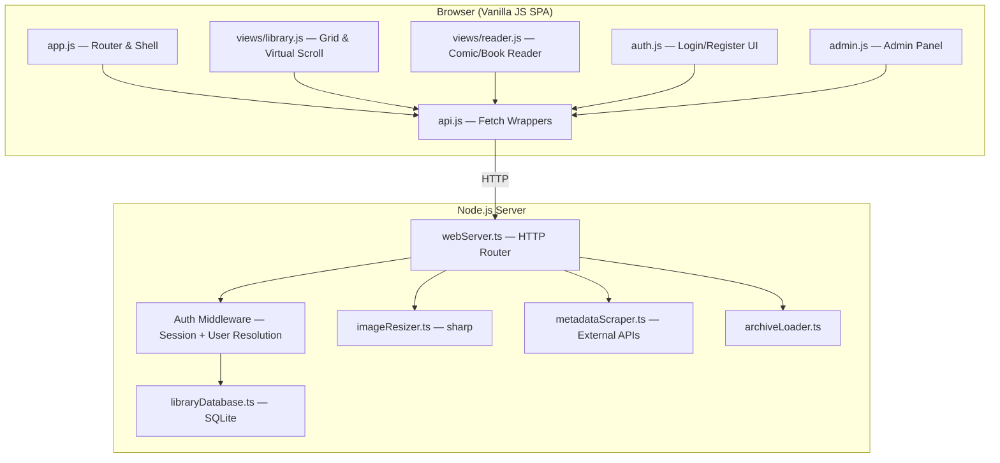
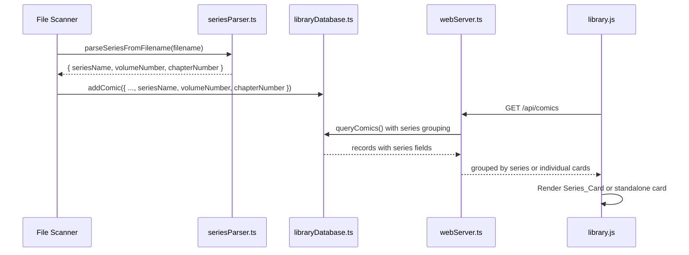

# Design Document: Web Reader Enhancements

## Overview

This design covers 26 requirements that transform the CB8 web UI from a basic page viewer into a full-featured comic/book reading platform with multi-user support. The changes span four major areas:

1. **Enhanced Comic Reader** (Req 1–8): Zoom modes, pinch-to-zoom, spread mode, webtoon mode, fullscreen, page transitions, reading direction, and wake lock — all implemented in `src/web/views/reader.js` using vanilla JS and browser APIs.
2. **Reading Progress & Library** (Req 9–18): Mark read/unread, bookmarks, reading history, read-status filtering, series auto-detection/grouping, pull-to-refresh, orientation lock, server-side image resizing (via `sharp`), and virtual scrolling grid.
3. **Multi-User System** (Req 19–24): User registration/login with bcrypt password hashing, per-user progress/bookmarks/history, admin role management, configurable guest access, per-user favorites, and a continue-reading shelf.
4. **Metadata** (Req 25–26): External API scraping (ComicVine, AniList, MangaDex) and manual metadata editing with new columns on the `comics` table.

All client-side work is vanilla JS with no build step. Server-side additions use `sharp` (image resizing) and `bcrypt` (password hashing) as the only new npm dependencies.

## Architecture

The existing architecture is preserved: a Node.js HTTP server (`webServer.ts`) serves a vanilla-JS SPA from `src/web/`. The database layer (`libraryDatabase.ts`) uses SQLite via `better-sqlite3`.

### High-Level Component Diagram



### Request Flow

1. Browser makes fetch request via `api.js`
2. `webServer.ts` routes the request, extracting the user from the session cookie via `AUTH_MW`
3. For authenticated endpoints, the resolved `userId` is passed to database methods
4. Database methods scope queries by `userId` for progress, bookmarks, history, and favorites
5. For image endpoints with a `width` param, `imageResizer.ts` resizes before responding

### Key Architectural Decisions

| Decision | Rationale |
|---|---|
| Extend existing session cookies with `userId` | Avoids breaking the current admin flow; sessions already work |
| `sharp` for server-side resizing | Mature, fast, no native GUI dependencies; already common in Node.js |
| `bcrypt` for password hashing | Industry standard; `bcryptjs` is a pure-JS fallback if native build fails |
| Series parsing in JS (not SQL) | Regex-based filename parsing is easier to test and iterate on in JS |
| Virtual grid via IntersectionObserver | No dependencies; works in all modern browsers; matches existing patterns |
| Metadata scraping server-side | Avoids CORS issues; keeps API keys server-side; client just displays results |

## Components and Interfaces

### Client-Side Components

#### 1. `src/web/views/reader.js` — Enhanced Comic Reader

The existing `renderComicReader` function is extended with:

- **Zoom controller**: Manages `zoomMode` (`fit-width` | `fit-height` | `original`), persisted to `localStorage`. Applies CSS `object-fit` / `width` / `height` styles to `#comic-page-img`.
- **Pinch-to-zoom handler**: Tracks two-touch gestures via `touchstart`/`touchmove`/`touchend`. Maintains a `pinchScale` (1×–5×) applied via CSS `transform: scale()`. Suppresses swipe navigation when `pinchScale > 1`.
- **Spread mode**: When enabled, renders two `` elements side by side in a flex container. Page navigation advances by 2. First/last pages display solo.
- **Webtoon mode**: Replaces the single-image viewer with a scrollable `<div>` containing all pages as stacked `` elements. Uses `IntersectionObserver` with a 2-page buffer for lazy loading. Tracks the most-visible page for progress updates.
- **Fullscreen toggle**: Calls `Element.requestFullscreen()` / `document.exitFullscreen()` on `#reader-overlay`. Hidden if API unavailable.
- **Page transitions**: `none` (current), `slide` (CSS `transform: translateX` over 250ms), `fade` (CSS `opacity` over 200ms). A `transitioning` flag blocks navigation during animation.
- **Reading direction**: `ltr` | `rtl`. Reverses tap-zone and swipe mappings. In spread mode, swaps left/right page positions. Keyboard arrows remain unchanged.
- **Wake lock**: Acquires `navigator.wakeLock.request('screen')` on reader open, releases on close. Re-acquires on `visibilitychange` back to `visible`.
- **Bookmark toggle**: Button in toolbar; calls `POST/DELETE /api/comics/:id/bookmarks`. Long-press opens note editor.
- **Orientation lock**: Calls `screen.orientation.lock('portrait'|'landscape')` based on spread mode state.
- **Toolbar controls**: Zoom cycle button, spread toggle, webtoon toggle, fullscreen toggle, direction toggle, bookmark toggle, orientation lock toggle, bookmarks list button.

```
Reader Toolbar Layout:
[← Back] [Title...] [🔖 Bookmark] [📐 Zoom] [📖 Spread] [📜 Webtoon] [↔ Direction] [🔒 Orient] [⛶ Fullscreen] [Slider] [3/24]
```

#### 2. `src/web/views/library.js` — Enhanced Library Grid

- **Read-status filter strip**: New pill row (`All | Unread | In Progress | Completed`) rendered below the file-type strip. Sends `readStatus` query param.
- **Series grouping**: When API returns series data, renders `Series_Card` elements instead of individual cards. Click navigates to `#/series/:name`.
- **Virtual grid**: When `totalCount > 200`, switches to virtual rendering. A spacer div maintains scroll height. `IntersectionObserver` on sentinel rows triggers card creation/removal.
- **Pull-to-refresh**: On mobile, a `touchstart`/`touchmove`/`touchend` handler on `#main-content` detects overscroll > 80px at `scrollTop ≤ 0`. Shows a spinner, re-fetches data, re-renders grid.
- **Continue Reading shelf**: On `#/` route for authenticated users, renders a horizontal scrollable row of small cards above the grid. Fetches from `GET /api/recently-read?limit=10`.
- **Favorites filter**: New "Favorites" pill in the filter strip (authenticated users only). Sends `favorites=true` query param.
- **Favorite toggle**: Heart icon on each card (authenticated users only). Calls `POST/DELETE /api/comics/:id/favorite`.

#### 3. `src/web/auth.js` — New Authentication UI

New module handling the multi-user login/register flow:

- **Login form**: Username + password fields. Calls `POST /api/auth/login`. On success, stores user info and refreshes session.
- **Register form** (admin only): Username + password fields. Calls `POST /api/auth/register`.
- **User management panel** (admin only): Lists users, allows promote/demote/delete. Calls `GET/POST/DELETE /api/users`, `PUT /api/users/:id/role`.
- **Guest mode detection**: On app init, if `GET /api/auth/session` returns `{ authenticated: false }` and guest access is disabled, shows login form instead of library.

#### 4. `src/web/api.js` — Extended API Client

New fetch wrappers for all new endpoints:
- `POST /api/auth/login`, `POST /api/auth/register`, `POST /api/auth/logout`, `GET /api/auth/session`
- `PUT/DELETE /api/comics/:id/progress` (with `completed` flag)
- `POST/DELETE/GET /api/comics/:id/bookmarks`, `PUT/DELETE /api/comics/:id/bookmarks/:id`
- `POST /api/history`, `GET /api/history`
- `POST/DELETE /api/comics/:id/favorite`
- `GET /api/series`, `GET /api/series/:name/comics`
- `GET /api/comics/:id/metadata-search`, `PUT /api/comics/:id/metadata`
- `GET/POST/DELETE /api/users`, `PUT /api/users/:id/role`
- `PUT /api/settings/guest-access`
- Updated `pageUrl()` and `thumbnailUrl()` to accept optional `width` param

#### 5. `src/web/app.js` — Router Extensions

New routes:
- `#/series/:name` — Series detail view
- `#/history` — Reading history view
- `#/login` — Login page (when guest access disabled and not authenticated)

### Server-Side Components

#### 1. `src/main/webServer.ts` — Extended HTTP Router

New API endpoints organized by feature area:

**Auth endpoints** (Req 19):
- `POST /api/auth/login` — Authenticate with username/password, create session
- `POST /api/auth/register` — Admin creates new user
- `POST /api/auth/logout` — Invalidate session
- `GET /api/auth/session` — Return current session state with user info

**Progress endpoints** (Req 9, 20):
- `PUT /api/comics/:id/progress` — Upsert per-user progress (extended with `completed` flag)
- `DELETE /api/comics/:id/progress` — Clear per-user progress

**Bookmark endpoints** (Req 10):
- `POST /api/comics/:id/bookmarks` — Create bookmark
- `GET /api/comics/:id/bookmarks` — List bookmarks for comic (scoped to user)
- `PUT /api/comics/:id/bookmarks/:bookmarkId` — Update bookmark note
- `DELETE /api/comics/:id/bookmarks/:bookmarkId` — Delete bookmark

**History endpoints** (Req 11):
- `POST /api/history` — Log reading event
- `GET /api/history` — List history entries (scoped to user, paginated)

**Series endpoints** (Req 13–14):
- `GET /api/series` — List all series with counts and cover info
- `GET /api/series/:name/comics` — List comics in a series

**User management endpoints** (Req 21):
- `GET /api/users` — List all users (admin only)
- `POST /api/users` — Create user (admin only)
- `DELETE /api/users/:id` — Delete user (admin only)
- `PUT /api/users/:id/role` — Promote/demote user (admin only)

**Settings endpoints** (Req 22):
- `PUT /api/settings/guest-access` — Toggle guest access (admin only)

**Favorites endpoints** (Req 23):
- `POST /api/comics/:id/favorite` — Add favorite
- `DELETE /api/comics/:id/favorite` — Remove favorite

**Metadata endpoints** (Req 25–26):
- `GET /api/comics/:id/metadata-search` — Search external APIs
- `PUT /api/comics/:id/metadata` — Apply metadata to comic

**Auth middleware** changes:
- Sessions now store `{ userId, expiresAt }` instead of just `{ expiresAt }`
- New `resolveUser(req)` function returns `{ userId, isAdmin }` or `null` for guests
- Existing `isAuthenticated()` still works but now checks the `users` table
- Guest access check: if `guest_access` is `"false"` in `app_meta`, unauthenticated requests to non-auth endpoints return 401

**Image resizing** (Req 17):
- `GET /api/comics/:id/pages/:page?width=N` — When `width` param present, resize via `sharp` before responding
- `GET /api/comics/:id/thumbnail?width=N` — Same for thumbnails
- Cache resized images in `<userData>/image-cache/<comicId>/<page>-<width>.jpg`

#### 2. `src/main/libraryDatabase.ts` — Schema Extensions

New tables and columns added via migration in `migrateSchema()`:

**New tables**: `users`, `user_progress`, `bookmarks`, `reading_history`, `user_favorites`
**New columns on `comics`**: `series_name`, `volume_number`, `chapter_number`, `completed`, `author`, `artist`, `genre`, `year`, `summary`, `external_id`, `external_source`

New database methods for each feature area (detailed in Data Models section).

#### 3. `src/main/imageResizer.ts` — New Module

```typescript
interface ResizeOptions {
  width: number;       // target width (200–4000)
  inputBuffer: Buffer; // raw image bytes
  format?: 'jpeg' | 'png' | 'webp';
}

async function resizeImage(options: ResizeOptions): Promise<Buffer>;
async function getCachedOrResize(comicId: number, page: number, width: number, getOriginal: () => Promise<Buffer>): Promise<Buffer>;
```

Uses `sharp` to resize, caching results in `<userData>/image-cache/`.

#### 4. `src/main/metadataScraper.ts` — New Module

```typescript
interface MetadataCandidate {
  source: 'comicvine' | 'anilist' | 'mangadex';
  externalId: string;
  title: string;
  author: string | null;
  artist: string | null;
  genre: string[];
  year: number | null;
  summary: string | null;
  coverUrl: string | null;
}

async function searchMetadata(query: string, sources?: string[]): Promise<{ results: MetadataCandidate[]; warnings: string[] }>;
```

Makes HTTP requests to external APIs. Each source has its own adapter function. Errors are caught per-source and returned as warnings.

#### 5. `src/main/seriesParser.ts` — New Module

```typescript
interface ParsedSeries {
  seriesName: string | null;
  volumeNumber: number | null;
  chapterNumber: number | null;
}

function parseSeriesFromFilename(filename: string): ParsedSeries;
function normalizeSeriesName(name: string): string;
```

Pure function that extracts series info from filenames using regex patterns. Handles common formats:
- `Title v01.cbz`, `Title Vol. 3.cbz`, `Title Vol 3 Ch 12.cbz`
- `Title #005.cbr`, `Title - Chapter 12.cbz`
- `Title (2020) #01.cbz`

`normalizeSeriesName` trims whitespace and collapses multiple spaces.


## Data Models

### New Database Tables

#### `users` Table
```sql
CREATE TABLE IF NOT EXISTS users (
  id INTEGER PRIMARY KEY AUTOINCREMENT,
  username TEXT NOT NULL UNIQUE COLLATE NOCASE,
  password_hash TEXT NOT NULL,
  is_admin INTEGER NOT NULL DEFAULT 0,
  created_at TEXT NOT NULL DEFAULT (datetime('now'))
);
CREATE UNIQUE INDEX IF NOT EXISTS idx_users_username ON users(username COLLATE NOCASE);
```

#### `user_progress` Table
```sql
CREATE TABLE IF NOT EXISTS user_progress (
  user_id INTEGER NOT NULL REFERENCES users(id) ON DELETE CASCADE,
  comic_id INTEGER NOT NULL REFERENCES comics(id) ON DELETE CASCADE,
  last_page INTEGER,
  last_location TEXT,
  last_read TEXT,
  completed INTEGER NOT NULL DEFAULT 0,
  PRIMARY KEY (user_id, comic_id)
);
CREATE INDEX IF NOT EXISTS idx_user_progress_user ON user_progress(user_id);
CREATE INDEX IF NOT EXISTS idx_user_progress_comic ON user_progress(comic_id);
```

#### `bookmarks` Table
```sql
CREATE TABLE IF NOT EXISTS bookmarks (
  id INTEGER PRIMARY KEY AUTOINCREMENT,
  user_id INTEGER NOT NULL REFERENCES users(id) ON DELETE CASCADE,
  comic_id INTEGER NOT NULL REFERENCES comics(id) ON DELETE CASCADE,
  page INTEGER NOT NULL,
  note TEXT,
  created_at TEXT NOT NULL DEFAULT (datetime('now'))
);
CREATE INDEX IF NOT EXISTS idx_bookmarks_user_comic ON bookmarks(user_id, comic_id);
```

#### `reading_history` Table
```sql
CREATE TABLE IF NOT EXISTS reading_history (
  id INTEGER PRIMARY KEY AUTOINCREMENT,
  user_id INTEGER NOT NULL REFERENCES users(id) ON DELETE CASCADE,
  comic_id INTEGER NOT NULL REFERENCES comics(id) ON DELETE CASCADE,
  action TEXT NOT NULL,
  page INTEGER,
  timestamp TEXT NOT NULL DEFAULT (datetime('now'))
);
CREATE INDEX IF NOT EXISTS idx_reading_history_user ON reading_history(user_id);
CREATE INDEX IF NOT EXISTS idx_reading_history_timestamp ON reading_history(timestamp);
```

#### `user_favorites` Table
```sql
CREATE TABLE IF NOT EXISTS user_favorites (
  user_id INTEGER NOT NULL REFERENCES users(id) ON DELETE CASCADE,
  comic_id INTEGER NOT NULL REFERENCES comics(id) ON DELETE CASCADE,
  created_at TEXT NOT NULL DEFAULT (datetime('now')),
  PRIMARY KEY (user_id, comic_id)
);
CREATE INDEX IF NOT EXISTS idx_user_favorites_user ON user_favorites(user_id);
```

### Modified `comics` Table — New Columns

```sql
-- Series detection (Req 13)
ALTER TABLE comics ADD COLUMN series_name TEXT DEFAULT NULL;
ALTER TABLE comics ADD COLUMN volume_number REAL DEFAULT NULL;
ALTER TABLE comics ADD COLUMN chapter_number REAL DEFAULT NULL;

-- Completion flag (Req 9) — global fallback for non-user-scoped queries
ALTER TABLE comics ADD COLUMN completed INTEGER NOT NULL DEFAULT 0;

-- Metadata (Req 25–26)
ALTER TABLE comics ADD COLUMN author TEXT DEFAULT NULL;
ALTER TABLE comics ADD COLUMN artist TEXT DEFAULT NULL;
ALTER TABLE comics ADD COLUMN genre TEXT DEFAULT NULL;  -- JSON array of strings
ALTER TABLE comics ADD COLUMN year INTEGER DEFAULT NULL;
ALTER TABLE comics ADD COLUMN summary TEXT DEFAULT NULL;
ALTER TABLE comics ADD COLUMN external_id TEXT DEFAULT NULL;
ALTER TABLE comics ADD COLUMN external_source TEXT DEFAULT NULL;
```

New indexes:
```sql
CREATE INDEX IF NOT EXISTS idx_comics_series ON comics(series_name COLLATE NOCASE);
CREATE INDEX IF NOT EXISTS idx_comics_last_read ON comics(last_read);
```

### Migration Strategy

All schema changes are applied in `libraryDatabase.ts` `migrateSchema()` using the existing pattern:

```typescript
// Check if column exists via PRAGMA table_info, then ALTER TABLE ADD COLUMN
const cols = db.prepare('PRAGMA table_info(comics)').all();
if (!cols.some(c => c.name === 'series_name')) {
  db.prepare('ALTER TABLE comics ADD COLUMN series_name TEXT DEFAULT NULL').run();
}
// ... repeat for each new column

// Create new tables (IF NOT EXISTS handles idempotency)
db.exec(`CREATE TABLE IF NOT EXISTS users (...)`);
db.exec(`CREATE TABLE IF NOT EXISTS user_progress (...)`);
// etc.
```

On first startup after migration, if the `users` table is empty, create the initial admin user:
```typescript
const userCount = db.prepare('SELECT COUNT(*) as cnt FROM users').get();
if (userCount.cnt === 0) {
  const hash = bcrypt.hashSync(existingAdminPassword, 10);
  db.prepare('INSERT INTO users (username, password_hash, is_admin) VALUES (?, ?, 1)')
    .run('admin', hash);
}
```

### Session Model Changes

Current session storage: `Map<string, { expiresAt: number }>`

New session storage: `Map<string, { userId: number; expiresAt: number }>`

The `resolveUser` function extracts the session token from the cookie, looks up the session, and returns the user record:

```typescript
interface ResolvedUser {
  id: number;
  username: string;
  isAdmin: boolean;
}

function resolveUser(req: http.IncomingMessage): ResolvedUser | null {
  const token = parseCookies(req.headers.cookie)[SESSION_COOKIE];
  if (!token) return null;
  const session = sessions.get(token);
  if (!session || session.expiresAt < Date.now()) return null;
  return db.getUserById(session.userId);
}
```

### API Response Model Changes

The `WebComicRecord` interface is extended:

```typescript
interface WebComicRecord {
  // ... existing fields ...
  completed: boolean;
  isFavorite: boolean;        // per-user, false for guests
  seriesName: string | null;
  volumeNumber: number | null;
  chapterNumber: number | null;
  author: string | null;
  artist: string | null;
  genre: string[] | null;
  year: number | null;
  summary: string | null;
}
```

When building the response, per-user fields (`lastPage`, `lastLocation`, `lastRead`, `completed`, `isFavorite`) are joined from `user_progress` and `user_favorites` using the resolved `userId`. For guest users, these fields are `null`/`false`.

### Series Data Flow




## Correctness Properties

*A property is a characteristic or behavior that should hold true across all valid executions of a system — essentially, a formal statement about what the system should do. Properties serve as the bridge between human-readable specifications and machine-verifiable correctness guarantees.*

### Property 1: Zoom mode cycling is deterministic

*For any* starting zoom mode (`fit-width`, `fit-height`, `original`) and *for any* number of cycle taps N ≥ 0, the resulting zoom mode SHALL equal `MODES[(indexOf(start) + N) % 3]` where `MODES = ['fit-width', 'fit-height', 'original']`.

**Validates: Requirements 1.5**

### Property 2: Reader preferences localStorage round-trip

*For any* valid reader preference object containing `zoomMode`, `spreadMode`, `webtoonMode`, `pageTransition`, and `readingDirection`, serializing to localStorage and then deserializing SHALL produce an object equal to the original.

**Validates: Requirements 1.6, 3.5, 4.6, 6.4, 7.6**

### Property 3: Pinch zoom scale clamping

*For any* numeric input scale value (including negative, zero, and very large values), the clamped pinch zoom scale SHALL always be within the range [1, 5] inclusive.

**Validates: Requirements 2.2**

### Property 4: Swipe suppression when pinch-zoomed

*For any* pinch zoom scale value, swipe page-turn gestures SHALL be suppressed if and only if the scale is strictly greater than 1.

**Validates: Requirements 2.5**

### Property 5: Spread mode page layout

*For any* comic with `pageCount ≥ 1`, *for any* current page index in `[0, pageCount-1]`, and *for any* reading direction (`ltr` | `rtl`): (a) if the current page is 0 or the last page of an odd-total comic, the spread SHALL display one page centered; (b) otherwise, the spread SHALL display two pages with the lower-numbered page on the left for LTR or on the right for RTL; (c) the page label SHALL reflect the lower-numbered visible page; (d) navigation SHALL advance/retreat by 2 (clamped to bounds).

**Validates: Requirements 3.3, 3.4, 3.6, 7.5**

### Property 6: Webtoon mode lazy-load buffer

*For any* visible page index `v` in a comic with `pageCount` pages, the set of pages that should be loaded SHALL be exactly `{ p : max(0, v-2) ≤ p ≤ min(pageCount-1, v+2) }`.

**Validates: Requirements 4.3**

### Property 7: Direction-dependent navigation mapping

*For any* reading direction (`ltr` | `rtl`) and *for any* navigation input (left tap zone, right tap zone, swipe-left, swipe-right), the resulting navigation action (next page, previous page) SHALL be: for LTR, left=prev and right=next; for RTL, left=next and right=prev. Keyboard arrow keys SHALL always map ArrowRight=next, ArrowLeft=prev regardless of direction.

**Validates: Requirements 7.2, 7.3, 7.4**

### Property 8: Read status menu option selection

*For any* comic with a Read_Status of `unread`, `in-progress`, or `completed`, the context menu SHALL show "Mark as read" if the status is not `completed`, and "Mark as unread" if the status is `completed` or `in-progress`.

**Validates: Requirements 9.1**

### Property 9: Read status filter correctness

*For any* set of comics with varying progress states (lastPage, lastLocation, completed) and *for any* combination of filters (readStatus, mediaType, fileExt, tag, search), the returned set SHALL contain exactly those comics that satisfy ALL active filter predicates simultaneously, where: `unread` = (lastPage IS NULL AND lastLocation IS NULL AND completed = 0), `in-progress` = ((lastPage IS NOT NULL OR lastLocation IS NOT NULL) AND completed = 0), `completed` = (completed = 1).

**Validates: Requirements 12.3, 12.4, 12.5, 12.6**

### Property 10: Series filename parsing

*For any* filename matching a known series pattern (e.g., `"<Title> v<N>.cbz"`, `"<Title> Vol. <N> Ch. <M>.cbz"`, `"<Title> #<N>.cbr"`), the parser SHALL extract a non-null `seriesName`, and the correct `volumeNumber` and/or `chapterNumber`. *For any* filename not matching any pattern, all three fields SHALL be null.

**Validates: Requirements 13.1, 13.4**

### Property 11: Series name normalization is idempotent

*For any* input string, `normalizeSeriesName(normalizeSeriesName(s))` SHALL equal `normalizeSeriesName(s)`. Additionally, the normalized result SHALL contain no leading or trailing whitespace and no consecutive space characters.

**Validates: Requirements 13.3**

### Property 12: Series grouping correctness

*For any* set of comics where some have non-null `series_name` values, the grouping function SHALL produce exactly one group per distinct normalized `series_name`, each group containing all comics with that normalized name. Comics with null `series_name` SHALL appear as standalone items, not in any group.

**Validates: Requirements 14.1, 14.5**

### Property 13: Image resize width clamping

*For any* numeric `width` parameter value, the server SHALL clamp it to the range [200, 4000] inclusive. Values below 200 become 200; values above 4000 become 4000.

**Validates: Requirements 17.3**

### Property 14: Virtual grid visible row calculation

*For any* scroll position, viewport height, row height, and total item count (all non-negative), the set of visible row indices (plus a 2-row buffer above and below) SHALL be a contiguous range within `[0, totalRows-1]`, and SHALL include all rows whose vertical position overlaps the viewport.

**Validates: Requirements 18.1, 18.2, 18.4**

### Property 15: Per-user data isolation

*For any* two distinct users A and B, and *for any* comic: (a) updating A's progress SHALL NOT change B's progress for the same comic; (b) creating a bookmark as A SHALL NOT make it visible to B; (c) A's reading history entries SHALL NOT appear in B's history queries; (d) A's favorites SHALL NOT appear in B's favorites list.

**Validates: Requirements 20.2, 20.3, 20.6, 20.7**

### Property 16: Role-based access control

*For any* authenticated user with `isAdmin = false`, requests to admin-only endpoints (user management, library scanning, uploading, deleting comics, managing libraries/folders/tags) SHALL return HTTP 403. *For any* authenticated user with `isAdmin = true`, the same requests SHALL succeed (2xx).

**Validates: Requirements 21.6, 21.7, 21.8**

### Property 17: Guest access control

*For any* API endpoint and *for any* guest_access setting (`true` | `false`): (a) when `guest_access = false` and the request is unauthenticated, all endpoints except `POST /api/auth/login` and `GET /api/auth/session` SHALL return 401; (b) when `guest_access = true` and the request is unauthenticated, read-only endpoints SHALL succeed and write endpoints SHALL return 401.

**Validates: Requirements 22.2, 22.3, 22.4**

### Property 18: Genre field validation

*For any* input value for the `genre` field in a `PUT /api/comics/:id/metadata` request: if the value is a valid JSON array where every element is a string, the server SHALL accept it (200); if the value is not a valid JSON array of strings (e.g., contains numbers, is a plain string, is an object), the server SHALL reject it (400).

**Validates: Requirements 26.5**


## Error Handling

### Client-Side Error Handling

| Scenario | Handling |
|---|---|
| Browser API not supported (Fullscreen, Wake Lock, Orientation Lock) | Feature-detect before rendering toggle buttons. Hide buttons if API unavailable. No error shown to user. |
| Pinch-to-zoom on non-touch device | No touch events fired; pinch handler simply never activates. No error. |
| Page image fails to load | Existing `onerror` handler shows placeholder. In webtoon mode, show a "Failed to load" placeholder in the scroll column. |
| API request fails (network error) | Show toast with "Cannot reach the server" message. Retry on next user action. |
| Login with invalid credentials | Show inline error "Invalid username or password" without revealing which field was wrong. |
| Register with duplicate username | Show inline error "Username already taken" (409 from server). |
| localStorage unavailable or full | Catch `SecurityError`/`QuotaExceededError` in preference persistence. Fall back to in-memory defaults. Reader still works. |
| Metadata API unreachable | Server returns empty results array with a `warnings` field listing which sources failed. Client shows "No results from [source]" in the selection dialog. |
| Image resize fails (sharp error) | Server falls back to serving the original unresized image. Logs the error. |
| Guest tries write operation | Server returns 401. Client shows login prompt. |
| Non-admin tries admin operation | Server returns 403. Client shows toast "Admin access required". |
| Session expired mid-use | API returns 401. Client detects via response status, clears local auth state, shows login prompt. |
| Bookmark creation on same page twice | Server uses UNIQUE constraint; returns existing bookmark. No error to user. |
| Favorite toggle on already-favorited comic | Server uses INSERT OR IGNORE; returns success. Idempotent. |
| Series parser encounters unexpected filename | Parser returns `{ seriesName: null, volumeNumber: null, chapterNumber: null }`. Comic appears as standalone. |
| Virtual grid with zero items | Falls back to non-virtualized rendering (empty state). |
| Pull-to-refresh while already refreshing | Ignored (guard flag prevents concurrent refreshes). |
| Orientation lock rejected by browser | Catch the rejected promise. Show toast "Orientation lock not available" or hide the button. |
| bcrypt hash comparison fails | Return 401 to client. Log nothing about the password. |
| Database migration fails | Existing pattern: log warning, attempt to recreate database. Worst case: fresh database with no data. |

### Server-Side Error Handling

All API endpoints follow the existing pattern:
- Parse errors → 400 with descriptive message
- Auth failures → 401 "Unauthorized"
- Permission failures → 403 "Forbidden"
- Not found → 404 with entity-specific message
- Conflict (duplicate) → 409 with descriptive message
- Internal errors → 500 with generic message (details logged server-side only)

The `handleRequest` function's existing top-level `catch` ensures unhandled errors return 500 JSON.

### Data Integrity

- All multi-step database operations (e.g., deleting a user and their progress/bookmarks/history/favorites) use SQLite transactions via `db.transaction()`.
- Foreign key cascades (`ON DELETE CASCADE`) on `user_progress`, `bookmarks`, `reading_history`, `user_favorites` ensure orphaned rows are cleaned up when a user or comic is deleted.
- The `completed` flag on `user_progress` is a boolean integer (0/1), not derived, to avoid ambiguity with page-count-based completion detection.

## Testing Strategy

### Testing Framework

- **Unit tests**: Vitest (already configured in `vitest.config.ts`)
- **Property-based tests**: `fast-check` library with Vitest integration
- **Integration tests**: Vitest with in-memory SQLite database instances

### Property-Based Tests

Each correctness property from the design document is implemented as a `fast-check` property test with a minimum of 100 iterations. Tests are tagged with the property they validate.

```typescript
// Example tag format:
// Feature: web-reader-enhancements, Property 11: Series name normalization is idempotent
```

**PBT test files** (new):
- `src/shared/readerPreferences.test.ts` — Properties 1, 2, 3, 4
- `src/shared/spreadLayout.test.ts` — Property 5
- `src/shared/webtoonBuffer.test.ts` — Property 6
- `src/shared/navigationMapping.test.ts` — Property 7
- `src/shared/readStatus.test.ts` — Properties 8, 9
- `src/shared/seriesParser.test.ts` — Properties 10, 11, 12
- `src/shared/imageClamping.test.ts` — Property 13
- `src/shared/virtualGrid.test.ts` — Property 14
- `src/shared/genreValidation.test.ts` — Property 18

**PBT tests requiring database** (integration-style PBT):
- `src/main/userIsolation.test.ts` — Property 15
- `src/main/accessControl.test.ts` — Properties 16, 17

### Unit Tests (Example-Based)

Focus areas:
- Zoom mode CSS style application (Req 1.2–1.4)
- Double-tap toggle behavior (Req 2.4)
- Fullscreen API feature detection (Req 5.4)
- Page transition animation blocking (Req 6.5)
- Wake lock lifecycle (Req 8.1–8.5)
- Bookmark CRUD operations (Req 10)
- Reading history logging (Req 11)
- Pull-to-refresh gesture detection (Req 15)
- Orientation lock API calls (Req 16)
- Login/register form validation (Req 19)
- Continue Reading shelf visibility conditions (Req 24)
- Metadata edit form pre-fill (Req 26)

### Integration Tests

- Auth flow: login → session check → logout → session check
- User management: create user → list → promote → demote → delete
- Per-user progress: user A updates progress → user B sees own progress unchanged
- Bookmark CRUD: create → list → update note → delete
- Guest access toggle: enable → verify read access → verify write blocked → disable → verify all blocked
- Image resize endpoint: request with width param → verify response dimensions
- Series detection: add comics with series filenames → verify GET /api/series returns correct grouping
- Metadata: search → apply → verify comic record updated

### Test Organization

```
src/shared/
  readerPreferences.test.ts    (Properties 1–4)
  spreadLayout.test.ts         (Property 5)
  webtoonBuffer.test.ts        (Property 6)
  navigationMapping.test.ts    (Property 7)
  readStatus.test.ts           (Properties 8–9)
  seriesParser.test.ts         (Properties 10–12)
  imageClamping.test.ts        (Property 13)
  virtualGrid.test.ts          (Property 14)
  genreValidation.test.ts      (Property 18)
src/main/
  userIsolation.test.ts        (Property 15)
  accessControl.test.ts        (Properties 16–17)
```

### Test Configuration

- `fast-check` configured with `{ numRuns: 100 }` minimum per property
- Database tests use temporary in-memory SQLite instances (`':memory:'`)
- No external network calls in tests — metadata scraper tests use mocked HTTP responses
- All tests run via `pnpm test` (Vitest single-run mode)

