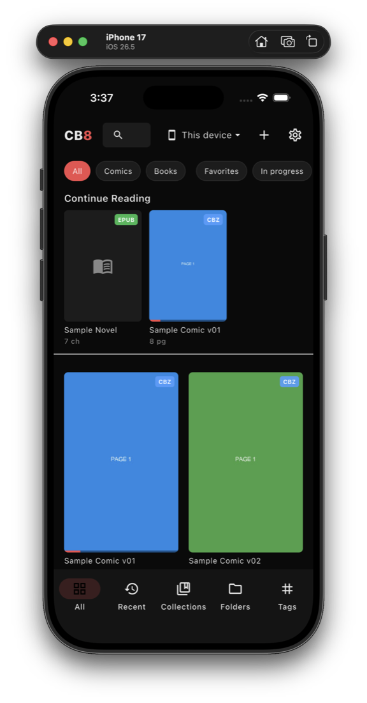
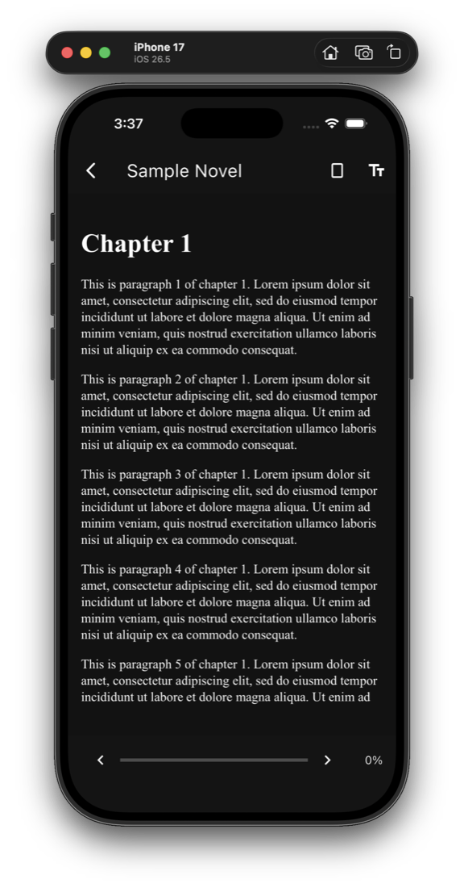
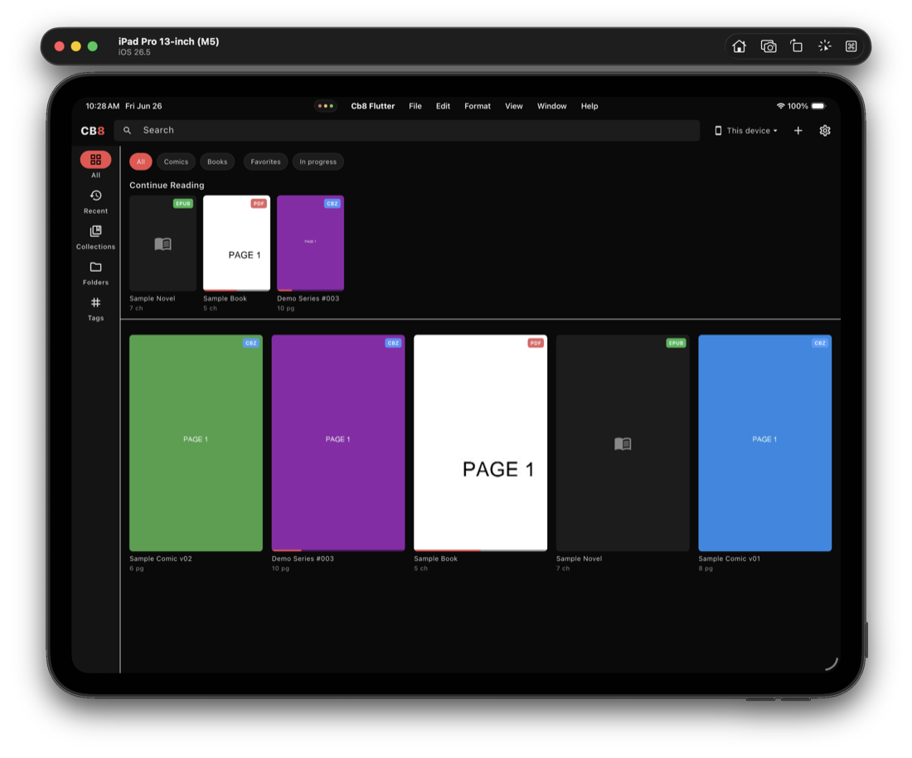
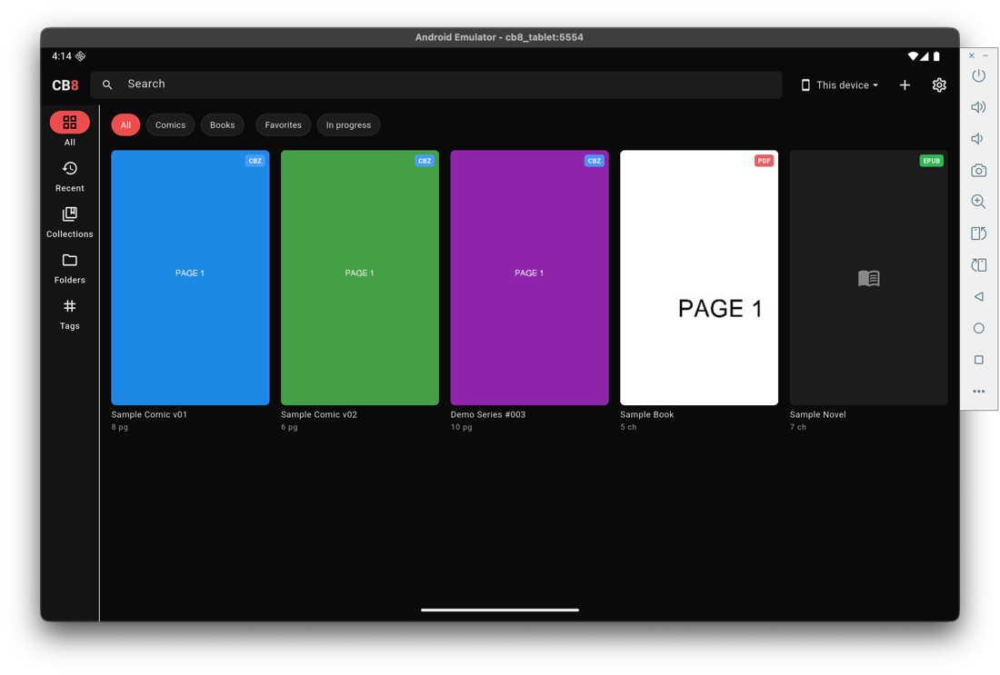
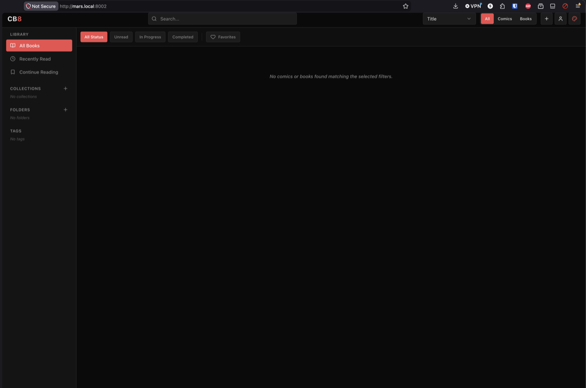
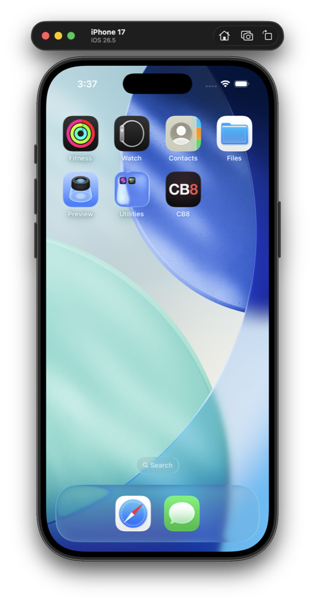

# CB8

A fast, cross-platform **comic & ebook reader** for **CBZ, PDF, and EPUB**, built with Flutter.
Mobile-first, with a polished desktop experience and an optional *hybrid* mode that pairs with a
self-hosted CB8 server.

<p align="center">
  
</p>

## Features

- **Three formats, one library** — CBZ comics (`archive` + `photo_view`), PDFs (`pdfrx` / pdfium), and reflowable EPUB (epub.js in a WebView).
- **Organized library** — cover grid with format badges, search, quick filters (Comics / Books / Favorites / In progress), Collections, Folders (auto-grouped series), Tags, a Recent tab, and a **Continue Reading** shelf.
- **Resume where you left off** — per-item reading progress is tracked and restored; the Continue Reading shelf updates live.
- **Reading modes** — continuous scroll, single page, and two-page spread, with tap zones, swipe, and pinch-zoom.
- **Hybrid / server mode** — read from *this device*, or connect to a self-hosted CB8 server and browse + read remotely with progress sync.
- **Truly cross-platform** — iOS, Android, and macOS (Windows/Linux scaffolded). The shell adapts: a `NavigationRail` on tablets & desktops, a bottom bar on phones.
- **Desktop-native touches** — keyboard navigation + zoom shortcuts, drag-and-drop import, a native macOS menu bar, fullscreen, and window size/position persistence.

## Screenshots

### On your phone
Adaptive phone layout with a bottom nav bar, and the dark-themed EPUB reader.

<p align="center">
  
  &nbsp;&nbsp;&nbsp;
  
</p>

### On a tablet
On a wide screen the app switches to a sidebar rail and a denser grid — iPad and Android tablet.

<p align="center">
  
</p>
<p align="center">
  
</p>

### Hybrid / server mode
Point the app at a self-hosted **CB8 server** to browse and read your whole library remotely — progress syncs back.

<p align="center">
  
</p>

### Native app icon
<p align="center">
  
</p>

## Tech stack

| Area | Library |
|---|---|
| State / DI | [Riverpod](https://riverpod.dev) |
| Navigation | [go_router](https://pub.dev/packages/go_router) |
| Local catalog | [Drift](https://drift.simonbinder.eu) + `sqlite3_flutter_libs` |
| PDF | [pdfrx](https://pub.dev/packages/pdfrx) (pdfium) |
| CBZ | [photo_view](https://pub.dev/packages/photo_view) + `archive` |
| EPUB | [flutter_epub_viewer](https://pub.dev/packages/flutter_epub_viewer) (epub.js / WebView) |
| Networking | [dio](https://pub.dev/packages/dio) + `cookie_jar` |
| Import | `file_picker`, `desktop_drop` (desktop drag-and-drop) |

## Getting started

```bash
flutter pub get
flutter run                          # choose a device when prompted

# Explore the UI instantly with synthetic CBZ/PDF/EPUB samples:
flutter run --dart-define=SEED=true
```

Supported targets: **iOS**, **Android**, **macOS** (verified) — **Windows** / **Linux** desktop scaffolds exist; EPUB on Linux needs a WebView strategy (see `todo.md`).

## Project status

Active personal project. Local reading + library organization and hybrid server mode work across iOS, Android, and macOS. Remaining work (store packaging/signing, the Linux EPUB engine, polish) is tracked in [`todo.md`](todo.md).
