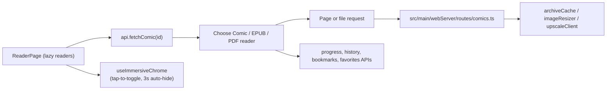

# Reader Guide

CB8 has three reader surfaces. `src/renderer/pages/ReaderPage.tsx` fetches the
comic record and chooses the reader from its media type and extension
(`readerPageHelpers.ts` → `determineReaderFormat`):

- `src/renderer/components/reader/ComicReader.tsx` for CBZ / CBR.
- `src/renderer/components/reader/EpubReader.tsx` for EPUB.
- `src/renderer/components/reader/PdfReader.tsx` for PDF.

All three are **lazy-loaded** (`React.lazy` in `ReaderPage.tsx`), so the heavy
libraries (pdf.js, epub.js) live in their own chunks and are only fetched when
a book is actually opened — they stay out of the initial library bundle.

The shared toolbar lives in `ReaderToolbar.tsx`; each reader contributes its
format-specific controls (`ComicReaderControls`, `EpubReaderControls`,
`EpubReaderSheets`). Reader preferences are stored in
`src/renderer/store/readerStore.ts`.

## Immersive chrome

All three readers share one chrome pattern, owned by
`src/renderer/hooks/useImmersiveChrome.ts` and wired up in `ReaderPage`:

- The toolbar is **hidden when a book opens**.
- A **center tap/click toggles it**; side tap zones stay reserved for page
  turns and never reach the toggle.
- Any activity (mouse movement, interacting with the chrome) reveals it or
  keeps it up; it **auto-hides after 3 seconds** of inactivity
  (`CHROME_AUTO_HIDE_MS`) — unless the pointer is resting on the chrome
  itself, which pins it open.

The show/hide decision is a pure function (`nextChromeState`) with unit tests
in `useImmersiveChrome.test.ts`, so timing rules can change without touching
React. The EPUB reader renders into iframes whose events can't bubble out, so
it broadcasts `cb8:reader-toggle-toolbar` / `cb8:reader-back` /
`cb8:reader-toggle-fullscreen` custom events that `ReaderPage` listens for.

## Keyboard bindings

Chrome-level shortcuts are owned by `ReaderPage` and apply in **every** reader
(`readerPageHelpers.ts` → `readerChromeKeyAction`):

| Key | Action |
| --- | --- |
| `Escape` | Back to the library |
| `f` | Toggle fullscreen |

Format-specific bindings:

- **Comic** (`src/renderer/hooks/useComicKeyboard.ts`): arrows are spatial
  (mapped to forward/back per reading direction); `Space` / `PageDown` advance,
  `Backspace` / `PageUp` go back; `Home` / `End` jump to first/last page; `Z`
  cycles zoom, `+` / `-` / `0` zoom in/out/reset; `B` toggles bookmark; `S`
  toggles two-page spread.
- **EPUB** (`epubReaderInteractions.ts`): `ArrowRight` / `Space` next,
  `ArrowLeft` / `Backspace` previous.
- **PDF** (`pdfReaderRules.ts`): same arrow/space/backspace scheme.

Shortcuts never fire while an editable form control has focus, and keys are
left alone while a sheet/dialog owns them (Escape must close the sheet, not
exit the book).

## Comic Reader

Comic pages are fetched from `/api/comics/:id/pages/:page` (optionally
`?width=` for a resized variant, `?upscale=1` for the HD Real-ESRGAN variant
when an upscale service is configured). The server opens the archive through
`src/main/webServer/archiveCache.ts`, reads the page with
`src/main/archiveLoader.ts`, and resizes/upscales via
`src/main/imageResizer.ts` / `src/main/upscaleClient.ts`.

Useful entry points:

- `ComicReader.tsx` — orchestration: page fetching, preload cache (keyed by
  page + HD flag), progress writes.
- `ComicReaderView.tsx` / `ComicReaderControls.tsx` — presentation and toolbar
  controls.
- `comicReaderRules.ts` — tested pure rules (paging, spread, direction).
- `src/renderer/hooks/useComicKeyboard.ts` / `useComicGestures.ts` — keyboard
  and touch gestures.
- `src/shared/scaleFit.ts` — fit-width / fit-height math.

## EPUB Reader

EPUB files are served from `/api/comics/:id/file` and rendered with `epub.js`.
Theme injection lives in `src/shared/epubTheme.ts` and
`epubRenditionTheme.ts`; fonts in `epubReaderFonts.ts`; iframe event bridging
in `epubReaderIframeEvents.ts`.

Progress is stored as an EPUB location (CFI) **plus a whole-book percentage**
with `api.updateLocation(comicId, cfi, percent)`. The percentage comes from
epub.js's whole-book location index (`book.locations.percentageFromCfi`) —
`location.start.percentage` alone is only section-local — and the reader
footer shows it as "*N*% read" once the index is generated. The same percent
drives the library card caption and the Continue-reading progress bar.

## PDF Reader

PDF files are served from `/api/comics/:id/file` and rendered with `pdfjs-dist`.
The worker bundle is produced by the renderer build.

Progress is stored as a zero-based page index with
`api.updateProgress(comicId, page)`.

## Reader Data Flow

## Safe Places To Start

For small reader changes, start in this order:

1. `ReaderPage.tsx` if the change is about choosing a reader or chrome-level
   behavior (keyboard, immersive chrome, fullscreen).
2. The format's `*Rules.ts` / interaction helper if the logic is a paging or
   input rule — they're pure and unit-tested.
3. The specific reader component if the change is format-specific.
4. `readerStore.ts` if the change is a persistent preference.
5. `src/shared/scaleFit.ts` or another shared helper if the logic is pure and
   easy to unit test.
