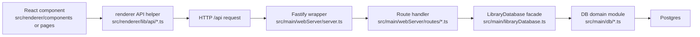
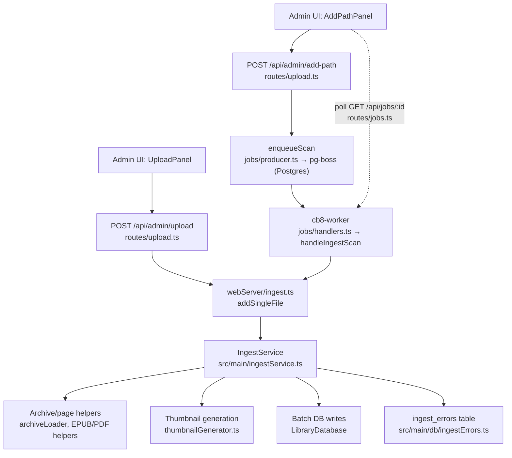
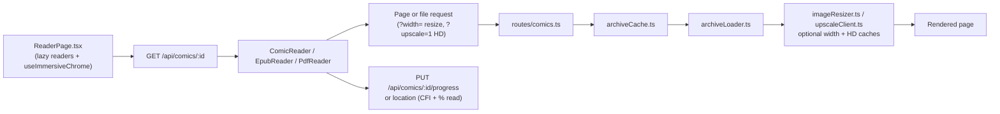
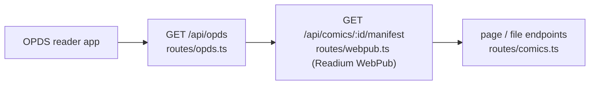

# CB8 Flow Diagrams

These diagrams are intentionally small. They are here to help new contributors
build a mental model before diving into files.

## Renderer To API To Database

## Upload And Ingest

Two paths get files into the library. Direct uploads stream to disk and ingest
inline; adding a server path enqueues a durable scan job that the separate
worker process executes while the UI polls for progress.

## Reader Page/Image Flow

## External Reader Apps (OPDS / WebPub)

