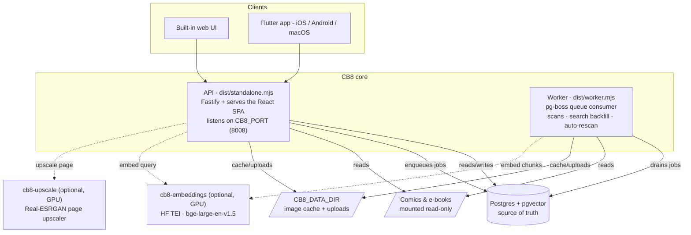

# Architecture

> **Optional background — you don't need this to run CB8.** This page explains how the server is built under the hood. It's for the curious and for anyone troubleshooting an advanced setup. If you just want to get reading, follow [Install with Docker](/installation/docker) and the [Usage](/usage) guide instead.

This page describes how CB8 is put together internally: what the moving parts are, where your data lives, and how a typical request travels through the system. You don't need to understand any of it to use CB8, but it can help if you ever need to debug, back up, or scale your setup. Unfamiliar terms are explained as they come up, and you can always check the [Glossary](/glossary).

In one sentence: CB8 is three cooperating programs plus two optional add-ons. The guiding rule is simple — **Postgres is the source of truth** (the database that holds everything important), the **API** program answers requests from your apps and *queues up* heavy jobs, and a separate **background worker** does the slow, heavy work. Because every queued job is stored in Postgres, a restart picks up where it left off and never duplicates work.

## Runtime topology

Here's the big picture — the boxes are the running programs and stores, and the arrows show how they talk to each other.

### The two processes

CB8 runs two programs at once: a quick-to-respond **API** and a slow-but-steady **worker**. Both are started from the **same container image** (the same packaged software) — they just run different entry points. A *container* is a lightweight, self-contained package of an app and everything it needs; see the [Glossary](/glossary) if that's a new term.

| Process | Command | Role |
| --- | --- | --- |
| **API** | `node /app/dist/standalone.mjs` | A Fastify server that serves the React SPA and the `/api/*` surface, reads catalog data from Postgres, and **only enqueues** heavy jobs (it runs pg-boss in producer-only mode). Listens on `CB8_HOST:CB8_PORT` (default `0.0.0.0:8008`), runs as uid `10001`. Throws on startup if `DATABASE_URL` is unset. |
| **Worker** | `node /app/dist/worker.mjs` (via `tini`) | A pg-boss queue consumer with no HTTP listener. It **drains** the queues — library `ingest-scan` jobs and ebook `search-backfill` jobs — and runs the **auto-rescan scheduler**, which enqueues a durable low-priority scan per folder on an interval. This is where all the long, CPU-heavy work happens. |

Why split them up? It keeps the app snappy. The API never gets stuck waiting on a big library scan — it just notes the job and moves on, so the interface stays responsive. The worker quietly handles the heavy lifting in the background, and if either program restarts, no work is lost or repeated.

## What lives where

Three different places hold three different kinds of data. Knowing which is which tells you what to back up (Postgres and uploads) and what you can safely throw away (the cache).

### Postgres — durable, the source of truth

**Postgres** is the database at the heart of CB8 — it's the one place that holds everything you'd be sad to lose. (The Kubernetes setup uses the `pgvector/pgvector:pg18` image; `pgvector` is a Postgres add-on for AI-style similarity search, used by the "search inside your books" feature.) Postgres stores:

- The **catalog** — one row per comic/book, series/volume/chapter grouping, tags, collections.
- **Cover thumbnails** (stored in the database, not on disk).
- **Users and sessions** (better-auth state) and per-user reading progress, bookmarks, favorites, and history.
- The **e-book search vectors** — `pgvector` columns plus Postgres full-text search, used by the "search inside your books" feature.
- The **pg-boss job queue** itself — so jobs survive restarts.

`pgvector` is required (not optional) because the schema declares vector columns; the schema is created automatically on first connect.

### CB8_DATA_DIR — regenerable only

`CB8_DATA_DIR` (default `/var/lib/cb8`) is a folder for **throwaway, easily-rebuilt** data:

- The on-demand **image cache** (resized pages, keyed by comic/page/width; LRU-evicted within a budget).
- **Uploaded archives** (files added through the web UI's upload path).

If this folder is wiped, nothing important is lost — the cache just rebuilds itself the next time pages are viewed. The one exception is uploads: those are real files you'll want to keep, so they should live on storage that survives restarts and is shared between the API and worker.

### Library files — read-only source

Your comics and e-books are connected **read-only** ("read-only" means CB8 can look but never change or delete anything). These files are the true home of your content. The catalog in Postgres is just a *derived* index of them: a scan reads through the files, pulls out covers and details, and records them in the database. If the catalog is ever wrong or lost, a rescan rebuilds it straight from your files — **CB8 never writes to your library.**

## Optional GPU sidecars

Two optional add-on services unlock extra, GPU-powered features. A **GPU** (graphics processor) does the kind of math these features need much faster than a regular CPU. Both are completely optional — the reader works fully without them — and CB8 simply skips the feature when you haven't set the matching address. See the dedicated [GPU services](/gpu-services) page for setup.

| Service | What it is | Used for |
| --- | --- | --- |
| **`cb8-embeddings`** | Hugging Face Text Embeddings Inference (`ghcr.io/huggingface/text-embeddings-inference:86-1.8`) serving `BAAI/bge-large-en-v1.5`, exposing an OpenAI-compatible endpoint at `:8000/v1/embeddings`. | **E-book semantic search.** The API and worker read `EMBED_URL` / `EMBED_MODEL`; the worker embeds extracted text chunks (1024-d, matching the schema), the API embeds your query. |
| **`cb8-upscale`** | A Real-ESRGAN comic-page upscaler exposing `:8000/upscale`. | **Comic HD upscaling.** The API reads `UPSCALE_URL`, POSTs a page image, and gets an upscaled version back (cached on disk). |

(*Semantic search* finds books by meaning, not just exact words. *Embeddings* are the numeric "fingerprints" of text that make that possible. *Upscaling* enlarges and sharpens comic pages. All three are explained in the [Glossary](/glossary).)

In the reference Kubernetes layout these run as single-GPU pods on a GPU machine, reachable in-cluster as `http://cb8-embeddings:8000/...` and `http://cb8-upscale:8000/...`. Leave the addresses unset to run on CPU only.

## How a request flows

A few everyday examples of how the pieces work together:

- **Browsing / reading** — your app asks the API for something; the API checks you're signed in, reads from Postgres (or serves a page image from the cache, optionally sharpened by `cb8-upscale`), and replies. The worker isn't involved.
- **Adding a library folder** — the API records a scan job and answers right away, so the UI doesn't freeze. The worker then walks the folder, extracts covers and details, and fills in the catalog. An automatic rescan repeats this on a schedule so new files you drop in get picked up on their own.
- **Search inside e-books** — in the background, the worker reads each book, breaks it into chunks, turns them into embeddings, and stores them. When you search, the API turns your query into an embedding too and blends meaning-based and keyword matches for the best results.

## See also

- [Configuration](/configuration) — the full environment-variable reference (`DATABASE_URL`, `CB8_PORT`, `CB8_HOST`, `CB8_DATA_DIR`, `CB8_SEVENZIP_PATH`, `EMBED_URL`, `UPSCALE_URL`, and the rest).
- [Install on Kubernetes](/installation/kubernetes) — the manifest layout (Postgres, the `cb8` API Deployment, the `cb8-worker` Deployment, and the optional `cb8-embeddings` / `cb8-upscale` sidecars).
